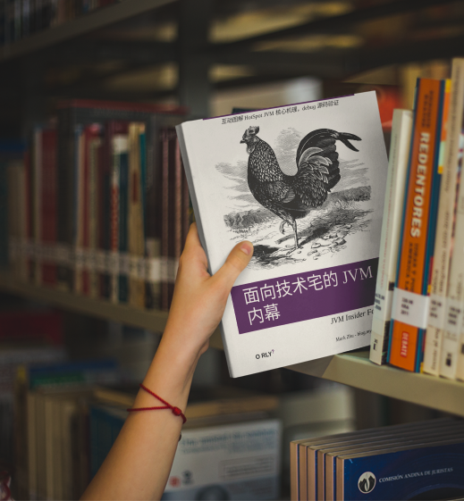

# 前言

这是一本编写中的书，现在只是草稿阶段。书名为《面向技术宅的 JVM 内幕》，英文名《JVM Insider For Nerds》。

不知不觉，以 Java 程序员的名义在职场混了 20 有余个年头。年纪渐长，就养成了一个年轻人最讨厌的毛病：总喜欢回望过去。我一直写书和博客，都在思考一个问题。我为什么，为谁在写东西？ 总的回答是，我想留下和分享点东西，意义在于留下和分享的过程。读者当然越多越好，但从不为读者多少而主导自己的写作范围。

大部分时间，我的职业是一名 Java 程序员。但从毕业到现在，我一直想摆脱 Java。我喜欢 C/C++ 那种控制一切，真男人不过度包装(封装)，无所不能，有很多奇技*巧，学习门槛高，又容易出错，难入门又可以卖弄炫技，容易实现欺负新人愿望的编程技术。直到，最近有点时间去研究一下 OpenJDK Hotspot JVM。事情好像发生了点戏剧变化。用底层开发视角去看 JVM 实现，不但相当有趣，正好迎合自己多年的底层技术开发的所谓初心，还可以为 20 年的 Java 路划上一个不太完满的句号。毕竟，在神州， 40 岁的 Java 程序员大概已经走了这条赛道的尽头了。人生大概准备进入另外一条赛道了，那么在此之前，记录一下以作回忆。起码将来在墓志铭上，可以写上那么一句："xxx书的作者"，而不只是 xyz 的老爸那么无趣。

我职场前半段，为生继而学和用 Java。而 Java 这个词如果你搜索一下网上资讯，很大程度上网上资讯都是教人如何：`学习 -> 应对面试 -> 找到理想工作 -> 成为行业专家 -> 成为技术 leader -> 成为 CTO/投资人 -> 远离技术细节搞大格局` 。 自从民间传说程序员的收入有多高后，会发觉现在的 Java 程序员，更多是职业型的。这类型的人材会把工作任务出色完成。不过他们本身其实对技术没什么打磨式的所谓工匠追求。注意，这里无褒贬，每个行为的健康发展，都需要人材的多样性。

在准备进入职场后半段前，我想换一下视角看技术。从 “有为“ 到 ”无为“ 。于是，我想写一本书：《面向技术宅的 JVM 内幕》 英文名叫： JVM Insider For Nerds 。 

如果有人问我 Java 本身已经很老旧了，新语言很多。学习 Golang、 Rust 不好？ 还有，都  AI 时代了，研究那么底层的 JVM 内部还有意义吗？ 不都是问一下 GPT 就有答案了？ 这些问题我没答案。因为这本书名字就叫 “面向技术宅” 。

本书主要以 openjdk hotspot VM 源码的调试和文档为依据写成。写作风格和我之前写的书 [《Istio & Envoy 内幕》](https://istio-insider.mygraphql.com/zh-cn/latest/) 一样：

> 这本不是一本《深入 xyz 源码》类型的书。甚至可以说，我尽了最大的努力少在书中直接贴源码。看源码是掌握实现细节必须的一步，但在书中浏览源码的体验一般非常糟糕。反而，一个源码的导航图可能更来得实用。

## 本书概述

### 本书是什么
//TBD

### 本书不是什么(Yet another JVM book?)

Yet another JVM book? 的确，已经太多优秀的深入 JVM 类型的书籍和文章了。我希望这本书有一些不同：
- 内容（包括文字和图片）尽量提供到源码或文档的溯源链接，以供读者 Fact check 和扩展知识
- 基于 draw.io 的高清互动图片，有链接，有 hover tips。读者可以用 draw.io 修改原图来定制自己的笔记，建立自己的知识体系。
- 所有内容均开源
- 以当前较新的 Java 21(Hotspot Open JDK 21) 为参考
- 内容信息源尽量控制在源码和官方文档中，尽量避免互联网路边社的 Fake Docs
- 实现优先于规范。Java 世界最麻烦的一点是，抽象说得太多，实现说得太少。本书尽量从实现切入抽象，而不是相反，这样比较符合人类学习知识的习惯。
- 保留原味术语，毕竟，英文术语方便溯源和国际化的交流

### 读者对象
这不是一本从入门到精通类型的书。我写得也比较随性，有点像笔记。所以，随性随缘吧。当然，假设读者有一些年的 Java 经验、饱满的好奇心，当然，最最重要一点是对作者各种错误的指正和包容 :)

### 书的访问地址
- [https://jvm-insider.mygraphql.com](https://jvm-insider.mygraphql.com)
- [https://jvm-insider.readthedocs.io](https://jvm-insider.readthedocs.io)
- [https://jvm-insider.rtfd.io](https://jvm-insider.rtfd.io)

### 关于作者
我叫 Mark Zhu，一个中年且头发少的程序员。//TBD

Blog: [https://blog.mygraphql.com/](https://blog.mygraphql.com/)

### 重要：风格、样式、本文的交互阅读方式 📖

#### 互动图书

可以这样说，我写作的大部时间不是花在文字上，是在绘图上。所以用电脑去读图，才是本书的正确打开方法。手机，只是个引流的阳谋。
这里的图大多比较复杂，不是 PPT 大饼图。所以，基本也不适合打印出纸质书。但我会让图与读者互动：

- 原创的图，多数是用 Draw.io 制作的 SVG 图片：`*.drawio.svg`。

复杂的图，建议 `用 draw.io 打开` ：
- 有的图片提供了 `用 draw.io 打开` 的链接，可以在浏览器用互动性更强的方式浏览:
  - 有的地方（带下划线的文字），链接到相关文档和代码行。
  - 鼠标放上去，会弹出 `hover` 窗口，提示更多的信息。如配置文件内容。

如果不喜欢 draw.io 那么直接看 SVG:
- 浏览 SVG 图片的正确姿势是浏览器中图片处右键，选择 `新 Tab 中打开图片` 。大的 SVG 图片，按下鼠标中键，自由滚动/拖动。
- SVG 图片可以点击链接，直接跳转到相应源码网页(或相关文档)，有时会精确到源码行。

#### 语言风格
由于本文不打算打印出版。也不是什么官方文档。所以语言上我是口语化的。如果读者的期望是阅读一本非常严肃的书，那么可能会失望。但不严肃不代表不严谨。

### 参与编写
如果你也对编写本书有兴趣，欢迎联系我。本书的出发点不是刷简历，也没这个能力。而且，这样的非`短平快` 且 `TL;DR` 书籍注定是小众货。

### Dedication 💞
First, to my dear parents, for showing me how to live a happy
and productive life. To my dear wife and our amazing kid – thanks for all your love and patience.

### Copyleft 声明
无论是文字还是图片，如果转载或修改，请注明原出处。