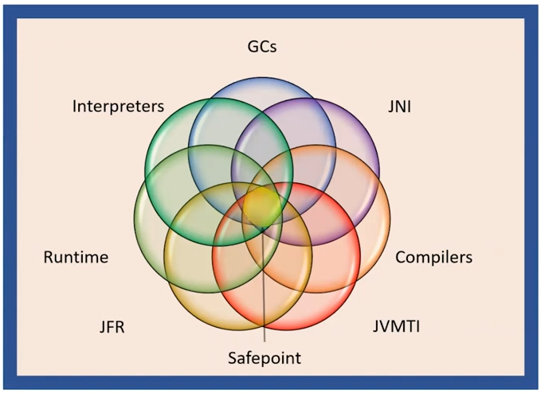
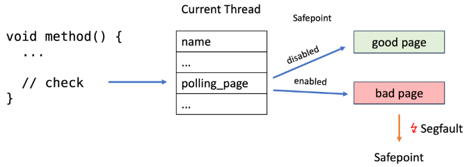

---

---

# Safepoint


Safepoint 作为 Java 最让 end-user 讨厌，但又最让 JVM 实现者爱恨交织，重度依赖的机制。成为每个要研究 Java/JVM 的人都必须研究的机制。




*图: Safepoint 是 JVM 众多模块的依赖和协调机制 ([来自: HotSpot JVM Deep Dive - Safepoint](https://www.youtube.com/watch?v=JkbWPPNc4SI&ab_channel=Java))*


## Safepoint 术语


先看看 Safepoint 相关知识的术语：

`Safepoint` /  `Safepointing` / `Stopping-the-world`


> [来自: HotSpot JVM Deep Dive - Safepoint](https://www.youtube.com/watch?v=JkbWPPNc4SI&ab_channel=Java)
>
> - `Thread-local GC root` := An [oop](/memory/oop/oop.md) , i.e. a pointer into the Java heap, local to a `JavaThread`. The denoted Java object is a root of a reachability tree.  
>
> - `Mutable thread state` := A JavaThread state in which the thread can mutate the Java heap or its thread-local GC roots. Aka an unsafe state. 
>
> - `A Safepoint (noun)` is a global JVM state 
>   - Intuition: At this point (state), the Java world is stopped. It is therefore safe, as in exclusive access, to inspect and process by the JVM. 
>   - Technical: No JavaThread is executing inside or can transition into a thread state classified as mutable 
>   - Technical: Thread-local GC roots for all JavaThreads are accessible (published) to the JVM 
>
> 
>
> - `Safepointing (verb)` or Stopping-the-world is a JVM process or mechanism to reach a Safepoint 
>   - Intuition, older notion: "The process of halting or stopping all executing Java threads" 
>   - Technical: The JVM cooperates with Java Threads using a technique called Cooperative Suspension 
>
> 
>
> - `Cooperative Suspension` is a poll-based technique 
>   - JavaThreads check or poll thread-local state at designated locations 
>   - On suspension, the JVM blocks JavaThreads from transitioning into thread states classified as mutable 
>   - On suspension, the JVM triggers JavaThreads to transition from a mutable into an immutable thread state. As a consequence, thread-local GC roots are published. 
>
>   - For example: 
>     - mov r10, qword ptr [r15+130h] // get thread-local poll page address 
>     - test dword ptr [r10], eax // try to read the poll page
>
> - Traditionally, bringing the system to a Safepoint has been a necessary evil for runtimes that provide some form of automatic memory management** 
>
>   - A pervasive JVM/Runtime mechanism. Consequently, a lot of machinery in the JVM.
>   - But JVM developments, especially in the GC area, move ever closer to obviating the need for the global JVM safepoint state.
>
>


- `Thread-local GC root` := `JavaThread` 本地的一个指向 heap 的  [oop](/memory/oop/oop.md) 。作为 GC 对象可达性分析树的树根
- `Mutable thread state` := 指一类型的 JavaThread 的状态，在该状态下，线程可以改变 Java help 或其 `Thread-local GC root`。又称 `unsafe state`。
- `Safepoint (名词)` 是指一种 JVM 全局状态
  - 直觉上：此时（状态），Java 世界已停止。因此，JVM 检查和处理是安全的，就像独占访问一样。
  - 技术上：没有 JavaThread 在内部执行或可以转换为归类为 `Mutable thread state`  的线程
  - 技术上：所有 JavaThread 的`Thread-local GC root`都可以访问（发布）到 JVM

- `Safepointing（动词）` 或 Stopping-the-world 是 JVM 达到安全点的过程或机制

  - 直觉上，较旧的概念：暂停或停止所有正在执行的 Java 线程的过程

  - 技术：JVM 使用一种称为`Cooperative Suspension 协作挂起`的技术与 Java 线程协作

- 传统上，将系统置于`Safepoint`对于提供某种形式的自动内存管理的运行时来说是一种必要之恶

  - 但是 JVM 的发展，特别是在 GC 领域，已经越来越接近于消除对全局 JVM 安全点状态的需求。


## Safepoint 流程概述


以上文字内容不太直观，来个图：


*图: Stop The World 的步骤。Source: [Async-profiler - manual by use cases](https://krzysztofslusarski.github.io/2022/12/12/async-manual.html#tts)*


1. Global safepoint request 

   1.1 有一个线程向一个叫  `VM Thread` 提出了进入 safepoint 的请求，请求中带上 `safepoint operation` 参数，参数其实是  STOP THE WORLD(STW) 后要执行的 Callback 操作 。可能是触发 GC。也可能是其它原因。

   1.2 `VM Thread` 线程在收到 safepoint request 后，修改一个 JVM 全局的 `safepoint flag `为 true（这个 flag 可以是操作系统的内存页权限标识） 。

   1.3 然后这个  `VM Thread`   就开始等待其它应用线程（App thread） 到达（进入） safepoint 。

   1.4 其它应用线程（App thread）其实会高频检查这个 safepoint flag ，当发现为 true 时，就到达（进入） safepoint 状态。

   [源码 SafepointSynchronize::begin() ](https://github.com/openjdk/jdk/blob/dfacda488bfbe2e11e8d607a6d08527710286982/src/hotspot/share/runtime/safepoint.cpp#L339)

   

2. Global safepoint

   当 `VM Thread`   发现所有 App thread 都到达 safepoint （真实的 STW 的开始） 。就开始执行 `safepoint operation` 。`GC 操作` 是 `safepoint operation` 其中一种可能类型。

   [源码 RuntimeService::record_safepoint_synchronized()](https://github.com/openjdk/jdk/blob/dfacda488bfbe2e11e8d607a6d08527710286982/src/hotspot/share/runtime/safepoint.cpp#L1108)

   

3. End of safepoint operation 

   `safepoint operation`  执行完毕， `VM Thread`  结束 STW 。

   [源码 SafepointSynchronize::end()](https://github.com/openjdk/jdk/blob/dfacda488bfbe2e11e8d607a6d08527710286982/src/hotspot/share/runtime/safepoint.cpp#L487-L488)


##  JavaThread - State

详见本书的 [JavaThread Polling 与 Reach Safepoint - JavaThread - State](/exec-engine/safepoint/javathread-polling-reach-sp.md#javathread_state) 一节。


## GC oop trace

[src/hotspot/share/runtime/javaThread.hpp](https://github.com/openjdk/jdk//blob/890adb6410dab4606a4f26a942aed02fb2f55387/src/hotspot/share/runtime/javaThread.hpp#L244)

```c++
class JavaThread: public Thread {
...
  // Active_handles points to a block of handles
  JNIHandleBlock* _active_handles;
...
  JavaFrameAnchor _anchor;                       // Encapsulation of current java frame and it state
```


[src/hotspot/share/runtime/javaFrameAnchor.hpp](https://github.com/openjdk/jdk//blob/890adb6410dab4606a4f26a942aed02fb2f55387/src/hotspot/share/runtime/javaFrameAnchor.hpp#L40)

```c++
class JavaFrameAnchor {
...
 private:
  //
  // Whenever _last_Java_sp != nullptr other anchor fields MUST be valid!
  // The stack may not be walkable [check with walkable() ] but the values must be valid.
  // The profiler apparently depends on this.
  //
  intptr_t* volatile _last_Java_sp;

  // Whenever we call from Java to native we can not be assured that the return
  // address that composes the last_Java_frame will be in an accessible location
  // so calls from Java to native store that pc (or one good enough to locate
  // the oopmap) in the frame anchor. Since the frames that call from Java to
  // native are never deoptimized we never need to patch the pc and so this
  // is acceptable.
  volatile  address _last_Java_pc;

  // tells whether the last Java frame is set
  // It is important that when last_Java_sp != nullptr that the rest of the frame
  // anchor (including platform specific) all be valid.

  bool has_last_Java_frame() const                   { return _last_Java_sp != nullptr; }
```


> Global jvm state the second clause was that thread local gc routes for all java threads are accessible or published to the jvm. All current garbage collectors are tracing collectors which means they follow or trace the reachability trees starting out from what is called a root set. That is a set of immediately available oops. 
>
> Proper subset of the route set is the set of routes that is local to and reachable from java threads.
>
> 
>
> Let's take a look at what some of these thread local gc routes are.
>
> 
>
> ###  oop Handles
>
> - Local jni handles
>
>   A `JavaThread` has a field called `JNIHandleBlock* _active_handles`. A `local jni handle` provides indirect access to an `oop` for jni code running in `state native` . But allocating/deallocating and even dereferencing a jni handle involve first performing a `vm state transition` which will perform a safe point check.  `Local jni handles` are auto managed so when the code returns from a jni method that is it transitions from `state native` doing a safe point check into `state java` the `local jni handles` allocated by that method are deallocated. 
>
> - HandleArea *(missed in OpenJDK21)*
>
>   The `JavaThread` also has a field called `handle area` and handle area and its companion the handle provides pretty much the same indirection functionality as a `local jni handle` but these are targeted for code running in the `vm state`.  The important difference is that these handles are NOT auto managed but instead must be manually managed by the openjdk programmer. `Handle marks` are used to describe a `handle scope`. And the `handle mark` destructor will deallocate the allocated handles for that particular scope and the scopes can also be nested.
>
> ### Last Java Frame
>
> The thread also has an embedded struct called the `JavaFrameAnchor _anchor` field. It consists of three pointers:
>
> - `_last_Java_sp` for last java stack pointer 
>
> - `_last_Java_pc` for last java program counter
>
> - `_last_Java_fp`*(missed in OpenJDK21, because of virtual thread ?)* for last java frame pointer. the last java frame is the entry point for external stack walking. It is set if a thread has at least one java activation record or frame on its stack and it's currently not in `state java`. So the `_last_Java_fp` is set in `state java` before the thread transitions out. And conversely it is cleared upon thread reentry. 
>
> The anchor struct here requires only that the `last java stack pointer` is set as the other fields are either not relevant for that context or they can be derived by the stack walking code. 
>
> Java frames on the stack may contain `ordinary narrow oops` or `derived oops`. So if you compared to the handles we discussed previously these are naked oops that is they do not have a handling direction they are direct pointers. 
>
> - An `ordinary oop` is a regular oop, 
> - a `narrow oop` is a compressed version of an oop it's a 32-bit size oop. 
> - And the `derived oop` is a pointer into an object not pointing directly to its header. 
>
> So for example we can think of an a pointer that points out an element in an array and a `derived oop` is always associated with a base for a specific code position in java for a specific code position like a` program counter` which stack slots and registers contain oops relative to that `pc` is described by a piece of metadata generated by the compilers something called an `oop map`. 
>
> For a specific code position (pc), which stack slots and registers contain oops is described by a piece of metadata generated by the compilers, called an `OopMap`. To pinpoint an oop in a frame, the `OopMap` describes a location using a relative address, either from the `frame stackpointer (sp)` or as an index into a `RegisterMap`. Not all code positions have `OopMaps`; mainly call sites and safepoint poll page instructions. For stackwalks, the return address of each frame is associated with an `OopMap`.
>
> ### JavaThread CPU Context
>
> A thread executing Java code also has a CPU context. Per the calling convention and performance reasons, oops are ideally placed in registers. Hotspot widely employs something called `Stubs` or `StubRoutines`, which are special platform-specific assembly helper routines. An important feature of most `Stubs` is to save the CPU context when a thread leaves, or suspends its Java execution, and restoring it when the thread re-enters, resuming execution. A `Register Map` is used to resolve a location described by an `OopMap` to be in a register. 


## Safepoint 协作流程详述

Safepoint 协作流程可以划分为以下几步：

1.  应用线程 Polling Safepoint
2.  监听 Safepoint Request
3.  接收 Safepoint Request
4.  Arm Safepoint - 标记所有线程
5.  等待应用线程到达 Safepoint
6.  应用线程陷入 Safepoint
7.  Global safepoint - The World Stopped
8.  Safepoint operation 结束
9.  Disarming Safepoint


### 应用线程 Polling Safepoint

详见本书的 [JavaThread Polling 与 Reach Safepoint - Polling](/exec-engine/safepoint/javathread-polling-reach-sp.md#polling) 一节。


### 监听 Safepoint Request

见本书的 [VM Operations](/exec-engine/threads/vm-threads-cooperative/vm-operation.md) 一节。


### 接收 Safepoint Request

可能是分配内存失败触发 GC，也可能是其它原因，Java 线程向  `VM Thread` 提出了进入 safepoint 的请求(`VM_Operation`)，请求中带上 `safepoint operation` 参数，参数其实是  STOP THE WORLD(STW) 后要执行的 Callback 操作 。

```c++
void VMThread::inner_execute(VM_Operation* op) {
...
  if (_cur_vm_operation->evaluate_at_safepoint() &&
      !SafepointSynchronize::is_at_safepoint()) {
    SafepointSynchronize::begin(); // <<<----
    if (has_timeout_task) {
      _timeout_task->arm(_cur_vm_operation->name());
    }
    end_safepoint = true;
  }

  evaluate_operation(_cur_vm_operation); // <<<----

  if (end_safepoint) {
    if (has_timeout_task) {
      _timeout_task->disarm();
    }
    SafepointSynchronize::end(); // <<<----
  }

...
}
```


(arming_safepoint)=

### Arm Safepoint - 标记所有线程

`VM Thread` 线程在收到 safepoint request 后，修改一个 JVM 全局的 `safepoint flag `为 true（这个 flag 可以是操作系统的内存页权限标识） 。


Arm Safepoint 术语中这个 arm 可以直译成 “武装/装备” ，但我翻译成`设置标志` 。


[src/hotspot/share/runtime/safepoint.cpp](https://github.com/openjdk/jdk//blob/890adb6410dab4606a4f26a942aed02fb2f55387/src/hotspot/share/runtime/safepoint.cpp#L352)

```c++
// Roll all threads forward to a safepoint and suspend them all
void SafepointSynchronize::begin() {
...
  int nof_threads = Threads::number_of_threads();
  _nof_threads_hit_polling_page = 0;
...
  // Arms the safepoint, _current_jni_active_count and _waiting_to_block must be set before.
  arm_safepoint();
  // Will spin until all threads are safe.
  int iterations = synchronize_threads(safepoint_limit_time, nof_threads, &initial_running);
  ...
}

void SafepointSynchronize::arm_safepoint() {
  // Begin the process of bringing the system to a safepoint.
  // Java threads can be in several different states and are
  // stopped by different mechanisms:
  //
  //  1. Running interpreted
  //     When executing branching/returning byte codes interpreter
  //     checks if the poll is armed, if so blocks in SS::block().
  //  2. Running in native code
  //     When returning from the native code, a Java thread must check
  //     the safepoint _state to see if we must block.  If the
  //     VM thread sees a Java thread in native, it does
  //     not wait for this thread to block.  The order of the memory
  //     writes and reads of both the safepoint state and the Java
  //     threads state is critical.  In order to guarantee that the
  //     memory writes are serialized with respect to each other,
  //     the VM thread issues a memory barrier instruction.
  //  3. Running compiled Code
  //     Compiled code reads the local polling page that
  //     is set to fault if we are trying to get to a safepoint.
  //  4. Blocked
  //     A thread which is blocked will not be allowed to return from the
  //     block condition until the safepoint operation is complete.
  //  5. In VM or Transitioning between states
  //     If a Java thread is currently running in the VM or transitioning
  //     between states, the safepointing code will poll the thread state
  //     until the thread blocks itself when it attempts transitions to a
  //     new state or locking a safepoint checked monitor.

  // We must never miss a thread with correct safepoint id, so we must make sure we arm
  // the wait barrier for the next safepoint id/counter.
  // Arming must be done after resetting _current_jni_active_count, _waiting_to_block.
...
  for (JavaThreadIteratorWithHandle jtiwh; JavaThread *cur = jtiwh.next(); ) {
    // Make sure the threads start polling, it is time to yield.
    SafepointMechanism::arm_local_poll(cur);
  }    
```

可见，`vm thread` 逐一 `arm` 所有的应用线程 。


自从 OpenJDK11 的 [JEP 312: Thread-Local Handshakes - 2017年](https://openjdk.org/jeps/312) 后，就有了非 JVM Global 的 Safepoint - Thread Safepoint 。而 JVM Global 的 Safepoint 好像也修改为基于 `Thread-Local Handshakes` 去实现，即对每一条 JavaThread 执行 `Thread-Local Handshakes`。


[src/hotspot/share/runtime/safepointMechanism.inline.hpp](https://github.com/openjdk/jdk//blob/890adb6410dab4606a4f26a942aed02fb2f55387/src/hotspot/share/runtime/safepointMechanism.inline.hpp#L94)

```c++
void SafepointMechanism::arm_local_poll(JavaThread* thread) {
  thread->poll_data()->set_polling_word(_poll_word_armed_value);
  thread->poll_data()->set_polling_page(_poll_page_armed_value);
}

inline void SafepointMechanism::ThreadData::set_polling_word(uintptr_t poll_value) {
  Atomic::store(&_polling_word, poll_value);
}

inline void SafepointMechanism::ThreadData::set_polling_page(uintptr_t poll_value) {
  Atomic::store(&_polling_page, poll_value);
}
```


可以用下图说明 polling_page 的切换：



*图: polling_page 的切换. Source: [The Inner Workings of Safepoints 2023 - mostlynerdless.de](https://mostlynerdless.de/blog/2023/07/31/the-inner-workings-of-safepoints/)*


### 等待应用线程到达 Safepoint

然后这个  `VM Thread`   就开始等待其它应用线程（App thread） 到达（进入） safepoint 。

[src/hotspot/share/runtime/safepoint.cpp](https://github.com/openjdk/jdk//blob/890adb6410dab4606a4f26a942aed02fb2f55387/src/hotspot/share/runtime/safepoint.cpp#L218)

```c++
int SafepointSynchronize::synchronize_threads(jlong safepoint_limit_time, int nof_threads, int* initial_running)
{
  // Iterate through all threads until it has been determined how to stop them all at a safepoint.
  int still_running = nof_threads;
  ThreadSafepointState *tss_head = nullptr;
  ThreadSafepointState **p_prev = &tss_head;
  for (; JavaThread *cur = jtiwh.next(); ) {
    ThreadSafepointState *cur_tss = cur->safepoint_state();
    assert(cur_tss->get_next() == nullptr, "Must be null");
    if (thread_not_running(cur_tss)) {
      --still_running;
    } else {
      *p_prev = cur_tss;
      p_prev = cur_tss->next_ptr();
    }
  }
  ...
```


### 应用线程陷入 Safepoint

Java 线程会高频检查 safepoint flag(safepoint check/polling) ，当发现为 true（arm) 时，就到达（进入） safepoint 状态。


详见本书的 [JavaThread Polling 与 Reach Safepoint - Reach and handle](/exec-engine/safepoint/javathread-polling-reach-sp.md#reach) 一节。


### Global safepoint - The World Stopped

当 `VM Thread`   发现所有 App thread 都到达 safepoint （真实的 STW 的开始） 。就开始执行 `safepoint operation` 。`GC 操作` 是 `safepoint operation` 其中一种可能类型。

[源码 RuntimeService::record_safepoint_synchronized()](https://github.com/openjdk/jdk/blob/dfacda488bfbe2e11e8d607a6d08527710286982/src/hotspot/share/runtime/safepoint.cpp#L1108)


### Safepoint operation 结束

`safepoint operation`  执行完毕， `VM Thread`  结束 STW 。

[源码 SafepointSynchronize::end()](https://github.com/openjdk/jdk/blob/dfacda488bfbe2e11e8d607a6d08527710286982/src/hotspot/share/runtime/safepoint.cpp#L487-L488)


### Disarming Safepoint

[src/hotspot/share/runtime/safepointMechanism.inline.hpp](https://github.com/openjdk/jdk//blob/890adb6410dab4606a4f26a942aed02fb2f55387/src/hotspot/share/runtime/safepointMechanism.inline.hpp#L101)

```c++
// Disarming one thread 
void SafepointMechanism::disarm_local_poll(JavaThread* thread) {
  thread->poll_data()->set_polling_word(_poll_word_disarmed_value);
  thread->poll_data()->set_polling_page(_poll_page_disarmed_value);
}
```


## 参考

- [HotSpot JVM Deep Dive - Safepoint - Youtube Java Channel](https://www.youtube.com/watch?v=JkbWPPNc4SI&ab_channel=Java)
- [Async-profiler - manual by use cases - krzysztofslusarski.github.io](https://krzysztofslusarski.github.io/2022/12/12/async-manual.html#tts)
- [Safepoints: Meaning, Side Effects and Overheads - psy-lob-saw.blogspot.com](https://psy-lob-saw.blogspot.com/2015/12/safepoints.html)
- [Where is my safepoint? - psy-lob-saw.blogspot.com](https://psy-lob-saw.blogspot.com/2014/03/where-is-my-safepoint.html)
- [The Inner Workings of Safepoints 2023 - mostlynerdless.de](https://mostlynerdless.de/blog/2023/07/31/the-inner-workings-of-safepoints/)
- [Robbin Ehn: Handshaking HotSpot - Youtube Java Channel - 2020](https://www.youtube.com/watch?v=VBCOfAJ409s&ab_channel=Java)


```{toctree}
javathread-polling-reach-sp.md
```