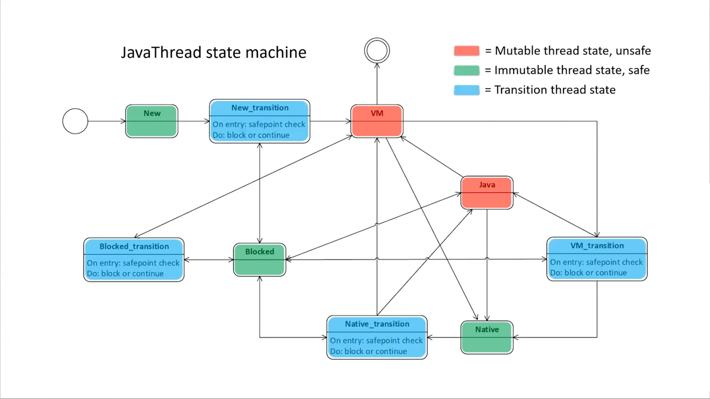
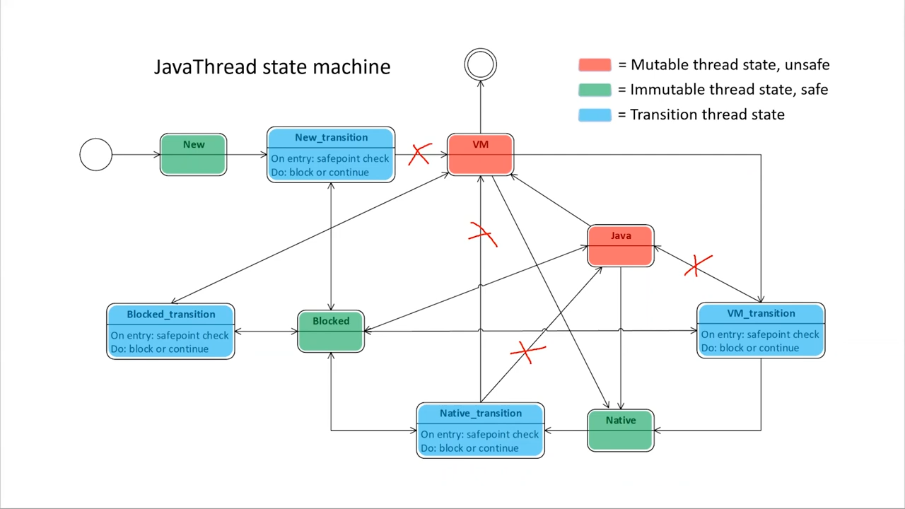
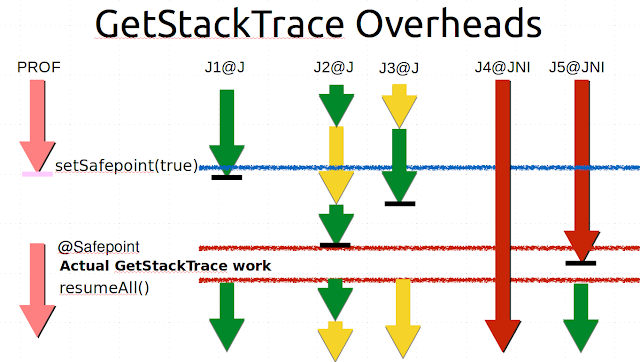

---

---

# Safepoint


Safepoint 作为 Java 最让 end-user 讨厌，但又最让 JVM 实现者爱恨交织，重度依赖的机制。成为每个要研究 Java/JVM 的人都必须研究的机制。


*图: Safepoint 是 JVM 众多模块的依赖和协调机制 ([来自: HotSpot JVM Deep Dive - Safepoint](https://www.youtube.com/watch?v=JkbWPPNc4SI&ab_channel=Java))*


## Safepoint 术语


先看看 Safepoint 相关知识的术语：

`Safepoint` /  `Safepointing` / `Stopping-the-world`


> [来自: HotSpot JVM Deep Dive - Safepoint](https://www.youtube.com/watch?v=JkbWPPNc4SI&ab_channel=Java)
>
> - `Thread-local GC root` := An [oop](/memory/oop/oop.md) , i.e. a pointer into the Java heap, local to a `JavaThread`. The denoted Java object is a root of a reachability tree.  
>
> - `Mutable thread state` := A JavaThread state in which the thread can mutate the Java heap or its thread-local GC roots. Aka an unsafe state. 
>
> - `A Safepoint (noun)` is a global JVM state 
>   - Intuition: At this point (state), the Java world is stopped. It is therefore safe, as in exclusive access, to inspect and process by the JVM. 
>   - Technical: No JavaThread is executing inside or can transition into a thread state classified as mutable 
>   - Technical: Thread-local GC roots for all JavaThreads are accessible (published) to the JVM 
>
> 
>
> - `Safepointing (verb)` or Stopping-the-world is a JVM process or mechanism to reach a Safepoint 
>   - Intuition, older notion: "The process of halting or stopping all executing Java threads" 
>   - Technical: The JVM cooperates with Java Threads using a technique called Cooperative Suspension 
>
> 
>
> - `Cooperative Suspension` is a poll-based technique 
>   - JavaThreads check or poll thread-local state at designated locations 
>   - On suspension, the JVM blocks JavaThreads from transitioning into thread states classified as mutable 
>   - On suspension, the JVM triggers JavaThreads to transition from a mutable into an immutable thread state. As a consequence, thread-local GC roots are published. 
>
>   - For example: 
>     - mov r10, qword ptr [r15+130h] // get thread-local poll page address 
>     - test dword ptr [r10], eax // try to read the poll page
>
> - Traditionally, bringing the system to a Safepoint has been a necessary evil for runtimes that provide some form of automatic memory management** 
>
>   - A pervasive JVM/Runtime mechanism. Consequently, a lot of machinery in the JVM.
>   - But JVM developments, especially in the GC area, move ever closer to obviating the need for the global JVM safepoint state.
>
>


- `Thread-local GC root` := `JavaThread` 本地的一个指向 heap 的  [oop](/memory/oop/oop.md) 。作为 GC 对象可达性分析树的树根
- `Mutable thread state` := 指一类型的 JavaThread 的状态，在该状态下，线程可以改变 Java help 或其 `Thread-local GC root`。又称 `unsafe state`。
- `Safepoint (名词)` 是指一种 JVM 全局状态
  - 直觉上：此时（状态），Java 世界已停止。因此，JVM 检查和处理是安全的，就像独占访问一样。
  - 技术上：没有 JavaThread 在内部执行或可以转换为归类为 `Mutable thread state`  的线程
  - 技术上：所有 JavaThread 的`Thread-local GC root`都可以访问（发布）到 JVM

- `Safepointing（动词）` 或 Stopping-the-world 是 JVM 达到安全点的过程或机制

  - 直觉上，较旧的概念：暂停或停止所有正在执行的 Java 线程的过程

  - 技术：JVM 使用一种称为`Cooperative Suspension 协作挂起`的技术与 Java 线程协作

- 传统上，将系统置于`Safepoint`对于提供某种形式的自动内存管理的运行时来说是一种必要之恶

  - 但是 JVM 的发展，特别是在 GC 领域，已经越来越接近于消除对全局 JVM 安全点状态的需求。


## Safepoint 流程概述


以上文字内容不太直观，来个图：


*图: Stop The World 的步骤。Source: [Async-profiler - manual by use cases](https://krzysztofslusarski.github.io/2022/12/12/async-manual.html#tts)*


1. Global safepoint request 

   1.1 有一个线程向一个叫  `VM Thread` 提出了进入 safepoint 的请求，请求中带上 `safepoint operation` 参数，参数其实是  STOP THE WORLD(STW) 后要执行的 Callback 操作 。可能是触发 GC。也可能是其它原因。

   1.2 `VM Thread` 线程在收到 safepoint request 后，修改一个 JVM 全局的 `safepoint flag `为 true（这个 flag 可以是操作系统的内存页权限标识） 。

   1.3 然后这个  `VM Thread`   就开始等待其它应用线程（App thread） 到达（进入） safepoint 。

   1.4 其它应用线程（App thread）其实会高频检查这个 safepoint flag ，当发现为 true 时，就到达（进入） safepoint 状态。

   [源码 SafepointSynchronize::begin() ](https://github.com/openjdk/jdk/blob/dfacda488bfbe2e11e8d607a6d08527710286982/src/hotspot/share/runtime/safepoint.cpp#L339)

   

2. Global safepoint

   当 `VM Thread`   发现所有 App thread 都到达 safepoint （真实的 STW 的开始） 。就开始执行 `safepoint operation` 。`GC 操作` 是 `safepoint operation` 其中一种可能类型。

   [源码 RuntimeService::record_safepoint_synchronized()](https://github.com/openjdk/jdk/blob/dfacda488bfbe2e11e8d607a6d08527710286982/src/hotspot/share/runtime/safepoint.cpp#L1108)

   

3. End of safepoint operation 

   `safepoint operation`  执行完毕， `VM Thread`  结束 STW 。

   [源码 SafepointSynchronize::end()](https://github.com/openjdk/jdk/blob/dfacda488bfbe2e11e8d607a6d08527710286982/src/hotspot/share/runtime/safepoint.cpp#L487-L488)


##  JavaThread - State


Safepoint 机制的实现依赖于 [JavaThread](/exec-engine/threads/java-thread/java-thread.md) 。


[src/hotspot/share/runtime/javaThread.hpp](https://github.com/openjdk/jdk//blob/890adb6410dab4606a4f26a942aed02fb2f55387/src/hotspot/share/runtime/javaThread.hpp#L244)

```c++
class JavaThread: public Thread {
...
  // Safepoint support
 public:                                                        // Expose _thread_state for SafeFetchInt()
  volatile JavaThreadState _thread_state;
 private:
  SafepointMechanism::ThreadData _poll_data;
  ThreadSafepointState*          _safepoint_state;              // Holds information about a thread during a safepoint
  address                        _saved_exception_pc;           // Saved pc of instruction where last implicit exception happened

```

[src/hotspot/share/utilities/globalDefinitions.hpp](https://github.com/openjdk/jdk//blob/890adb6410dab4606a4f26a942aed02fb2f55387/src/hotspot/share/utilities/globalDefinitions.hpp#L1030)

```c++
// JavaThreadState keeps track of which part of the code a thread is executing in. This
// information is needed by the safepoint code.
//
// There are 4 essential states:
//
//  _thread_new         : Just started, but not executed init. code yet (most likely still in OS init code)
//  _thread_in_native   : In native code. This is a safepoint region, since all oops will be in jobject handles
//  _thread_in_vm       : Executing in the vm
//  _thread_in_Java     : Executing either interpreted or compiled Java code (or could be in a stub)
//
// Each state has an associated xxxx_trans state, which is an intermediate state used when a thread is in
// a transition from one state to another. These extra states makes it possible for the safepoint code to
// handle certain thread_states without having to suspend the thread - making the safepoint code faster.
//
// Given a state, the xxxx_trans state can always be found by adding 1.
//
enum JavaThreadState {
  _thread_uninitialized     =  0, // should never happen (missing initialization)
  _thread_new               =  2, // just starting up, i.e., in process of being initialized
  _thread_new_trans         =  3, // corresponding transition state (not used, included for completeness)
  _thread_in_native         =  4, // running in native code
  _thread_in_native_trans   =  5, // corresponding transition state
  _thread_in_vm             =  6, // running in VM
  _thread_in_vm_trans       =  7, // corresponding transition state
  _thread_in_Java           =  8, // running in Java or in stub code
  _thread_in_Java_trans     =  9, // corresponding transition state (not used, included for completeness)
  _thread_blocked           = 10, // blocked in vm
  _thread_blocked_trans     = 11, // corresponding transition state
  _thread_max_state         = 12  // maximum thread state+1 - used for statistics allocation
};

```

其中 `class JavaThread` 的 `JavaThreadState _thread_state` 字段记录了线程的状态。




*图: JavaThread 状态机。Source: [Java Thread state machine](https://youtu.be/JkbWPPNc4SI?si=c5YYAKHYBPROZAZ_&t=576)*


> [来自: HotSpot JVM Deep Dive - Safepoint](https://www.youtube.com/watch?v=JkbWPPNc4SI&ab_channel=Java)
>
> This is the state machine for the java thread and we can further classify it into the following categories:
>
> - `mutable thread state` it's a state in which the thread can mute it the java heap or its thread local gc routes
> - `immutable thread states` is a state where the threat can do none of these things
> - `transition states` which act like bridges between the mutable and the immutable states a transition state has a **safe point check** or a **poll instruction** together with appropriate fencing


这是 Java 线程的状态机，我们可以进一步将其分为以下类别：

- `mutable thread state 可变线程状态` 线程可以修改 Java 堆或其线程本地 GC 数据
- `immutable thread states 不可变线程状态` 不能修改 oop 的状态
- `transition states 过渡状态` 充当`mutable thread state`和`immutable thread states` 之间的桥梁，过渡状态具有 **safe point check** 或 **轮询指令** 以及适当的隔离


> [来自: HotSpot JVM Deep Dive - Safepoint](https://youtu.be/JkbWPPNc4SI?si=YIq5HIHvSQFcC4U9&t=597)
>
> Let's for example take a look at this situation:
> we have a new thread comes into being it starts running in the `VM state`.
> Let's say this thread now wants to execute some java code. In order to do that it will need to traverse a transition into the `java state` and as that the transition as we said contains a `save point check`. Some notable transitions here is that the `java code(java state)` can transition to `VM state` and to `Native state` **without** performing save point checks instead the save point check is performed when the thread returns to `state java`.
>
> 
>
> Another important takeaway here is that code executing in `state native` is considered safe this means that during a safe point java threads can actually continue running native code and this also means that counter to the intuitive notion that a safe point involves blocking or halting all java threads it only means that they do not executein a sense a sensitive `mutable state`


关于 `transition states` 的作用 ，让我们看一下这种情况：
我们有一个新的线程出现，一开始在 `VM state` 中运行。
假设这个线程现在要执行一些 Java 代码。为了做到这一点，它将需要间接跳转到  ` java state` ，这个跳转包含 safepoint check。 值得注意的是，Java 代码（`Java state`） 可以直接跳转到 `VM state` 和  `native state` ，**无需** 执行 safepoint check，但在线程返回到 `Java state` 时执行，需要 safepoint check 。


另一个要注意的是，在`native state`下执行的代码被认为是安全的，这意味着在安全点期间，java 线程实际上可以继续运行 native code ，这也意味着，与安全点会阻塞或停止所有 java 线程的直观想法相反，安全点只意味着不执行敏感的 `mutable state` 操作。


## GC oop trace

[src/hotspot/share/runtime/javaThread.hpp](https://github.com/openjdk/jdk//blob/890adb6410dab4606a4f26a942aed02fb2f55387/src/hotspot/share/runtime/javaThread.hpp#L244)

```c++
class JavaThread: public Thread {
...
  // Active_handles points to a block of handles
  JNIHandleBlock* _active_handles;
...
  JavaFrameAnchor _anchor;                       // Encapsulation of current java frame and it state
```


[src/hotspot/share/runtime/javaFrameAnchor.hpp](https://github.com/openjdk/jdk//blob/890adb6410dab4606a4f26a942aed02fb2f55387/src/hotspot/share/runtime/javaFrameAnchor.hpp#L40)

```c++
class JavaFrameAnchor {
...
 private:
  //
  // Whenever _last_Java_sp != nullptr other anchor fields MUST be valid!
  // The stack may not be walkable [check with walkable() ] but the values must be valid.
  // The profiler apparently depends on this.
  //
  intptr_t* volatile _last_Java_sp;

  // Whenever we call from Java to native we can not be assured that the return
  // address that composes the last_Java_frame will be in an accessible location
  // so calls from Java to native store that pc (or one good enough to locate
  // the oopmap) in the frame anchor. Since the frames that call from Java to
  // native are never deoptimized we never need to patch the pc and so this
  // is acceptable.
  volatile  address _last_Java_pc;

  // tells whether the last Java frame is set
  // It is important that when last_Java_sp != nullptr that the rest of the frame
  // anchor (including platform specific) all be valid.

  bool has_last_Java_frame() const                   { return _last_Java_sp != nullptr; }
```


> Global jvm state the second clause was that thread local gc routes for all java threads are accessible or published to the jvm. All current garbage collectors are tracing collectors which means they follow or trace the reachability trees starting out from what is called a root set. That is a set of immediately available oops. 
>
> Proper subset of the route set is the set of routes that is local to and reachable from java threads.
>
> 
>
> Let's take a look at what some of these thread local gc routes are.
>
> 
>
> ###  oop Handles
>
> - Local jni handles
>
>   A `JavaThread` has a field called `JNIHandleBlock* _active_handles`. A `local jni handle` provides indirect access to an `oop` for jni code running in `state native` . But allocating/deallocating and even dereferencing a jni handle involve first performing a `vm state transition` which will perform a safe point check.  `Local jni handles` are auto managed so when the code returns from a jni method that is it transitions from `state native` doing a safe point check into `state java` the `local jni handles` allocated by that method are deallocated. 
>
> - HandleArea *(missed in OpenJDK21)*
>
>   The `JavaThread` also has a field called `handle area` and handle area and its companion the handle provides pretty much the same indirection functionality as a `local jni handle` but these are targeted for code running in the `vm state`.  The important difference is that these handles are NOT auto managed but instead must be manually managed by the openjdk programmer. `Handle marks` are used to describe a `handle scope`. And the `handle mark` destructor will deallocate the allocated handles for that particular scope and the scopes can also be nested.
>
> ### Last Java Frame
>
> The thread also has an embedded struct called the `JavaFrameAnchor _anchor` field. It consists of three pointers:
>
> - `_last_Java_sp` for last java stack pointer 
>
> - `_last_Java_pc` for last java program counter
>
> - `_last_Java_fp`*(missed in OpenJDK21, because of virtual thread ?)* for last java frame pointer. the last java frame is the entry point for external stack walking. It is set if a thread has at least one java activation record or frame on its stack and it's currently not in `state java`. So the `_last_Java_fp` is set in `state java` before the thread transitions out. And conversely it is cleared upon thread reentry. 
>
> The anchor struct here requires only that the `last java stack pointer` is set as the other fields are either not relevant for that context or they can be derived by the stack walking code. 
>
> Java frames on the stack may contain `ordinary narrow oops` or `derived oops`. So if you compared to the handles we discussed previously these are naked oops that is they do not have a handling direction they are direct pointers. 
>
> - An `ordinary oop` is a regular oop, 
> - a `narrow oop` is a compressed version of an oop it's a 32-bit size oop. 
> - And the `derived oop` is a pointer into an object not pointing directly to its header. 
>
> So for example we can think of an a pointer that points out an element in an array and a `derived oop` is always associated with a base for a specific code position in java for a specific code position like a` program counter` which stack slots and registers contain oops relative to that `pc` is described by a piece of metadata generated by the compilers something called an `oop map`. 
>
> For a specific code position (pc), which stack slots and registers contain oops is described by a piece of metadata generated by the compilers, called an `OopMap`. To pinpoint an oop in a frame, the `OopMap` describes a location using a relative address, either from the `frame stackpointer (sp)` or as an index into a `RegisterMap`. Not all code positions have `OopMaps`; mainly call sites and safepoint poll page instructions. For stackwalks, the return address of each frame is associated with an `OopMap`.
>
> ### JavaThread CPU Context
>
> A thread executing Java code also has a CPU context. Per the calling convention and performance reasons, oops are ideally placed in registers. Hotspot widely employs something called `Stubs` or `StubRoutines`, which are special platform-specific assembly helper routines. An important feature of most `Stubs` is to save the CPU context when a thread leaves, or suspends its Java execution, and restoring it when the thread re-enters, resuming execution. A `Register Map` is used to resolve a location described by an `OopMap` to be in a register. 


## Safepoint 协作流程详述


### 监听 Safepoint Request

见本书的 [VM Operations](/exec-engine/threads/vm-threads-cooperative/vm-operation.md) 一节。


### 接收 Safepoint Request

可能是分配内存失败触发 GC，也可能是其它原因，Java 线程向  `VM Thread` 提出了进入 safepoint 的请求(`VM_Operation`)，请求中带上 `safepoint operation` 参数，参数其实是  STOP THE WORLD(STW) 后要执行的 Callback 操作 。

```c++
void VMThread::inner_execute(VM_Operation* op) {
...
  if (_cur_vm_operation->evaluate_at_safepoint() &&
      !SafepointSynchronize::is_at_safepoint()) {
    SafepointSynchronize::begin(); // <<<----
    if (has_timeout_task) {
      _timeout_task->arm(_cur_vm_operation->name());
    }
    end_safepoint = true;
  }

  evaluate_operation(_cur_vm_operation); // <<<----

  if (end_safepoint) {
    if (has_timeout_task) {
      _timeout_task->disarm();
    }
    SafepointSynchronize::end(); // <<<----
  }

...
}
```


### Arm Safepoint - 标记所有线程， Global Safepoint 开始

`VM Thread` 线程在收到 safepoint request 后，修改一个 JVM 全局的 `safepoint flag `为 true（这个 flag 可以是操作系统的内存页权限标识） 。


先看看相关的数据结构：

[src/hotspot/share/runtime/javaThread.hpp](https://github.com/openjdk/jdk//blob/890adb6410dab4606a4f26a942aed02fb2f55387/src/hotspot/share/runtime/javaThread.hpp#L246)

```c++
class JavaThread: public Thread {
    ...
 private:
  SafepointMechanism::ThreadData _poll_data;
  ThreadSafepointState*          _safepoint_state;              // Holds information about a thread during a safepoint
  address                        _saved_exception_pc;           // Saved pc of instruction where last implicit exception happened
```


[src/hotspot/share/runtime/safepointMechanism.hpp](https://github.com/openjdk/jdk//blob/890adb6410dab4606a4f26a942aed02fb2f55387/src/hotspot/share/runtime/safepointMechanism.hpp#L68)

```c++
class SafepointMechanism {
  static uintptr_t _poll_page_armed_value;
  static uintptr_t _poll_page_disarmed_value;

  static uintptr_t _poll_word_armed_value;
  static uintptr_t _poll_word_disarmed_value;

  static address _polling_page;
...    
  struct ThreadData {
    volatile uintptr_t _polling_word;
    volatile uintptr_t _polling_page;
    ...
  };
```


JVM 在启动时，就已经初始化了两个 Memory Page ，用于 safepoint 。一个 bad_page 不可读，如在它上执行 `test` x86指令，线程会因收到信号而挂起并跳转到信号处理器代码 。一个 good_page 可读，可正常执行 `test` x86指令：

[src/hotspot/share/runtime/safepointMechanism.cpp](https://github.com/openjdk/jdk//blob/890adb6410dab4606a4f26a942aed02fb2f55387/src/hotspot/share/runtime/safepointMechanism.cpp#L74)

```c++
uintptr_t SafepointMechanism::_poll_word_armed_value;
uintptr_t SafepointMechanism::_poll_page_armed_value;

//   const static intptr_t _poll_bit = 1;

void SafepointMechanism::default_initialize() {
  // Poll bit values
  _poll_word_armed_value    = poll_bit();
  _poll_word_disarmed_value = ~_poll_word_armed_value;

...
    // Polling page
    const size_t page_size = os::vm_page_size();
    const size_t allocation_size = 2 * page_size;
    char* polling_page = os::reserve_memory(allocation_size);
    os::commit_memory_or_exit(polling_page, allocation_size, false, "Unable to commit Safepoint polling page");
    MemTracker::record_virtual_memory_type((address)polling_page, mtSafepoint);

    char* bad_page  = polling_page;
    char* good_page = polling_page + page_size;

    os::protect_memory(bad_page,  page_size, os::MEM_PROT_NONE);
    os::protect_memory(good_page, page_size, os::MEM_PROT_READ);

    log_info(os)("SafePoint Polling address, bad (protected) page:" INTPTR_FORMAT ", good (unprotected) page:" INTPTR_FORMAT, p2i(bad_page), p2i(good_page));

    // Poll address values
    _poll_page_armed_value    = reinterpret_cast<uintptr_t>(bad_page);
    _poll_page_disarmed_value = reinterpret_cast<uintptr_t>(good_page);
    _polling_page = (address)bad_page;
}
```


[src/hotspot/share/runtime/safepoint.cpp](https://github.com/openjdk/jdk//blob/890adb6410dab4606a4f26a942aed02fb2f55387/src/hotspot/share/runtime/safepoint.cpp#L352)

```c++
// Roll all threads forward to a safepoint and suspend them all
void SafepointSynchronize::begin() {
...
  int nof_threads = Threads::number_of_threads();
  _nof_threads_hit_polling_page = 0;
...
  // Arms the safepoint, _current_jni_active_count and _waiting_to_block must be set before.
  arm_safepoint();
  // Will spin until all threads are safe.
  int iterations = synchronize_threads(safepoint_limit_time, nof_threads, &initial_running);
  ...
}

void SafepointSynchronize::arm_safepoint() {
  // Begin the process of bringing the system to a safepoint.
  // Java threads can be in several different states and are
  // stopped by different mechanisms:
  //
  //  1. Running interpreted
  //     When executing branching/returning byte codes interpreter
  //     checks if the poll is armed, if so blocks in SS::block().
  //  2. Running in native code
  //     When returning from the native code, a Java thread must check
  //     the safepoint _state to see if we must block.  If the
  //     VM thread sees a Java thread in native, it does
  //     not wait for this thread to block.  The order of the memory
  //     writes and reads of both the safepoint state and the Java
  //     threads state is critical.  In order to guarantee that the
  //     memory writes are serialized with respect to each other,
  //     the VM thread issues a memory barrier instruction.
  //  3. Running compiled Code
  //     Compiled code reads the local polling page that
  //     is set to fault if we are trying to get to a safepoint.
  //  4. Blocked
  //     A thread which is blocked will not be allowed to return from the
  //     block condition until the safepoint operation is complete.
  //  5. In VM or Transitioning between states
  //     If a Java thread is currently running in the VM or transitioning
  //     between states, the safepointing code will poll the thread state
  //     until the thread blocks itself when it attempts transitions to a
  //     new state or locking a safepoint checked monitor.

  // We must never miss a thread with correct safepoint id, so we must make sure we arm
  // the wait barrier for the next safepoint id/counter.
  // Arming must be done after resetting _current_jni_active_count, _waiting_to_block.
...
  for (JavaThreadIteratorWithHandle jtiwh; JavaThread *cur = jtiwh.next(); ) {
    // Make sure the threads start polling, it is time to yield.
    SafepointMechanism::arm_local_poll(cur);
  }    
```

可见，`vm thread` 逐一 `arm` 所有的应用线程 。这个 arm 可以直译成 “武装/装备” ，但我翻译成`设置标志`。


[src/hotspot/share/runtime/safepointMechanism.inline.hpp](https://github.com/openjdk/jdk//blob/890adb6410dab4606a4f26a942aed02fb2f55387/src/hotspot/share/runtime/safepointMechanism.inline.hpp#L94)

```c++
void SafepointMechanism::arm_local_poll(JavaThread* thread) {
  thread->poll_data()->set_polling_word(_poll_word_armed_value);
  thread->poll_data()->set_polling_page(_poll_page_armed_value);
}

inline void SafepointMechanism::ThreadData::set_polling_word(uintptr_t poll_value) {
  Atomic::store(&_polling_word, poll_value);
}

inline void SafepointMechanism::ThreadData::set_polling_page(uintptr_t poll_value) {
  Atomic::store(&_polling_page, poll_value);
}
```


可以用下图说明 polling_page 的切换：


*图: polling_page 的切换. Source: [The Inner Workings of Safepoints 2023 - mostlynerdless.de](https://mostlynerdless.de/blog/2023/07/31/the-inner-workings-of-safepoints/)*


### 等待应用线程到达 Safepoint

然后这个  `VM Thread`   就开始等待其它应用线程（App thread） 到达（进入） safepoint 。

[src/hotspot/share/runtime/safepoint.cpp](https://github.com/openjdk/jdk//blob/890adb6410dab4606a4f26a942aed02fb2f55387/src/hotspot/share/runtime/safepoint.cpp#L218)

```c++
int SafepointSynchronize::synchronize_threads(jlong safepoint_limit_time, int nof_threads, int* initial_running)
{
  // Iterate through all threads until it has been determined how to stop them all at a safepoint.
  int still_running = nof_threads;
  ThreadSafepointState *tss_head = nullptr;
  ThreadSafepointState **p_prev = &tss_head;
  for (; JavaThread *cur = jtiwh.next(); ) {
    ThreadSafepointState *cur_tss = cur->safepoint_state();
    assert(cur_tss->get_next() == nullptr, "Must be null");
    if (thread_not_running(cur_tss)) {
      --still_running;
    } else {
      *p_prev = cur_tss;
      p_prev = cur_tss->next_ptr();
    }
  }
  ...
```


### Polling Safepoint and Reach Safepoint - 应用线程 polling 并陷入 Safepoint

其它应用线程（App thread）其实会高频检查这个 safepoint flag(safepoint check/polling) ，当发现为 true（arm) 时，就到达（进入） safepoint 状态。


- 对于 绿色 `immutable thread state` 状态的 JavaThread:  

  `vm thread`  通过 `arm` Java 线程的 polling page，这实际上在 arm safepoint 期间阻止了线程从所有绿色 `immutable thread state` 中唤醒/返回后，转换到任何红色 unsafe `mutable thread state` 。见 [src/hotspot/share/utilities/globalDefinitions.hpp](https://github.com/openjdk/jdk//blob/890adb6410dab4606a4f26a942aed02fb2f55387/src/hotspot/share/utilities/globalDefinitions.hpp#L1030)：

  ```c++
  // Each state has an associated xxxx_trans state, which is an intermediate state used when a thread is in
  // a transition from one state to another. These extra states makes it possible for the safepoint code to
  // handle certain thread_states without having to suspend the thread - making the safepoint code faster.
  ```

  



*图: 当 JavaThread  被`arm`  polling page 后的状态机变化 。Source: [HotSpot JVM Deep Dive - Safepoint](https://youtu.be/JkbWPPNc4SI?si=c5YYAKHYBPROZAZ_&t=576)*


- 对于 红色 `mutable thread state` 状态的 JavaThread: 

  `vm thread`  通过 `arm` Java 线程的 polling page， 触发 Java 线程从 `mutable thread state` 转换为 `immutable thread state` 状态。并且作为此转换的结果，线程本地 GC 树被同步到 JavaThread 对象。

  对于 `VM state` 的线程，这意味着需要等待线程自行完成转换。`VM state` 中只有少数几个地方显式执行安全点检查。例如，在争夺 `VM mutex 互斥锁`或 `VM monitor` 时。此设计的前提是 Java 线程应尽可能少地处于 `VM state`。但对于在 `state java`  下运行的线程，情况有所不同。

  


下图举一个例子，尝试说明在几种状态和操作系统调度环境下，线程到达 Safepoint (GetStackTrace 需要 Stop The World) 的情况。




*图:  几种状态和系统调度环境下，线程到达 Safepoint 的情况. Source: [Safepoints: Meaning, Side Effects and Overheads - psy-lob-saw.blogspot.com](https://psy-lob-saw.blogspot.com/2015/12/safepoints.html)*


- 绿色箭头：java state thread and running CPU
- 黄色箭头：java state thread and off CPU (因 CPU 资源不足等原因)
- 红色箭头：JNI state thread


从 VMThread arm safepoint 到 应用线程 Reach Safepoint 的延迟，叫 `Time To Safe Point(TTSP)` ：

每个线程在遇到安全点轮询时都会进入安全点。但到达安全点轮询需要执行未知数量的指令。上图中，我们可以看到：

- J1 直接命中安全点轮询并被暂停。J2 和 J3 正在争夺可用的 CPU 时间。J3 抢占了一些 CPU 时间，将 J2 推入运行队列，但 J2 并未进入安全点。J3 到达安全点并暂停，从而腾出内核，让 J2 取得足够的进展，进入安全点轮询。

- J4 和 J5 在执行 JNI 代码(`JNI state`)时属于`Immutable thread state`，它们不受 Safepoint 挂起影响。请注意，J5 在 Stop The World 执行到一半时试图离开 JNI，并在恢复执行 Java 代码前被暂停。重要的是，我们观察到不同线程到达安全点的时间各不相同，有些线程暂停的时间比其他线程长，Java 线程花很长时间到达安全点可能会耽误其他线程。


`-XX:+PrintGCApplicationStoppedTime` 可以打印出 TTSP 。


### Global safepoint - The World Stopped

当 `VM Thread`   发现所有 App thread 都到达 safepoint （真实的 STW 的开始） 。就开始执行 `safepoint operation` 。`GC 操作` 是 `safepoint operation` 其中一种可能类型。

[源码 RuntimeService::record_safepoint_synchronized()](https://github.com/openjdk/jdk/blob/dfacda488bfbe2e11e8d607a6d08527710286982/src/hotspot/share/runtime/safepoint.cpp#L1108)


### Safepoint operation 结束

`safepoint operation`  执行完毕， `VM Thread`  结束 STW 。

[源码 SafepointSynchronize::end()](https://github.com/openjdk/jdk/blob/dfacda488bfbe2e11e8d607a6d08527710286982/src/hotspot/share/runtime/safepoint.cpp#L487-L488)


## 参考

- [HotSpot JVM Deep Dive - Safepoint - Youtube Java Channel](https://www.youtube.com/watch?v=JkbWPPNc4SI&ab_channel=Java)
- [Async-profiler - manual by use cases - krzysztofslusarski.github.io](https://krzysztofslusarski.github.io/2022/12/12/async-manual.html#tts)
- [Safepoints: Meaning, Side Effects and Overheads - psy-lob-saw.blogspot.com](https://psy-lob-saw.blogspot.com/2015/12/safepoints.html)
- [Where is my safepoint? - psy-lob-saw.blogspot.com](https://psy-lob-saw.blogspot.com/2014/03/where-is-my-safepoint.html)
- [The Inner Workings of Safepoints 2023 - mostlynerdless.de](https://mostlynerdless.de/blog/2023/07/31/the-inner-workings-of-safepoints/)
- 