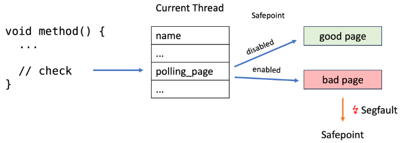
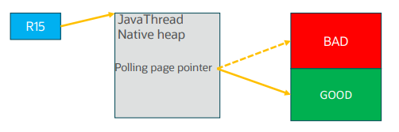
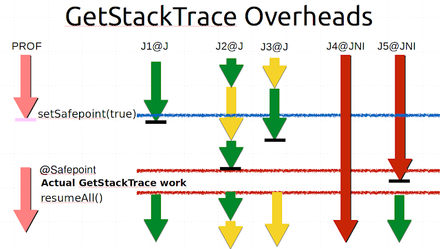

# Threads Handshake

Threads Handshake 是一种无需执行 Global VM Safepoint 即可在指定线程上执行 callback 的技术。使停止单个线程（而不是停止所有线程）变得可行且 light-weight。

技术基本信息：
- JEP: [JEP 312: Thread-Local Handshakes](https://openjdk.org/jeps/312)
- JEP 提交时间： 2017/08/01 13:30
- Since: JDK 10
- 首先应用/引入于： [JEP 333: ZGC: A Scalable Low-Latency Garbage Collector (Experimental)](https://openjdk.org/jeps/333)

## 作用

能够停止单个线程具有多种应用场景：

- 改进`偏向锁撤销(biased lock revocation)`，只停止单个线程以撤销偏向，而不是所有线程。
- 减少不同类型的`可服务性查询 serviceability queries`对 VM 整体延迟的影响，例如获取所有线程的`堆栈跟踪 stack traces`，这在具有大量 Java 线程的 VM 上可能是一项缓慢的操作。
- 通过减少对`信号 signals`的依赖来执行更安全的堆栈跟踪采样。
- 通过与 Java 线程进行握手，使用所谓的 `Asymmetric Dekker Synchronization` 技术消除一些`内存屏障 memory barrier`。例如，G1 与 CMS 均需要使用的 `conditional card mark code` 将不需要`memory barrier`。因此，可以优化 G1 `post write barrier`。

所有这些都均通过减少 global safepoint 的数量来帮助 VM 实现更低的延迟。


## 原理
 `handshake operation` 是针对每个 `JavaThread` 执行的 callback，该 callback 在该线程处于 safepoint 时执行。 callback 由被 safepoint 挂起的 `目标线程` 本身或 `VM thread` 执行，同时保持 `目标线程` 处于 `blocked state`。
 `safepointing` 和 `handshaking` 之间的最大区别在于，每个(可以多个) `目标线程` 的操作将尽快在 `目标线程` 上执行，并且它们将在自己的 callback 操作完成后立即恢复原程序的执行。如果已知 目标 JavaThread 正在运行，那么也可以与该目标 JavaThread 进行 `handshaking`。

在初始实现中，同一时间点最多只能有一个 `handshake operation` 实例。但是，该 `handshake operation`  可以指定多个 `目标 JavaThread` 。`VM Thread` 将通过一个 `VM operation` 协调 `handshake operation` ，这将有效地防止在执行 `handshake operation` 期间触发 `global safepoint`。

当前的 safepoint 实现方案已修改为： 
在每个线程中增加本地指针，执行间接寻址 polling page (将在下文说明)，这使得可以指定单个线程的原程序，因访问了禁止访问的保护页面(trap on the guard page) 而中收到 SIGSEGV signal 并断切换到 signal handler 。本质上，始终会有两个 polling page ：一个始终受保护(不能访问)，另一个始终不受保护(可访问)。为了强制线程 `让步(yield)`，VM 会更新 目标线程 的 polling page 指针以指向受保护的 page。

Thread-local handshakes 最初在 x64 和 SPARC 上实现。其他平台保持原有安全点。新 java 选项 `-XX:ThreadLocalHandshakes`（默认值为 true）允许用户在受支持的平台上选择原有安全点方案。


(javathread-state)=
## JavaThread - State


Safepoint 机制的实现依赖于 [JavaThread](/exec-engine/threads/java-thread/java-thread.md) 。


[src/hotspot/share/runtime/javaThread.hpp](https://github.com/openjdk/jdk//blob/890adb6410dab4606a4f26a942aed02fb2f55387/src/hotspot/share/runtime/javaThread.hpp#L244)

```c++
class JavaThread: public Thread {
...
  // Safepoint support
 public:                                                        // Expose _thread_state for SafeFetchInt()
  volatile JavaThreadState _thread_state;
 private:
  SafepointMechanism::ThreadData _poll_data;
  ThreadSafepointState*          _safepoint_state;              // Holds information about a thread during a safepoint
  address                        _saved_exception_pc;           // Saved pc of instruction where last implicit exception happened

```

[src/hotspot/share/utilities/globalDefinitions.hpp](https://github.com/openjdk/jdk//blob/890adb6410dab4606a4f26a942aed02fb2f55387/src/hotspot/share/utilities/globalDefinitions.hpp#L1030)

```c++
// JavaThreadState keeps track of which part of the code a thread is executing in. This
// information is needed by the safepoint code.
//
// There are 4 essential states:
//
//  _thread_new         : Just started, but not executed init. code yet (most likely still in OS init code)
//  _thread_in_native   : In native code. This is a safepoint region, since all oops will be in jobject handles
//  _thread_in_vm       : Executing in the vm
//  _thread_in_Java     : Executing either interpreted or compiled Java code (or could be in a stub)
//
// Each state has an associated xxxx_trans state, which is an intermediate state used when a thread is in
// a transition from one state to another. These extra states makes it possible for the safepoint code to
// handle certain thread_states without having to suspend the thread - making the safepoint code faster.
//
// Given a state, the xxxx_trans state can always be found by adding 1.
//
enum JavaThreadState {
  _thread_uninitialized     =  0, // should never happen (missing initialization)
  _thread_new               =  2, // just starting up, i.e., in process of being initialized
  _thread_new_trans         =  3, // corresponding transition state (not used, included for completeness)
  _thread_in_native         =  4, // running in native code
  _thread_in_native_trans   =  5, // corresponding transition state
  _thread_in_vm             =  6, // running in VM
  _thread_in_vm_trans       =  7, // corresponding transition state
  _thread_in_Java           =  8, // running in Java or in stub code
  _thread_in_Java_trans     =  9, // corresponding transition state (not used, included for completeness)
  _thread_blocked           = 10, // blocked in vm
  _thread_blocked_trans     = 11, // corresponding transition state
  _thread_max_state         = 12  // maximum thread state+1 - used for statistics allocation
};

```

其中 `class JavaThread` 的 `JavaThreadState _thread_state` 字段记录了线程的状态。


:::{figure-md}


*图: JavaThread 状态机*
:::
*[用 Draw.io 打开](https://app.diagrams.net/?ui=sketch#Uhttps%3A%2F%2Fjvm-insider.mygraphql.com%2Fzh-cn%2Flatest%2F_images%2Fjavathread-state.drawio.svg)*


> [来自: HotSpot JVM Deep Dive - Safepoint](https://www.youtube.com/watch?v=JkbWPPNc4SI&ab_channel=Java)
>
> This is the state machine for the java thread and we can further classify it into the following categories:
>
> - `mutable thread state` it's a state in which the thread can mute it the java heap or its thread local gc routes
> - `immutable thread states` is a state where the threat can do none of these things
> - `transition states` which act like bridges between the mutable and the immutable states a transition state has a **safe point check** or a **poll instruction** together with appropriate fencing


这是 Java 线程的状态机，我们可以进一步将其分为以下类别：

- `mutable thread state 可变线程状态` 线程可以修改 Java 堆或其线程本地 GC 数据
- `immutable thread states 不可变线程状态` 不能修改 oop 的状态
- `transition states 过渡状态` 充当`mutable thread state`和`immutable thread states` 之间的桥梁，过渡状态具有 **safe point check** 或 **轮询指令** 以及适当的隔离


> [来自: HotSpot JVM Deep Dive - Safepoint](https://youtu.be/JkbWPPNc4SI?si=YIq5HIHvSQFcC4U9&t=597)
>
> Let's for example take a look at this situation:
> we have a new thread comes into being it starts running in the `VM state`.
> Let's say this thread now wants to execute some java code. In order to do that it will need to traverse a transition into the `java state` and as that the transition as we said contains a `save point check`. Some notable transitions here is that the `java code(java state)` can transition to `VM state` and to `Native state` **without** performing save point checks instead the save point check is performed when the thread returns to `state java`.
>
> 
>
> Another important takeaway here is that code executing in `state native` is considered safe this means that during a safe point java threads can actually continue running native code and this also means that counter to the intuitive notion that a safe point involves blocking or halting all java threads it only means that they do not executein a sense a sensitive `mutable state`


关于 `transition states` 的作用 ，让我们看一下这种情况：
我们有一个新的线程出现，一开始在 `VM state` 中运行。
假设这个线程现在要执行一些 Java 代码。为了做到这一点，它将需要间接跳转到  ` java state` ，这个跳转包含 safepoint check。 值得注意的是，Java 代码（`Java state`） 可以直接跳转到 `VM state` 和  `native state` ，**无需** 执行 safepoint check，但在线程返回到 `Java state` 时执行，需要 safepoint check 。


另一个要注意的是，在`native state`下执行的代码被认为是安全的，这意味着在安全点期间，java 线程实际上可以继续运行 native code ，这也意味着，与安全点会阻塞或停止所有 java 线程的直观想法相反，在安全点上的线程，只意味着不会执行敏感的 `mutable state` 操作。

## 基础知识

- [JIT 生成代码的寄存器分类](/exec-engine/calling-convention/calling-convention.md#jit-code-registers)


## 实现封装

### HandshakeOperation


#### closure callback 对象包

src/hotspot/share/memory/iterator.hpp
```c++
// Thread iterator
class ThreadClosure {
 public:
  virtual void do_thread(Thread* thread) = 0;
};
```


[src/hotspot/share/runtime/handshake.hpp](https://github.com/openjdk/jdk//blob/890adb6410dab4606a4f26a942aed02fb2f55387/src/hotspot/share/runtime/handshake.hpp#L48)
```c++
// A handshake closure is a callback that is executed for a JavaThread
// while it is in a safepoint/handshake-safe state. Depending on the
// nature of the closure, the callback may be executed by the initiating
// thread, the target thread, or the VMThread. If the callback is not executed
// by the target thread it will remain in a blocked state until the callback completes.
class HandshakeClosure : public ThreadClosure, public CHeapObj<mtThread> {
  const char* const _name;
 public:
  HandshakeClosure(const char* name) : _name(name) {}
  virtual ~HandshakeClosure()                      {}
  const char* name() const                         { return _name; }
  virtual bool is_async()                          { return false; }
  virtual bool is_suspend()                        { return false; }
  virtual bool is_async_exception()                { return false; }
  virtual void do_thread(Thread* thread) = 0;
};

class AsyncHandshakeClosure : public HandshakeClosure {
 public:
   AsyncHandshakeClosure(const char* name) : HandshakeClosure(name) {}
   virtual ~AsyncHandshakeClosure() {}
   virtual bool is_async()          { return true; } //与 HandshakeClosure 的不同点
};
```

根据 closure 的属性，callback 可以在以下线程之一中执行 :
- 发起 thread
- 目标 thread 
- VM Thread


src/hotspot/share/runtime/handshake.cpp
```c++
class HandshakeOperation : public CHeapObj<mtThread> {
 protected:
  HandshakeClosure*   _handshake_cl;
  // Keeps track of emitted and completed handshake operations.
  // Once it reaches zero all handshake operations have been performed.
  int32_t             _pending_threads;
  JavaThread*         _target;
  Thread*             _requester;
  void prepare(JavaThread* current_target, Thread* executing_thread);
  void do_handshake(JavaThread* thread);
  bool is_completed() {
    int32_t val = Atomic::load(&_pending_threads);
    assert(val >= 0, "_pending_threads=%d cannot be negative", val);
    return val == 0;
  }

```

### 发起 Handshake

src/hotspot/share/runtime/handshake.hpp
```c++
class Handshake : public AllStatic {
 public:
  // Execution of handshake operation
  static void execute(HandshakeClosure*       hs_cl);
  // This version of execute() relies on a ThreadListHandle somewhere in
  // the caller's context to protect target (and we sanity check for that).
  static void execute(HandshakeClosure*       hs_cl, JavaThread* target);
  // This version of execute() is used when you have a ThreadListHandle in
  // hand and are using it to protect target. If tlh == nullptr, then we
  // sanity check for a ThreadListHandle somewhere in the caller's context
  // to verify that target is protected.
  static void execute(HandshakeClosure*       hs_cl, ThreadsListHandle* tlh, JavaThread* target);
  // This version of execute() relies on a ThreadListHandle somewhere in
  // the caller's context to protect target (and we sanity check for that).
  static void execute(AsyncHandshakeClosure*  hs_cl, JavaThread* target);
};
```

src/hotspot/share/runtime/handshake.cpp
```c++
void Handshake::execute(HandshakeClosure* hs_cl) {
  HandshakeOperation cto(hs_cl, nullptr, Thread::current());
  VM_HandshakeAllThreads handshake(&cto);
  VMThread::execute(&handshake);
}

void Handshake::execute(HandshakeClosure* hs_cl, JavaThread* target) {
  // tlh == nullptr means we rely on a ThreadsListHandle somewhere
  // in the caller's context (and we sanity check for that).
  Handshake::execute(hs_cl, nullptr, target);
}

void Handshake::execute(HandshakeClosure* hs_cl, ThreadsListHandle* tlh, JavaThread* target) {
  JavaThread* self = JavaThread::current();
  HandshakeOperation op(hs_cl, target, Thread::current());
  ...
  // Keeps count on how many of own emitted handshakes
  // this thread execute.
  int emitted_handshakes_executed = 0;
  HandshakeSpinYield hsy(start_time_ns);
  while (!op.is_completed()) {
    HandshakeState::ProcessResult pr = target->handshake_state()->try_process(&op);
    if (pr == HandshakeState::_succeeded) {
      emitted_handshakes_executed++;
    }
    if (op.is_completed()) {
      break;
    }

    // Check if handshake operation has timed out
    check_handshake_timeout(start_time_ns, &op, target);

    hsy.add_result(pr);
    // Check for pending handshakes to avoid possible deadlocks where our
    // target is trying to handshake us.
    if (SafepointMechanism::should_process(self)) {
      // Will not suspend here.
      ThreadBlockInVM tbivm(self);
    }
    hsy.process();
  }
  ...
}

void Handshake::execute(AsyncHandshakeClosure* hs_cl, JavaThread* target) {
  jlong start_time_ns = os::javaTimeNanos();
  AsyncHandshakeOperation* op = new AsyncHandshakeOperation(hs_cl, target, start_time_ns);

  guarantee(target != nullptr, "must be");

  Thread* current = Thread::current();
  if (current != target) {
    // Another thread is handling the request and it must be protecting
    // the target.
    guarantee(Thread::is_JavaThread_protected_by_TLH(target),
              "missing ThreadsListHandle in calling context.");
  }
  // Implied else:
  // The target is handling the request itself so it can't be dead.

  target->handshake_state()->add_operation(op);
}
```

### VM_HandshakeAllThreads - VM_Operation

VM_HandshakeAllThreads 是一个 VM_Operation ：

src/hotspot/share/runtime/handshake.cpp
```c++
class VM_HandshakeAllThreads: public VM_Operation {
  HandshakeOperation* const _op;
 public:
  VM_HandshakeAllThreads(HandshakeOperation* op) : _op(op) {}

  const char* cause() const { return _op->name(); }

  bool evaluate_at_safepoint() const { return false; } //注意，本 VM_Operation 本身 doit() 不需要 safepoint

  void doit() {
    ...
    JavaThreadIteratorWithHandle jtiwh;
    int number_of_threads_issued = 0;
    for (JavaThread* thr = jtiwh.next(); thr != nullptr; thr = jtiwh.next()) {
      thr->handshake_state()->add_operation(_op);
      number_of_threads_issued++;
    }    
    ...
    HandshakeSpinYield hsy(start_time_ns);
    // Keeps count on how many of own emitted handshakes
    // this thread execute.
    int emitted_handshakes_executed = 0;
    do {
      // Check if handshake operation has timed out
      check_handshake_timeout(start_time_ns, _op);

      // Have VM thread perform the handshake operation for blocked threads.
      // Observing a blocked state may of course be transient but the processing is guarded
      // by mutexes and we optimistically begin by working on the blocked threads
      jtiwh.rewind();
      for (JavaThread* thr = jtiwh.next(); thr != nullptr; thr = jtiwh.next()) {
        // A new thread on the ThreadsList will not have an operation,
        // hence it is skipped in handshake_try_process.
        HandshakeState::ProcessResult pr = thr->handshake_state()->try_process(_op);
        hsy.add_result(pr);
        if (pr == HandshakeState::_succeeded) {
          emitted_handshakes_executed++;
        }
      }
      hsy.process();
    } while (!_op->is_completed());    
  }


```


### JavaThread

每个 JavaThread 都有自己专用的 HandshakeState 来记录 handshakes 状态。

src/hotspot/share/runtime/handshake.hpp
```c++
// The HandshakeState keeps track of an ongoing handshake for this JavaThread.
// VMThread/Handshaker and JavaThread are serialized with _lock making sure the
// operation is only done by either VMThread/Handshaker on behalf of the
// JavaThread or by the target JavaThread itself.
class HandshakeState {
  // This a back reference to the JavaThread,
  // the target for all operation in the queue.
  JavaThread* _handshakee;
  // The queue containing handshake operations to be performed on _handshakee.
  FilterQueue<HandshakeOperation*> _queue;
  // Provides mutual exclusion to this state and queue. Also used for
  // JavaThread suspend/resume operations.
  Monitor _lock;
  // Set to the thread executing the handshake operation.
  Thread* volatile _active_handshaker;

  bool claim_handshake();
  bool possibly_can_process_handshake();
  bool can_process_handshake();

  bool have_non_self_executable_operation();
  HandshakeOperation* get_op_for_self(bool allow_suspend, bool check_async_exception);
  HandshakeOperation* get_op();
  void remove_op(HandshakeOperation* op);

  void set_active_handshaker(Thread* thread) { Atomic::store(&_active_handshaker, thread); }
...
  void add_operation(HandshakeOperation* op);

...
  // Suspend/resume support
 private:
  // This flag is true when the thread owning this
  // HandshakeState (the _handshakee) is suspended.
  volatile bool _suspended;
  // This flag is true while there is async handshake (trap)
  // on queue. Since we do only need one, we can reuse it if
  // thread gets suspended again (after a resume)
  // and we have not yet processed it.
  bool _async_suspend_handshake;

  };

```


src/hotspot/share/runtime/javaThread.hpp
```c++
class JavaThread: public Thread {
...
  // Support for thread handshake operations
  HandshakeState _handshake;
 public:
  HandshakeState* handshake_state() { return &_handshake; }

  // A JavaThread can always safely operate on it self and other threads
  // can do it safely if they are the active handshaker.
  bool is_handshake_safe_for(Thread* th) const {
    return _handshake.active_handshaker() == th || this == th;
  }

  // Suspend/resume support for JavaThread
  // higher-level suspension/resume logic called by the public APIs
  bool java_suspend();
  bool java_resume();
  bool is_suspended()     { return _handshake.is_suspended(); }

```

## Handshake Arming

### 实验环境

以下结合示例代码 [SafepointGDB.java](https://github.com/labilezhu/pub-diy/blob/f9e68a10cc79a4aa24c33d2724967a527c90eb25/jvm-insider-book/memory/java-obj-layout/src/com/mygraphql/jvm/insider/safepoint/SafepointGDB.java#L14) ，以及本书实验环境一节 [用 VSCode gdb 去 debug JVM](/appendix-lab-env/debug-jdk/debug-jdk-tools.md#vscode-gdb-attach-jvm-process) 的环境，来理论结合实验 fact check 分析一下内存分配失败后诱发 GC 的 Safepoint 流程。

由于 ZGC 重度使用 Handshake ，所以下面以 ZGC 为例。

```bash
bash -c 'echo $$ > /tmp/jvm-insider.pid && exec setarch $(uname -m) --addr-no-randomize /home/labile/opensource/jdk/build/linux-x86_64-server-slowdebug-hsdis/jdk/bin/java -XX:+AlwaysPreTouch  -Xms100m -Xmx100m -XX:MaxTenuringThreshold=5 -server -XX:+UseZGC  -XX:-UseCompressedOops -XX:+UnlockDiagnosticVMOptions "-Xlog:gc*=debug::tid" -Xlog:safepoint=debug::tid -cp /home/labile/pub-diy/jvm-insider-book/memory/java-obj-layout/out/production/java-obj-layout com.mygraphql.jvm.insider.safepoint.SafepointGDB'
```

ZGC XMark :
```
libjvm.so!VM_HandshakeAllThreads::VM_HandshakeAllThreads(VM_HandshakeAllThreads * const this, HandshakeOperation * op) (/home/labile/opensource/jdk/src/hotspot/share/runtime/handshake.cpp:239)
libjvm.so!Handshake::execute(HandshakeClosure * hs_cl) (/home/labile/opensource/jdk/src/hotspot/share/runtime/handshake.cpp:349)
libjvm.so!XMark::flush(XMark * const this, bool at_safepoint) (/home/labile/opensource/jdk/src/hotspot/share/gc/x/xMark.cpp:472)
libjvm.so!XMark::try_flush(XMark * const this, volatile size_t * nflush) (/home/labile/opensource/jdk/src/hotspot/share/gc/x/xMark.cpp:483)
libjvm.so!XMark::try_proactive_flush(XMark * const this) (/home/labile/opensource/jdk/src/hotspot/share/gc/x/xMark.cpp:498)
libjvm.so!XMark::work_without_timeout(XMark * const this, XMarkContext * context) (/home/labile/opensource/jdk/src/hotspot/share/gc/x/xMark.cpp:571)
libjvm.so!XMark::work(XMark * const this, uint64_t timeout_in_micros) (/home/labile/opensource/jdk/src/hotspot/share/gc/x/xMark.cpp:647)
libjvm.so!XMarkTask::work(XMarkTask * const this) (/home/labile/opensource/jdk/src/hotspot/share/gc/x/xMark.cpp:771)
libjvm.so!XTask::Task::work(XTask::Task * const this, uint worker_id) (/home/labile/opensource/jdk/src/hotspot/share/gc/x/xTask.cpp:34)
libjvm.so!WorkerTaskDispatcher::worker_run_task(WorkerTaskDispatcher * const this) (/home/labile/opensource/jdk/src/hotspot/share/gc/shared/workerThread.cpp:69)
libjvm.so!WorkerThread::run(WorkerThread * const this) (/home/labile/opensource/jdk/src/hotspot/share/gc/shared/workerThread.cpp:196)
libjvm.so!Thread::call_run(Thread * const this) (/home/labile/opensource/jdk/src/hotspot/share/runtime/thread.cpp:217)
libjvm.so!thread_native_entry(Thread * thread) (/home/labile/opensource/jdk/src/hotspot/os/linux/os_linux.cpp:778)
libc.so.6!start_thread(void * arg) (pthread_create.c:442)
libc.so.6!clone3() (clone3.S:81)
```

VM Thread Handle VM_Operation:
```
libjvm.so!VM_HandshakeAllThreads::doit(VM_HandshakeAllThreads * const this) (/home/labile/opensource/jdk/src/hotspot/share/runtime/handshake.cpp:250)
libjvm.so!VM_Operation::evaluate(VM_Operation * const this) (/home/labile/opensource/jdk/src/hotspot/share/runtime/vmOperations.cpp:71)
libjvm.so!VMThread::evaluate_operation(VMThread * const this, VM_Operation * op) (/home/labile/opensource/jdk/src/hotspot/share/runtime/vmThread.cpp:281)
libjvm.so!VMThread::inner_execute(VMThread * const this, VM_Operation * op) (/home/labile/opensource/jdk/src/hotspot/share/runtime/vmThread.cpp:435)
libjvm.so!VMThread::loop(VMThread * const this) (/home/labile/opensource/jdk/src/hotspot/share/runtime/vmThread.cpp:502)
libjvm.so!VMThread::run(VMThread * const this) (/home/labile/opensource/jdk/src/hotspot/share/runtime/vmThread.cpp:175)
libjvm.so!Thread::call_run(Thread * const this) (/home/labile/opensource/jdk/src/hotspot/share/runtime/thread.cpp:217)
libjvm.so!thread_native_entry(Thread * thread) (/home/labile/opensource/jdk/src/hotspot/os/linux/os_linux.cpp:778)
libc.so.6!start_thread(void * arg) (pthread_create.c:442)
libc.so.6!clone3() (clone3.S:81)
```

```c++
class VM_HandshakeAllThreads: public VM_Operation {
...

  void doit() {
    jlong start_time_ns = os::javaTimeNanos();

    JavaThreadIteratorWithHandle jtiwh;
    int number_of_threads_issued = 0;
    for (JavaThread* thr = jtiwh.next(); thr != nullptr; thr = jtiwh.next()) {
      thr->handshake_state()->add_operation(_op);
      number_of_threads_issued++;
    }
```

- `Common-Cleaner` 

threads call `do_handshake()`  :
```
libjvm.so!HandshakeOperation::do_handshake(HandshakeOperation * const this, JavaThread * thread) (/home/labile/opensource/jdk/src/hotspot/share/runtime/handshake.cpp:319)
libjvm.so!HandshakeState::process_by_self(HandshakeState * const this, bool allow_suspend, bool check_async_exception) (/home/labile/opensource/jdk/src/hotspot/share/runtime/handshake.cpp:562)
libjvm.so!SafepointMechanism::process(JavaThread * thread, bool allow_suspend, bool check_async_exception) (/home/labile/opensource/jdk/src/hotspot/share/runtime/safepointMechanism.cpp:159)
libjvm.so!SafepointMechanism::process_if_requested(JavaThread * thread, bool allow_suspend, bool check_async_exception) (/home/labile/opensource/jdk/src/hotspot/share/runtime/safepointMechanism.inline.hpp:83)
libjvm.so!ThreadBlockInVMPreprocess<void (JavaThread*)>::~ThreadBlockInVMPreprocess()(ThreadBlockInVMPreprocess<void(JavaThread*)> * const this) (/home/labile/opensource/jdk/src/hotspot/share/runtime/interfaceSupport.inline.hpp:218)
libjvm.so!ThreadBlockInVM::~ThreadBlockInVM(ThreadBlockInVM * const this) (/home/labile/opensource/jdk/src/hotspot/share/runtime/interfaceSupport.inline.hpp:223)
libjvm.so!Parker::park(Parker * const this, bool isAbsolute, jlong time) (/home/labile/opensource/jdk/src/hotspot/os/posix/os_posix.cpp:1741)
libjvm.so!Unsafe_Park(JNIEnv * env, jobject unsafe, jboolean isAbsolute, jlong time) (/home/labile/opensource/jdk/src/hotspot/share/prims/unsafe.cpp:768)
[Unknown/Just-In-Time compiled code] (Unknown Source:0)
```

- `C2 CompilerThre`

threads call `do_handshake()`  :
```
libjvm.so!HandshakeOperation::do_handshake(HandshakeOperation * const this, JavaThread * thread) (/home/labile/opensource/jdk/src/hotspot/share/runtime/handshake.cpp:319)
libjvm.so!HandshakeState::process_by_self(HandshakeState * const this, bool allow_suspend, bool check_async_exception) (/home/labile/opensource/jdk/src/hotspot/share/runtime/handshake.cpp:562)
libjvm.so!SafepointMechanism::process(JavaThread * thread, bool allow_suspend, bool check_async_exception) (/home/labile/opensource/jdk/src/hotspot/share/runtime/safepointMechanism.cpp:159)
libjvm.so!SafepointMechanism::process_if_requested(JavaThread * thread, bool allow_suspend, bool check_async_exception) (/home/labile/opensource/jdk/src/hotspot/share/runtime/safepointMechanism.inline.hpp:83)
libjvm.so!ThreadBlockInVMPreprocess<InFlightMutexRelease>::~ThreadBlockInVMPreprocess(ThreadBlockInVMPreprocess<InFlightMutexRelease> * const this) (/home/labile/opensource/jdk/src/hotspot/share/runtime/interfaceSupport.inline.hpp:218)
libjvm.so!Monitor::wait(Monitor * const this, uint64_t timeout) (/home/labile/opensource/jdk/src/hotspot/share/runtime/mutex.cpp:255)
libjvm.so!MonitorLocker::wait(MonitorLocker * const this, int64_t timeout) (/home/labile/opensource/jdk/src/hotspot/share/runtime/mutexLocker.hpp:255)
libjvm.so!CompileQueue::get(CompileQueue * const this, CompilerThread * thread) (/home/labile/opensource/jdk/src/hotspot/share/compiler/compileBroker.cpp:414)
libjvm.so!CompileBroker::compiler_thread_loop() (/home/labile/opensource/jdk/src/hotspot/share/compiler/compileBroker.cpp:1907)
libjvm.so!CompilerThread::thread_entry(JavaThread * thread, JavaThread * __the_thread__) (/home/labile/opensource/jdk/src/hotspot/share/compiler/compilerThread.cpp:58)
libjvm.so!JavaThread::thread_main_inner(JavaThread * const this) (/home/labile/opensource/jdk/src/hotspot/share/runtime/javaThread.cpp:719)
libjvm.so!JavaThread::run(JavaThread * const this) (/home/labile/opensource/jdk/src/hotspot/share/runtime/javaThread.cpp:704)
libjvm.so!Thread::call_run(Thread * const this) (/home/labile/opensource/jdk/src/hotspot/share/runtime/thread.cpp:217)
libjvm.so!thread_native_entry(Thread * thread) (/home/labile/opensource/jdk/src/hotspot/os/linux/os_linux.cpp:778)
libc.so.6!start_thread(void * arg) (pthread_create.c:442)
libc.so.6!clone3() (clone3.S:81)
```

- `PollinSafepoin` // Java Thread running java app code

threads call `do_handshake()`  :

```
libjvm.so!HandshakeOperation::do_handshake(HandshakeOperation * const this, JavaThread * thread) (/home/labile/opensource/jdk/src/hotspot/share/runtime/handshake.cpp:319)
libjvm.so!HandshakeState::process_by_self(HandshakeState * const this, bool allow_suspend, bool check_async_exception) (/home/labile/opensource/jdk/src/hotspot/share/runtime/handshake.cpp:562)
libjvm.so!SafepointMechanism::process(JavaThread * thread, bool allow_suspend, bool check_async_exception) (/home/labile/opensource/jdk/src/hotspot/share/runtime/safepointMechanism.cpp:159)
libjvm.so!SafepointMechanism::process_if_requested(JavaThread * thread, bool allow_suspend, bool check_async_exception) (/home/labile/opensource/jdk/src/hotspot/share/runtime/safepointMechanism.inline.hpp:83)
libjvm.so!SafepointMechanism::process_if_requested_with_exit_check(JavaThread * thread, bool check_async_exception) (/home/labile/opensource/jdk/src/hotspot/share/runtime/safepointMechanism.inline.hpp:88)
libjvm.so!ThreadSafepointState::handle_polling_page_exception(ThreadSafepointState * const this) (/home/labile/opensource/jdk/src/hotspot/share/runtime/safepoint.cpp:985)
libjvm.so!SafepointSynchronize::handle_polling_page_exception(JavaThread * thread) (/home/labile/opensource/jdk/src/hotspot/share/runtime/safepoint.cpp:778)
[Unknown/Just-In-Time compiled code] (Unknown Source:0)
```

- `main` thread sleep in `native thread state`
```
libc.so.6!__GI___libc_read(size_t nbytes, void * buf, int fd) (read.c:26)
libc.so.6!__GI___libc_read(int fd, void * buf, size_t nbytes) (read.c:24)
libjava.so!handleRead(jint fd, void * buf, jint len) (/home/labile/opensource/jdk/src/java.base/unix/native/libjava/io_util_md.c:188)
libjava.so!readBytes(JNIEnv * env, jobject this, jbyteArray bytes, jint off, jint len, jfieldID fid) (/home/labile/opensource/jdk/src/java.base/share/native/libjava/io_util.c:109)
libjava.so!Java_java_io_FileInputStream_readBytes(JNIEnv * env, jobject this, jbyteArray bytes, jint off, jint len) (/home/labile/opensource/jdk/src/java.base/share/native/libjava/FileInputStream.c:72)
[Unknown/Just-In-Time compiled code] (Unknown Source:0)
```


(polling)=
## Polling

Java 线程会高频检查 safepoint flag(safepoint check/polling) ，当发现为 true（arm) 时，就到达（进入） safepoint 状态。


### JVM 初始化

JVM 在启动时，就已经初始化了两个 Memory Page ，用于 safepoint 。一个 bad_page 不可读，如在它上执行 `test` x86指令，线程会因收到信号而挂起并跳转到信号处理器代码 。一个 good_page 可读，可正常执行 `test` x86指令：


Stack:

```
libjvm.so!SafepointMechanism::default_initialize() (/jdk/src/hotspot/share/runtime/safepointMechanism.cpp:68)
libjvm.so!SafepointMechanism::pd_initialize() (/jdk/src/hotspot/share/runtime/safepointMechanism.hpp:56)
libjvm.so!SafepointMechanism::initialize() (/jdk/src/hotspot/share/runtime/safepointMechanism.cpp:171)
libjvm.so!Threads::create_vm(JavaVMInitArgs * args, bool * canTryAgain) (/jdk/src/hotspot/share/runtime/threads.cpp:492)
libjvm.so!JNI_CreateJavaVM_inner(JavaVM ** vm, void ** penv, void * args) (/jdk/src/hotspot/share/prims/jni.cpp:3577)
libjvm.so!JNI_CreateJavaVM(JavaVM ** vm, void ** penv, void * args) (/jdk/src/hotspot/share/prims/jni.cpp:3668)
libjli.so!InitializeJVM(JavaVM ** pvm, JNIEnv ** penv, InvocationFunctions * ifn) (/jdk/src/java.base/share/native/libjli/java.c:1506)
libjli.so!JavaMain(void * _args) (/jdk/src/java.base/share/native/libjli/java.c:415)
libjli.so!ThreadJavaMain(void * args) (/jdk/src/java.base/unix/native/libjli/java_md.c:650)
libc.so.6!start_thread(void * arg) (pthread_create.c:442)
libc.so.6!clone3() (clone3.S:81)
```


[src/hotspot/share/runtime/safepointMechanism.cpp](https://github.com/openjdk/jdk//blob/890adb6410dab4606a4f26a942aed02fb2f55387/src/hotspot/share/runtime/safepointMechanism.cpp#L74)

```c++
uintptr_t SafepointMechanism::_poll_word_armed_value;
uintptr_t SafepointMechanism::_poll_page_armed_value;

//   const static intptr_t _poll_bit = 1;

void SafepointMechanism::default_initialize() {
  // Poll bit values
  _poll_word_armed_value    = poll_bit();
  _poll_word_disarmed_value = ~_poll_word_armed_value;

...
    // Polling page
    const size_t page_size = os::vm_page_size();
    const size_t allocation_size = 2 * page_size;
    char* polling_page = os::reserve_memory(allocation_size);
    os::commit_memory_or_exit(polling_page, allocation_size, false, "Unable to commit Safepoint polling page");
    MemTracker::record_virtual_memory_type((address)polling_page, mtSafepoint);

    char* bad_page  = polling_page;
    char* good_page = polling_page + page_size;

    os::protect_memory(bad_page,  page_size, os::MEM_PROT_NONE);
    os::protect_memory(good_page, page_size, os::MEM_PROT_READ);

    log_info(os)("SafePoint Polling address, bad (protected) page:" INTPTR_FORMAT ", good (unprotected) page:" INTPTR_FORMAT, p2i(bad_page), p2i(good_page));

    // Poll address values
    _poll_page_armed_value    = reinterpret_cast<uintptr_t>(bad_page); // <<<<<<<
    _poll_page_disarmed_value = reinterpret_cast<uintptr_t>(good_page); // <<<<<<<
    _polling_page = (address)bad_page; // <<<<<<<
}
```


(do-polling)=

### 真正 Polling


先看看相关的数据结构：

[src/hotspot/share/runtime/javaThread.hpp](https://github.com/openjdk/jdk//blob/890adb6410dab4606a4f26a942aed02fb2f55387/src/hotspot/share/runtime/javaThread.hpp#L246)

```c++
class JavaThread: public Thread {
    ...
 private:
  SafepointMechanism::ThreadData _poll_data;
  ThreadSafepointState*          _safepoint_state;              // Holds information about a thread during a safepoint
  address                        _saved_exception_pc;           // Saved pc of instruction where last implicit exception happened
```


[src/hotspot/share/runtime/safepointMechanism.hpp](https://github.com/openjdk/jdk//blob/890adb6410dab4606a4f26a942aed02fb2f55387/src/hotspot/share/runtime/safepointMechanism.hpp#L68)

```c++
class SafepointMechanism {
...
  static address _polling_page;
...    
  struct ThreadData {
    volatile uintptr_t _polling_word;
    volatile uintptr_t _polling_page;
    ...
  };
```

从上面代码，可以猜到 `SafepointMechanism._polling_page` 是个 Global var。对应着 Global Safepoint。 而  `JavaThread._poll_data._polling_page` 是 Thread Local 的，对应着 Thread-Local Handshakes 。

自从 OpenJDK10 的 [JEP 312: Thread-Local Handshakes - 2017年](https://openjdk.org/jeps/312) 后，就有了非 JVM Global 的 Safepoint - Thread Safepoint 。而 JVM Global 的 Safepoint 好像也修改为基于 `Thread-Local Handshakes` 去实现，即对每一条 JavaThread 执行 `Thread-Local Handshakes`。


在 OpenJDK10 时，可以通过 `-XX:-ThreadLocalHandshakes` 去禁用 ThreadLocalHandshakes ，但以下几个过程后就不可以禁用了：

- Deprecated in JDK13
- Obsoleted in JDK14
- Expired in JDK15

原因当然是 OpenJDK 已经强依赖于这个特性了： [Obsolete ThreadLocalHandshakes - bugs.openjdk.org](https://bugs.openjdk.org/browse/JDK-8220049) .


#### JIT 编译后的 Polling

可以用下图说明 polling_page 的切换：



*图: polling_page 的切换. Source: [The Inner Workings of Safepoints 2023 - mostlynerdless.de](https://mostlynerdless.de/blog/2023/07/31/the-inner-workings-of-safepoints/)*




*图: JavaThread 与 R15 寄存器. Source: [Robbin Ehn: Handshaking HotSpot - Youtube Java Channel - 2020](https://www.youtube.com/watch?v=VBCOfAJ409s&ab_channel=Java)*


上图意为，读取本线程对应的 JavaThread._poll_data(SafepointMechanism::ThreadData).polling_page 指向的地址。其中 R15 寄存器一般会指向本线程对应的  JavaThread。


```c++
// Generated poll in JIT 
// poll-offset: JavaThread._poll_data(SafepointMechanism::ThreadData).polling_page 在 JavaThread 的 offset
// thread_reg: 一般指 R15 寄存器,用于保存本线程对应的 JavaThread
mov poll-offset + thread_reg, reg 
test rax, reg
```

Source: [Robbin Ehn: Handshaking HotSpot - Youtube Java Channel - 2020](https://www.youtube.com/watch?v=VBCOfAJ409s&ab_channel=Java)


上面显示需要两条机器指令，才能完成 polling。如果你看过 [OpenJDK11 之前的资料](https://psy-lob-saw.blogspot.com/2014/03/where-is-my-safepoint.html)，之前应该就一条机器指令就够了：

```
test   DWORD PTR [rip+0xa2b0966],eax  
```


主要原因是  OpenJDK11 默认启用 [JEP 312: Thread-Local Handshakes](https://openjdk.org/jeps/312) 的设计，要求每条 Thread 有自己的 polling_page 指针，所以需要多一条机器命令来多一层寻址。


##### JIT Polling 实验

下面，用实验观察的方法 fact check 一下。直接采用本书的 [Stack Memory Anatomy - 堆栈内存剖析 - Java Options](/exec-engine/stack-mem-anatomy/stack-mem-anatomy.md#java-options) 一节中的示例环境、程序、输出。尝试在 `java ... -XX:+PrintAssembly ... -XX:LogFile=./round3/mylogfile.log` 输出的 JIT 汇编 mylogfile.log 文件中，找出 Polling 指令。

1. 启动 GDB Debugger，见 [Stack Memory Anatomy - 堆栈内存剖析 - 启动 debugger](/exec-engine/stack-mem-anatomy/stack-mem-anatomy.md#start-debugger) 一节
2. Inspect `JavaThread` object layout。详见 [GDB JVM FAQ - Inspect Object Layout](/appendix-lab-env/gdb/gdb-faq.md#inspect-object-layout) 一节

```
(gdb) ptype /xo 'Thread'
/* offset      |    size */  type = class Thread : public ThreadShadow {
                             private:
                               static class Thread *_thr_current;
/* 0x0020      |  0x0008 */    uint64_t _nmethod_disarmed_guard_value;
...                             public:
/* 0x048c      |  0x0004 */    volatile enum JavaThreadState _thread_state;
                             private:
/* 0x0490      |  0x0010 */    struct SafepointMechanism::ThreadData {
/* 0x0490      |  0x0008 */        volatile uintptr_t _polling_word;
/* 0x0498      |  0x0008 */        volatile uintptr_t _polling_page;

                                   /* total size (bytes):   16 */
                               } _poll_data;
/* 0x04a0      |  0x0008 */    class ThreadSafepointState *_safepoint_state;
/* 0x04a8      |  0x0008 */    address _saved_exception_pc;
```

3. 找到 Poll 指令

可见，_polling_page 的 offset 为 0x0498，即 0x498 。于是，在 mylogfile.log 中找 0x498 。发现几百个，抽其中一个：

```
[Entry Point]
  # {method} {0x00007ffbf4249ab8} &apos;enqueue&apos; &apos;(Ljava/util/concurrent/locks/AbstractQueuedSynchronizer$ConditionNode;)V&apos; in &apos;java/util/concurrent/locks/AbstractQueuedSynchronizer&apos;
  # this:     rsi:rsi   = &apos;java/util/concurrent/locks/AbstractQueuedSynchronizer&apos;
  # parm0:    rdx:rdx   = &apos;java/util/concurrent/locks/AbstractQueuedSynchronizer$ConditionNode&apos;
  #           [sp+0x40]  (sp of caller)
...  
  0x00007fffed738747:   call   0x00007fffed1170a0           ; ImmutableOopMap {[0]=Oop [16]=Derived_oop_[0] [8]=Oop [24]=Oop }
                                                            ;*invokevirtual setPrevRelaxed {reexecute=0 rethrow=0 return_oop=0}
                                                            ; - java.util.concurrent.locks.AbstractQueuedSynchronizer::enqueue@31 (line 614)
                                                            ;   {optimized virtual_call}
  0x00007fffed73874c:   nop    DWORD PTR [rax+rax*1+0x23c]  ;   {other}
...
  0x00007fffed738786:   mov    BYTE PTR [r9+r10*1],0x0      ;*ifeq {reexecute=0 rethrow=0 return_oop=0}
                                                            ; - java.util.concurrent.locks.AbstractQueuedSynchronizer::enqueue@40 (line 615)
 ;; B8: #	out( B3 B9 ) &lt;- in( B7 B6 )  Freq: 8.17349
  0x00007fffed73878b:   mov    r10,QWORD PTR [r15+0x498]    ; ImmutableOopMap {rdx=Oop [0]=Oop r8=Derived_oop_[0] [24]=Oop }
                                                            ;*ifeq {reexecute=1 rethrow=0 return_oop=0}
                                                            ; - (reexecute) java.util.concurrent.locks.AbstractQueuedSynchronizer::enqueue@40 (line 615)
  0x00007fffed738792:   test   DWORD PTR [r10],eax          ;   {poll}
  0x00007fffed738795:   test   r11d,r11d
  0x00007fffed738798:   je     0x00007fffed738722
```

其中

```
0x00007fffed73878b:   mov    r10,QWORD PTR [r15+0x498]
0x00007fffed738792:   test   DWORD PTR [r10],eax
```

即为 Safepoint polling。 上文已经介绍过， r15 寄存器保存 Thread Local 的 JavaThread 对象指针。还可以看到一些 OopMap 的身影。


Java 源码：

[src/java.base/share/classes/java/util/concurrent/locks/AbstractQueuedSynchronizer.java](https://github.com/openjdk/jdk//blob/890adb6410dab4606a4f26a942aed02fb2f55387/src/java.base/share/classes/java/util/concurrent/locks/AbstractQueuedSynchronizer.java#L606)

```
606:     final void enqueue(ConditionNode node) {
607:         if (node != null) {
608:             boolean unpark = false;
609:             for (Node t;;) {
610:                 if ((t = tail) == null && (t = tryInitializeHead()) == null) {
611:                     unpark = true;             
612:                     break;
613:                 }
614:                 node.setPrevRelaxed(t);        // <<<< Safe point polled after call
615:                 if (casTail(t, node)) { 
616:                     t.next = node;
617:                     if (t.status < 0)         
618:                         unpark = true;
619:                     break;
620:                 }
621:             }
622:             if (unpark)
623:                 LockSupport.unpark(node.waiter);
624:         }
625:     }
```


4. 进一步探索

这时，再看看 JavaThread 的属性。要知道 JavaThread 的属性，首先要知道 JavaThread 的地址。这时用 jhsdb：

```
hsdb> threads
513811 main
State: BLOCKED
Stack in use by Java: 0x00007ffff5285740 .. 0x00007ffff5285830
Base of Stack: 0x00007ffff5287000
Last_Java_SP: 0x00007ffff5285740
Last_Java_FP: null
Last_Java_PC: 0x00007fffed72c9af
Thread id: 513811

hsdb> threadcontext 513811
Thread "main" id=513811 Address=0x00007ffff002b3c0
```

可见，main JavaThread 的地址为 Address=0x00007ffff002b3c0 。hsdb inspect 一下:
```
hsdb> inspect 0x00007ffff002b3c0
Type is JavaThread (size of 1904)
oop ThreadShadow::_pending_exception: null
char* ThreadShadow::_exception_file: char @ null
int ThreadShadow::_exception_line: 0
ThreadLocalAllocBuffer Thread::_tlab: ThreadLocalAllocBuffer @ 0x00007ffff002b580
jlong Thread::_allocated_bytes: 0
ResourceArea* Thread::_resource_area: ResourceArea @ 0x00007ffff0018ba0
LockStack JavaThread::_lock_stack: LockStack @ 0x00007ffff002bae8
OopHandle JavaThread::_threadObj: OopHandle @ 0x00007ffff002b770
OopHandle JavaThread::_vthread: OopHandle @ 0x00007ffff002b778
OopHandle JavaThread::_jvmti_vthread: OopHandle @ 0x00007ffff002b780
OopHandle JavaThread::_scopedValueCache: OopHandle @ 0x00007ffff002b788
JavaFrameAnchor JavaThread::_anchor: JavaFrameAnchor @ 0x00007ffff002b798
oop JavaThread::_vm_result: null
Metadata* JavaThread::_vm_result_2: Metadata @ null
ObjectMonitor* JavaThread::_current_pending_monitor: ObjectMonitor @ null
bool JavaThread::_current_pending_monitor_is_from_java: 1
ObjectMonitor* JavaThread::_current_waiting_monitor: ObjectMonitor @ null
uint32_t JavaThread::_suspend_flags: 0
oop JavaThread::_exception_oop: null
address JavaThread::_exception_pc: address @ 0x00007ffff002b918
int JavaThread::_is_method_handle_return: 0
address JavaThread::_saved_exception_pc: address @ 0x00007ffff002b868
JavaThreadState JavaThread::_thread_state: 10
OSThread* JavaThread::_osthread: OSThread @ 0x00007ffff002d9a0
address JavaThread::_stack_base: address @ 0x00007ffff002b718
size_t JavaThread::_stack_size: 1048576
vframeArray* JavaThread::_vframe_array_head: vframeArray @ null
vframeArray* JavaThread::_vframe_array_last: vframeArray @ 0x00007ffff031da90
JNIHandleBlock* JavaThread::_active_handles: JNIHandleBlock @ 0x00007ffff01686f0
JavaThread::TerminatedTypes JavaThread::_terminated: 57002
```

还是 gdb 的信息会比 hsdb 多：

```
$1 = (class JavaThread *) 0x7ffff002b3c0
(gdb) p *((JavaThread*)0x00007ffff002b3c0)
$2 = {<Thread> = {<ThreadShadow> = {<CHeapObj<(MEMFLAGS)2>> = {<No data fields>}, _vptr.ThreadShadow = 0x7ffff7b4c4c8 <vtable for JavaThread+16>, _pending_exception = 0x0, _exception_file = 0x0, _exception_line = 0}, _nmethod_disarmed_guard_value = 1, ...

(gdb) p /x ((JavaThread*)0x00007ffff002b3c0)->_poll_data._polling_page
$4 = 0x7ffff7fa1000
```

然后，在 这前 pmap 的输出文件 pmap.txt 中找到：

```
         Address Perm   Offset Device    Inode     Size     Rss     Pss Referenced Anonymous LazyFree ShmemPmdMapped FilePmdMapped Shared_Hugetlb Private_Hugetlb Swap SwapPss Locked THPeligible Mapping

    7ffff7fa1000 ---p 00000000  00:00        0        4       0       0          0         0        0              0             0              0               0    0       0      0           0 
    7ffff7fa2000 r--p 00000000  00:00        0        4       0       0          0         0        0              0             0              0               0    0       0      0           0 
```

可见，在 core dump 时，thread local 的 _polling_page 指向了 bad page(没有 `r` Perm) 。即是 arming 状态。


再好奇一下 SafepointMechanism 的 static page 指针。

```
p/x SafepointMechanism::_poll_page_armed_value
$5 = 0x7ffff7fa1000 (Perm:---p)
p/x SafepointMechanism::_poll_page_disarmed_value
$6 = 0x7ffff7fa2000 (Perm:r--p)
p/x SafepointMechanism::_polling_page
$7 = 0x7ffff7fa1000
```


##### 更多 JIT Polling 实现方式

以上是 JIT Polling 方式的一个重要实现方式，JIT 对于不同类型的场景，可能会使用不同的方式。如： //TBD .


#### Non-JIT Polling

//TBD

(reach)=
## Reach and handle

在 VMThread arm safepoint (详见本书的 [Safepoint - Arm Safepoint - 标记所有线程](/exec-engine/safepoint/safepoint.md#arming-safepoint)） 后。polling 的应用线程最终会感知到 safepoint 的聚集要求(arming)。


- 对于 绿色 `immutable thread state` 状态的 JavaThread:  

  `vm thread`  通过 `arm` Java 线程的 polling page，这实际上在 arm safepoint 期间阻止了线程从所有绿色 `immutable thread state` 中唤醒/返回后，转换到任何红色 unsafe `mutable thread state` 。见 [src/hotspot/share/utilities/globalDefinitions.hpp](https://github.com/openjdk/jdk//blob/890adb6410dab4606a4f26a942aed02fb2f55387/src/hotspot/share/utilities/globalDefinitions.hpp#L1030)：

  ```c++
  // Each state has an associated xxxx_trans state, which is an intermediate state used when a thread is in
  // a transition from one state to another. These extra states makes it possible for the safepoint code to
  // handle certain thread_states without having to suspend the thread - making the safepoint code faster.
  ```

  

:::{figure-md} 图: 当 JavaThread 被 arm polling page 后的状态机变化


*图: 当 JavaThread 被 arm polling page 后的状态机变化*
:::
*[用 Draw.io 打开](https://app.diagrams.net/?ui=sketch#Uhttps%3A%2F%2Fjvm-insider.mygraphql.com%2Fzh-cn%2Flatest%2F_images%2Fdisable-to-mutable-thread-state-by-sp-check.drawio.svg)*


- 对于 红色 `mutable thread state` 状态的 JavaThread: 

  `vm thread`  通过 `arm` Java 线程的 polling page， 触发 Java 线程从 `mutable thread state` 转换为 `immutable thread state` 状态。并且作为此转换的结果，线程本地 GC 树被同步到 JavaThread 对象。

  对于 `VM state` 的线程，这意味着需要等待线程自行完成转换。`VM state` 中只有少数几个地方显式执行安全点检查。例如，在争夺 `VM mutex 互斥锁`或 `VM monitor` 时。此设计的前提是 Java 线程应尽可能少地处于 `VM state`。但对于在 `state java`  下运行的线程，情况有所不同。

  


下图举一个例子，尝试说明在几种线程状态和操作系统调度环境下，线程到达 Safepoint (GetStackTrace 需要 Stop The World) 的情况。




*图:  几种状态和系统调度环境下，线程到达 Safepoint 的情况. Source: [Safepoints: Meaning, Side Effects and Overheads - psy-lob-saw.blogspot.com](https://psy-lob-saw.blogspot.com/2015/12/safepoints.html)*


- 绿色箭头：java state thread and running **on CPU**
- 黄色箭头：java state thread and **off CPU** (因 CPU 资源不足等原因)
- 红色箭头：JNI state thread


从 VMThread arm safepoint 到 应用线程 Reach Safepoint 的延迟，叫 `Time To Safe Point(TTSP)` ：

每个线程在进行 safepoint check 时如发现 safepoint arming 都会进入安全点。但到达 safepoint check  前需要执行机器指令的数量不是固定的。上图中，我们可以看到：

- J1 直接命中安全点轮询并被暂停。J2 和 J3 正在争夺可用的 CPU 时间。J3 抢占了一些 CPU 时间，将 J2 推入运行队列，但 J2 并未进入安全点。J3 到达安全点并暂停，从而腾出内核，让 J2 取得足够的进展，进入安全点轮询。

- J4 和 J5 在执行 JNI 代码(`JNI state`)时属于`Immutable thread state`，它们不受 Safepoint 挂起影响。请注意，J5 在 Stop The World 执行到一半时试图离开 JNI，并在恢复执行 Java 代码前被暂停。重要的是，我们观察到不同线程到达安全点的时间各不相同，有些线程暂停的时间比其他线程长，Java 线程花很长时间到达安全点可能会耽误其他线程。


OpenJDK9 前，用 `-XX:+PrintGCApplicationStoppedTime` 可以打印出 TTSP 。OpenJDK9 后，由于采用了 `Unified Logging for GC logging` 的设计，配置修改成：
`-Xlog:safepoint` 。


### Signal Handle


JVM 启动初始化时，安装了JVM 自用的 Signal Handler ：

Stack :

```
libjvm.so!PosixSignals::install_sigaction_signal_handler(sigaction * sigAct, sigaction * oldSigAct, int sig, sa_sigaction_t handler) (/jdk/src/hotspot/os/posix/signals_posix.cpp:900)
libjvm.so!set_signal_handler(int sig) (/jdk/src/hotspot/os/posix/signals_posix.cpp:1271)
libjvm.so!install_signal_handlers() (/jdk/src/hotspot/os/posix/signals_posix.cpp:1313)
libjvm.so!PosixSignals::init() (/jdk/src/hotspot/os/posix/signals_posix.cpp:1855) // <<<<----
libjvm.so!os::init_2() (/jdk/src/hotspot/os/linux/os_linux.cpp:4613)
libjvm.so!Threads::create_vm(JavaVMInitArgs * args, bool * canTryAgain) (/jdk/src/hotspot/share/runtime/threads.cpp:482)
libjvm.so!JNI_CreateJavaVM_inner(JavaVM ** vm, void ** penv, void * args) (/jdk/src/hotspot/share/prims/jni.cpp:3577)
libjvm.so!JNI_CreateJavaVM(JavaVM ** vm, void ** penv, void * args) (/jdk/src/hotspot/share/prims/jni.cpp:3668)
libjli.so!InitializeJVM(JavaVM ** pvm, JNIEnv ** penv, InvocationFunctions * ifn) (/jdk/src/java.base/share/native/libjli/java.c:1506)
libjli.so!JavaMain(void * _args) (/jdk/src/java.base/share/native/libjli/java.c:415)
libjli.so!ThreadJavaMain(void * args) (/jdk/src/java.base/unix/native/libjli/java_md.c:650)
libc.so.6!start_thread(void * arg) (pthread_create.c:442)
libc.so.6!clone3() (clone3.S:81)
```


[src/hotspot/os/posix/signals_posix.cpp](https://github.com/openjdk/jdk//blob/890adb6410dab4606a4f26a942aed02fb2f55387/src/hotspot/os/posix/signals_posix.cpp#L1313)

```c++
// install signal handlers for signals that HotSpot needs to
// handle in order to support Java-level exception handling.
void install_signal_handlers() {
...    
  set_signal_handler(SIGSEGV); // <<<<<<<
...
}

void set_signal_handler(int sig) {
...
  struct sigaction sigAct;
  int ret = PosixSignals::install_sigaction_signal_handler(&sigAct, &oldAct,
                                                           sig, javaSignalHandler); // <<<<----
}

// Entry point for the hotspot signal handler.
static void javaSignalHandler(int sig, siginfo_t* info, void* context) {
  // Do not add any code here!
  // Only add code to either JVM_HANDLE_XXX_SIGNAL or PosixSignals::pd_hotspot_signal_handler.
  (void)JVM_HANDLE_XXX_SIGNAL(sig, info, context, true);
}

int JVM_HANDLE_XXX_SIGNAL(int sig, siginfo_t* info,
                          void* ucVoid, int abort_if_unrecognized)
{
  // Call platform dependent signal handler.
  if (!signal_was_handled) {
    JavaThread* const jt = (t != nullptr && t->is_Java_thread()) ? JavaThread::cast(t) : nullptr;
    signal_was_handled = PosixSignals::pd_hotspot_signal_handler(sig, info, uc, jt); // <<<<----
  }
...
}
```


Signal Handler 实现：

[src/hotspot/os_cpu/linux_x86/os_linux_x86.cpp](https://github.com/openjdk/jdk//blob/890adb6410dab4606a4f26a942aed02fb2f55387/src/hotspot/os_cpu/linux_x86/os_linux_x86.cpp#L207)

```c++
bool PosixSignals::pd_hotspot_signal_handler(int sig, siginfo_t* info,
                                             ucontext_t* uc, JavaThread* thread) {
...
    pc = (address) os::Posix::ucontext_get_pc(uc); // <<<<< 引发 SIGSEGV 的机器指令地址

    if (sig == SIGSEGV && info->si_addr == 0 && info->si_code == SI_KERNEL) {
      // An irrecoverable SI_KERNEL SIGSEGV has occurred.
      // It's likely caused by dereferencing an address larger than TASK_SIZE.
      return false;
    }

    // Handle ALL stack overflow variations here
    if (sig == SIGSEGV) {
      address addr = (address) info->si_addr; // <<<<< 引发 SIGSEGV 的寻址地址                                             
...
    if (thread->thread_state() == _thread_in_Java) {
      // Java thread running in Java code => find exception handler if any
      // a fault inside compiled code, the interpreter, or a stub

      if (sig == SIGSEGV && SafepointMechanism::is_poll_address((address)info->si_addr)) {  // <<<<< 引发 SIGSEGV 的寻址地址是 JVM自己初始化时建立的 bad page
        stub = SharedRuntime::get_poll_stub(pc); //  <<<<----
      } else ...
    } else ...
    // jni_fast_Get<Primitive>Field can trap at certain pc's if a GC kicks in
    // and the heap gets shrunk before the field access.
    if ((sig == SIGSEGV) || (sig == SIGBUS)) {
      address addr = JNI_FastGetField::find_slowcase_pc(pc);
      if (addr != (address)-1) {
        stub = addr;
      }
    }
...
  if (stub != nullptr) {
    // save all thread context in case we need to restore it
    if (thread != nullptr) thread->set_saved_exception_pc(pc);

    os::Posix::ucontext_set_pc(uc, stub); // <<<<---- 直接修改 PC 寄存器，goto 跳到上面获取的 SafepointBlob Stub 机器码中
    return true;
  }

}
```


### SafepointBlob Stub 机器码获取 - poll_stub

[src/hotspot/share/runtime/sharedRuntime.cpp](https://github.com/openjdk/jdk//blob/890adb6410dab4606a4f26a942aed02fb2f55387/src/hotspot/share/runtime/sharedRuntime.cpp#L554)

```c++
address SharedRuntime::get_poll_stub(address pc) {
  address stub;
  // Look up the code blob
  CodeBlob *cb = CodeCache::find_blob(pc);

  // Should be an nmethod
  guarantee(cb != nullptr && cb->is_compiled(), "safepoint polling: pc must refer to an nmethod");

  // Look up the relocation information
  assert(((CompiledMethod*)cb)->is_at_poll_or_poll_return(pc),
      "safepoint polling: type must be poll at pc " INTPTR_FORMAT, p2i(pc));
...
  bool at_poll_return = ((CompiledMethod*)cb)->is_at_poll_return(pc);
  bool has_wide_vectors = ((CompiledMethod*)cb)->has_wide_vectors();
  if (at_poll_return) {
    assert(SharedRuntime::polling_page_return_handler_blob() != nullptr,
           "polling page return stub not created yet");
    stub = SharedRuntime::polling_page_return_handler_blob()->entry_point();
  } else if (has_wide_vectors) {
    assert(SharedRuntime::polling_page_vectors_safepoint_handler_blob() != nullptr,
           "polling page vectors safepoint stub not created yet");
    stub = SharedRuntime::polling_page_vectors_safepoint_handler_blob()->entry_point();
  } else {
    assert(SharedRuntime::polling_page_safepoint_handler_blob() != nullptr,
           "polling page safepoint stub not created yet");
    stub = SharedRuntime::polling_page_safepoint_handler_blob()->entry_point(); // <<<<<<<
  }
  log_debug(safepoint)("... found polling page %s exception at pc = "
                       INTPTR_FORMAT ", stub =" INTPTR_FORMAT,
                       at_poll_return ? "return" : "loop",
                       (intptr_t)pc, (intptr_t)stub);
  return stub;
}

// JVM 启动初始化时，SafepointBlob Stub 机器码生成
static  _polling_page_safepoint_handler_blob = generate_handler_blob(CAST_FROM_FN_PTR(address, SafepointSynchronize::handle_polling_page_exception), POLL_AT_LOOP); // <<<<<<<<<
static  _polling_page_return_handler_blob    = generate_handler_blob(CAST_FROM_FN_PTR(address, SafepointSynchronize::handle_polling_page_exception), POLL_AT_RETURN);
```


JVM 启动初始化时，SafepointBlob Stub 机器码生成：

[src/hotspot/cpu/x86/sharedRuntime_x86_64.cpp](https://github.com/openjdk/jdk//blob/890adb6410dab4606a4f26a942aed02fb2f55387/src/hotspot/cpu/x86/sharedRuntime_x86_64.cpp#L3079)

```c++
//------------------------------generate_handler_blob------
//
// Generate a special Compile2Runtime blob that saves all registers,
// and setup oopmap.
//
SafepointBlob* SharedRuntime::generate_handler_blob(address call_ptr, int poll_type) {
  assert(StubRoutines::forward_exception_entry() != nullptr,
         "must be generated before");

  ResourceMark rm;
  OopMapSet *oop_maps = new OopMapSet();
  OopMap* map;

  // Allocate space for the code.  Setup code generation tools.
  CodeBuffer buffer("handler_blob", 2048, 1024);
  MacroAssembler* masm = new MacroAssembler(&buffer);

  address start   = __ pc();
  address call_pc = nullptr;
  int frame_size_in_words;
  bool cause_return = (poll_type == POLL_AT_RETURN);
  bool save_wide_vectors = (poll_type == POLL_AT_VECTOR_LOOP);

  if (UseRTMLocking) {
    // Abort RTM transaction before calling runtime
    // because critical section will be large and will be
    // aborted anyway. Also nmethod could be deoptimized.
    __ xabort(0);
  }

  // Make room for return address (or push it again)
  if (!cause_return) {
    __ push(rbx);
  }

  // Save registers, fpu state, and flags
  map = RegisterSaver::save_live_registers(masm, 0, &frame_size_in_words, save_wide_vectors);

  // The following is basically a call_VM.  However, we need the precise
  // address of the call in order to generate an oopmap. Hence, we do all the
  // work ourselves.

  __ set_last_Java_frame(noreg, noreg, nullptr, rscratch1);  // JavaFrameAnchor::capture_last_Java_pc() will get the pc from the return address, which we store next:

  // The return address must always be correct so that frame constructor never
  // sees an invalid pc.

  if (!cause_return) {
    // Get the return pc saved by the signal handler and stash it in its appropriate place on the stack.
    // Additionally, rbx is a callee saved register and we can look at it later to determine
    // if someone changed the return address for us!
    __ movptr(rbx, Address(r15_thread, JavaThread::saved_exception_pc_offset()));
    __ movptr(Address(rbp, wordSize), rbx);
  }

  // Do the call
  __ mov(c_rarg0, r15_thread);
  __ call(RuntimeAddress(call_ptr));

  // Set an oopmap for the call site.  This oopmap will map all
  // oop-registers and debug-info registers as callee-saved.  This
  // will allow deoptimization at this safepoint to find all possible
  // debug-info recordings, as well as let GC find all oops.

  oop_maps->add_gc_map( __ pc() - start, map);

  Label noException;

  __ reset_last_Java_frame(false);

  __ cmpptr(Address(r15_thread, Thread::pending_exception_offset()), NULL_WORD);
  __ jcc(Assembler::equal, noException);

  // Exception pending

  RegisterSaver::restore_live_registers(masm, save_wide_vectors);

  __ jump(RuntimeAddress(StubRoutines::forward_exception_entry()));

  // No exception case
  __ bind(noException);

  Label no_adjust;
...
  if (!cause_return) {
    Label no_prefix, not_special;

    // If our stashed return pc was modified by the runtime we avoid touching it
    __ cmpptr(rbx, Address(rbp, wordSize));
    __ jccb(Assembler::notEqual, no_adjust);

    // Skip over the poll instruction.
    // See NativeInstruction::is_safepoint_poll()
    // Possible encodings:
    //      85 00       test   %eax,(%rax)
    //      85 01       test   %eax,(%rcx)
    //      85 02       test   %eax,(%rdx)
    //      85 03       test   %eax,(%rbx)
    //      85 06       test   %eax,(%rsi)
    //      85 07       test   %eax,(%rdi)
    //
    //   41 85 00       test   %eax,(%r8)
    //   41 85 01       test   %eax,(%r9)
    //   41 85 02       test   %eax,(%r10)
    //   41 85 03       test   %eax,(%r11)
    //   41 85 06       test   %eax,(%r14)
    //   41 85 07       test   %eax,(%r15)
    //
    //      85 04 24    test   %eax,(%rsp)
    //   41 85 04 24    test   %eax,(%r12)
    //      85 45 00    test   %eax,0x0(%rbp)
    //   41 85 45 00    test   %eax,0x0(%r13)

    __ cmpb(Address(rbx, 0), NativeTstRegMem::instruction_rex_b_prefix);
    __ jcc(Assembler::notEqual, no_prefix);
    __ addptr(rbx, 1);
    __ bind(no_prefix);
...
    // r12/r13/rsp/rbp base encoding takes 3 bytes with the following register values:
    // r12/rsp 0x04
    // r13/rbp 0x05
    __ movzbq(rcx, Address(rbx, 1));
    __ andptr(rcx, 0x07); // looking for 0x04 .. 0x05
    __ subptr(rcx, 4);    // looking for 0x00 .. 0x01
    __ cmpptr(rcx, 1);
    __ jcc(Assembler::above, not_special);
    __ addptr(rbx, 1);
    __ bind(not_special);
...
    // Adjust return pc forward to step over the safepoint poll instruction
    __ addptr(rbx, 2);
    __ movptr(Address(rbp, wordSize), rbx);
  }

  __ bind(no_adjust);
  // Normal exit, restore registers and exit.
  RegisterSaver::restore_live_registers(masm, save_wide_vectors);
  __ ret(0);

...

  // Make sure all code is generated
  masm->flush();

  // Fill-out other meta info
  return SafepointBlob::create(&buffer, oop_maps, frame_size_in_words);
}
```


## 参考

- [JEP 312: Thread-Local Handshakes](https://openjdk.org/jeps/312)
- [Robbin Ehn: Handshaking HotSpot - Youtube Java Channel - 2020](https://www.youtube.com/watch?v=VBCOfAJ409s&ab_channel=Java)
- [Robbin Ehn: HotSpot Handshaking - Jfokus 2020](https://www.jfokus.se/jfokus20-preso/Handshaking-in-HotSpot.pdf)
