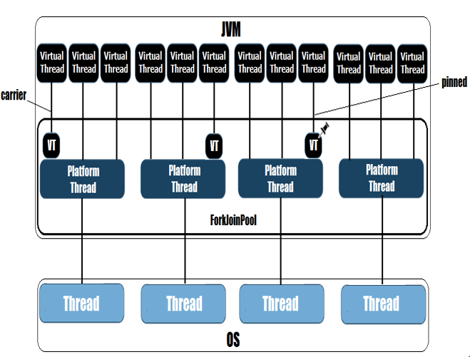
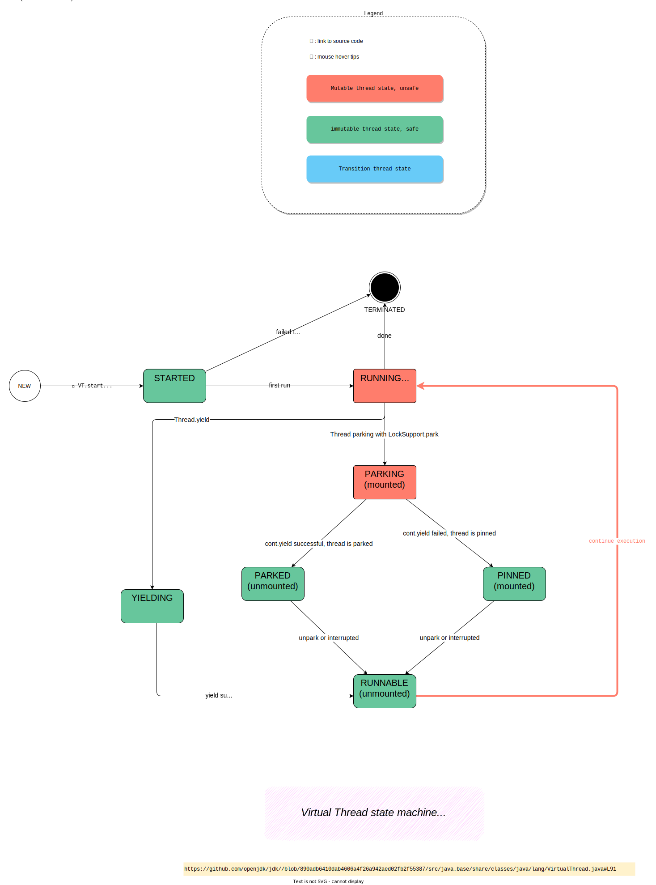
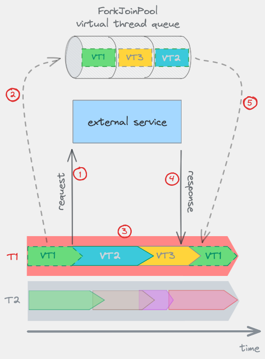
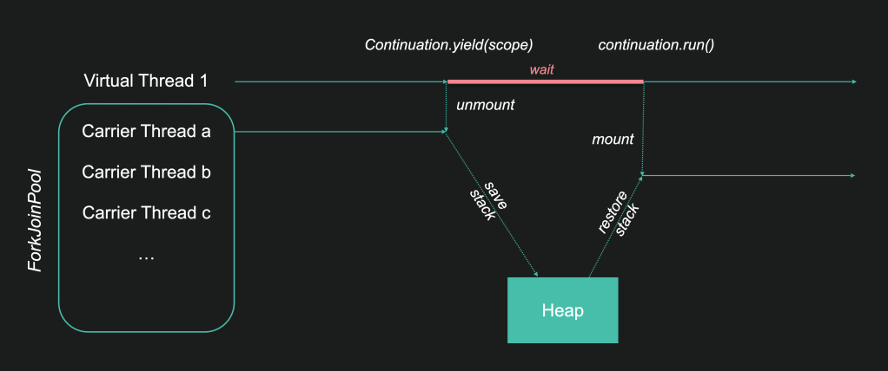
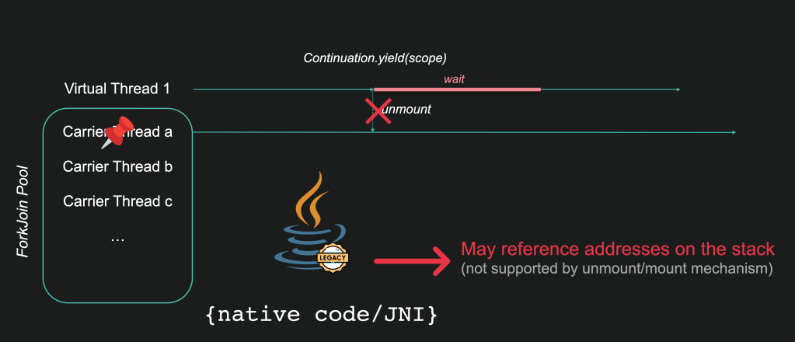

# Virtual Threads

按这本书作者的德性，和这本书的定位，这里不会有介绍什么是 `Virtual Threads` ，说 `Virtual Threads` 如何强大的章节了。只会写这个技术的一些细节。


术语：

- Virtual Thread (VT)
- Carrier Threads (CTs)
- Platform Thread (PT)




*图 ：Source: [Explaining how virtual threads work](https://www.washingtonred.org/2022/05/)*


## Virtual Thread 状态
:::{figure-md} 图: Virtual Thread 状态机



*图: Virtual Thread 状态机*
:::
*[用 Draw.io 打开](https://app.diagrams.net/?ui=sketch#Uhttps%3A%2F%2Fjvm-insider.mygraphql.com%2Fzh-cn%2Flatest%2F_images%2Fvirtual-thread-state.drawio.svg)*

上面是 OpenJDK 21.35 的状态图。

在 OpenJDK 22 的 [8312498: Thread::getState and JVM TI GetThreadState should return TIMED_WAITING virtual thread is timed parked](https://github.com/openjdk/jdk/commit/4461eeb31d5ccc89e304329a7dccb9cb130713fc) 后，状态图变复杂了一点。


## 优劣及原因

### 简化性能分析

> [JEP 444: Virtual Threads](https://openjdk.org/jeps/444)
> Java debuggers can step through virtual threads, show call stacks, and inspect variables in stack frames. JDK Flight Recorder (JFR), which is the JDK's low-overhead profiling and monitoring mechanism, can associate events from application code (such as object allocation and I/O operations) with the correct virtual thread. **These tools cannot do these things for applications written in the asynchronous style**. In that style tasks are not related to threads, so debuggers cannot display or manipulate the state of a task, and profilers cannot tell how much time a task spends waiting for I/O.

对于以前的基于 callback 异步编程模式编写的程序，很多性能分析(profiling)工具不能提供好的分析结果，因为这些工具有一个假设：一个任务是一个线程从头同步跑到尾的。工具本身不知道如何跟踪 callback 模式中的任务上下文，从而无法识别出运行期的相关性。
而采用 virtual thread 后，运行期上下文的 virtual thread id 可以用于跟踪任务的相关性，帮助已原生支持 VT 的 profiling 工具更好更简单地串联起多个运行期事件。这方面我一直在使用的 AsyncProfiler 好像在写本文时，还未很原生地支持 VT 。但 OpenJDK 内置的亲生子 JFR 好像支持得比较完善。


## 调度

virtual threads 的调度，在 Pure Java 代码中完成。所以，别对调度的 `公平性` `实时性` `可抢占性(preemptive)` 有太大期望了。用过 Go roroutines 的读者可能会有点点失望。如果你用过 199x 年的 MS Windows 3.1，看到过一个有 bug 的应用如何卡死了整个操作系统，就知道这种调度有什么短板了。不过，什么东西是没有短板的呢？

关于调度， Hacker News 上的一个讨论有意思：

> [ Java Virtual Threads: A Case Study](https://news.ycombinator.com/item?id=40959140)
>
> 🗣️ tomp:
>
> They're not equivalent to Go's goroutines.
> Go's goroutines are preemptive (and Go's development team went through a lot of pain to make them such).
>
> Java's lightweight threads aren't.
>
> Java's repeating the same mistakes that Go made (and learned from) 10 years ago.
>
> > 🗣️ unscaled:
> >
> > I would put it more charitably as "Java Virtual Threads are new and have not seen massive use and optimization yet".
> > This is crucial, because Java wouldn't necessarily require the same optimizations Go needed.
> >
> > Making Virtual Threads fully preemptive could be useful, but it's probably not as crucial as it was for Go.
> >
> > Go does not have a native mechanism to spawn OS threads that are separate from the scheduler pool, so if you want to run a long CPU-heavy task, you can only run it on the same pool as you run your I/O-bound Goroutines. **This could lead to starvation**, and adding partial preemption and later full preemption was a neat way to solve that issue.
> >
> > On the other hand, **Java still has OS threads, so you can put those long-running CPU-bound tasks on a separate thread-pool.** Yes, it means programmers need to be extra careful with the type of code they run on Virtual Threads, but it's not the same situation as Go faced: in Java they DO have a native escape hatch.
> >
> > I'm not saying a preemptive scheduler won't be helpful at Java, but it just isn't as direly needed as it was with Go. One of the most painful issues with Java Virtual Threads right now is thread pinning when a synchronized method call is executed. Unfortunately, a lot of existing Java code is heavily using synchronized methods, so it's very easy to unknowingly introduce a method call that pins an OS thread. Preemeptive could solve this issue, but it's not the only way to solve it.


> [JEP 444: Virtual Threads](https://openjdk.org/jeps/444)
> The JDK's virtual thread scheduler is a work-stealing ForkJoinPool that operates in FIFO mode. The parallelism of the scheduler is the number of platform threads available for the purpose of scheduling virtual threads. By default it is equal to the number of available processors, but it can be tuned with the system property  jdk.virtualThreadScheduler.parallelism.

JDK 的 VT scheduler是一个以 FIFO 模式运行的 ForkJoinPool。scheduler的并行度取决于可用于调度 VT 的 `platform threads` 数。默认情况下，它等于可用 CPU/core 的数量，但可以使用系统属性 `jdk.virtualThreadScheduler.parallelism` 进行调整。


下图描述了一个依赖于外部服务的 Java 应用。在 VT1 中发起外部请求，以及 VT1 被调度的过程：




*图：Scheduling of virtual threads. Source:[When not to use virtual threads in Java](https://berksoftware.com/24/1/When-Not-To-Use-Virtual-Threads)*


这里我们看到 T1 被用作carrier thread（scheduler池中用于执行 VT 的平台线程），运行虚拟线程 VT2 和 VT3，同时等待 VT1 解除阻塞。请注意线程的不均匀调度周期。

1. 从队列中取出虚拟线程 VT1，并将其mount 到scheduler的可用平台线程（carrier thread）之一上。执行 VT1，然后通过进行外部服务调用将其阻塞。
2. mount VT1；其堆栈保存到堆中，其状态设置为“parked”（blocked）并放入scheduler队列中。
3. scheduler从队列中取出 VT2，使用 T1 运行。VT2 完成后，它对 VT3 执行相同操作。
4. 收到外部服务的响应，可以调度 VT1。实际发生的情况是操作系统通知 JVM 有关结束阻塞的 I/O 资源。该消息被转发到scheduler，scheduler会移除 VT1 的 blocked 状态（‘parked’ -> ‘runnable’）。但 VT1 无法立即被调度，因为目前没有可用的 carrier thread。
5. 当 VT3 完成时，carrier thread T1 变为可用。VT1 被调度在 T1 上运行。


### 调度配置

#### ForkJoinPool

> 以下参考： [Monitoring Java Virtual Threads](https://jefrajames.fr/2024/01/10/monitoring-java-virtual-threads/)

正如我们所见，ForkJoinPool 在 VT 调度中起着关键作用。如果池太小，调度会变慢并降低性能。 可以使用以下系统属性配置 ForkJoinPool：

- `jdk.virtualThreadScheduler.parallelism` ：池大小（多少个 CT），默认为 CPU  core 数 。即 `Runtime.getRuntime().availableProcessors()`
- `jdk.virtualThreadScheduler.maxPoolSize` ：池的最大大小，默认为 256。当 CT 被阻止时（由于操作系统或 JVM 限制），CT 数量可能会暂时超过 `jdk.virtualThreadScheduler.parallelism` 设置的数量。（scheduler 在一些情况下，会通过临时增加并行 CT 来补偿 pinned VT 占用的 CT）
- `jdk.virtualThreadScheduler.minRunnable` ：池中保持可运行的线程的最小数量。控制何时将 CT 临时f添加到池中的属性。默认情况下设置为 max(1 , jdk.virtualThreadScheduler.parallelism/2) 。如果可用于执行 VT 的 CT 较少，则 CT 数量可能会暂时增加。这可以提高吞吐量，但启动新的平台线程也意味着开销。


## Java 层实现




*图：Magic of continuation : Source: [Monitoring Java Virtual Threads](https://jefrajames.fr/2024/01/10/monitoring-java-virtual-threads/)*


mount 了 VT 的 CT 的完整 stack 应该像：

```
// Stack trace of virtual thread:
StackTest.lambda$main$2(StackTest.java:25)
java.base/java.lang.VirtualThread.run(VirtualThread.java:295)
java.base/java.lang.VirtualThread$VThreadContinuation.lambda$new$0(VirtualThread.java:171)
java.base/java.lang.Continuation.enter0(Continuation.java:372)
java.base/java.lang.Continuation.enter(Continuation.java:365)
// Stack trace of carrier thread：
java.base/java.lang.Continuation.run(Continuation.java:300)
java.base/java.lang.VirtualThread.runContinuation(VirtualThread.java:224)
java.base/java.util.concurrent.ForkJoinTask$RunnableExecuteAction.exec(ForkJoinTask.java:1395)
java.base/java.util.concurrent.ForkJoinTask.doExec(ForkJoinTask.java:373)
java.base/java.util.concurrent.ForkJoinPool$WorkQueue.topLevelExec(ForkJoinPool.java:1177)
java.base/java.util.concurrent.ForkJoinPool.scan(ForkJoinPool.java:1648)
java.base/java.util.concurrent.ForkJoinPool.runWorker(ForkJoinPool.java:1615)
java.base/java.util.concurrent.ForkJoinWorkerThread.run(ForkJoinWorkerThread.java:165)
```


parked 后 umount 状态的 VT 的 stack 应该像：

```
java.base/java.lang.Continuation.yield(Continuation.java:402)
java.base/java.lang.VirtualThread.yieldContinuation(VirtualThread.java:367)
java.base/java.lang.VirtualThread.park(VirtualThread.java:531)
java.base/java.lang.System$2.parkVirtualThread(System.java:2346)
java.base/jdk.internal.misc.VirtualThreads.park(VirtualThreads.java:60)
java.base/java.util.concurrent.locks.LockSupport.park(LockSupport.java:369)
java.base/java.util.concurrent.locks.AbstractQueuedSynchronizer$ConditionNode.block(AbstractQueuedSynchronizer.java:506)
java.base/java.util.concurrent.ForkJoinPool.unmanagedBlock(ForkJoinPool.java:3469)
java.base/java.util.concurrent.ForkJoinPool.managedBlock(ForkJoinPool.java:3440)
java.base/java.util.concurrent.locks.AbstractQueuedSynchronizer$ConditionObject.await(AbstractQueuedSynchronizer.java:1623)
java.base/java.util.concurrent.ArrayBlockingQueue.take(ArrayBlockingQueue.java:420)
StackTest.lambda$main$2(StackTest.java:25)
java.base/java.lang.VirtualThread.run(VirtualThread.java:295)
java.base/java.lang.VirtualThread$VThreadContinuation.lambda$new$0(VirtualThread.java:171)
java.base/java.lang.Continuation.enter0(Continuation.java:372)
java.base/java.lang.Continuation.enter(Continuation.java:365)
```


### pin Carrier Threads


> [Monitoring Java Virtual Threads](https://jefrajames.fr/2024/01/10/monitoring-java-virtual-threads/)
>
> This happens when Java stack addresses are referenced from non-Java code. Java adresses are relocated when restoring from the heap, making non-Java references no longer good.
>
> To prevent this error, the CT is pinned:



*图：Continuation pinned : Source: [Monitoring Java Virtual Threads](https://jefrajames.fr/2024/01/10/monitoring-java-virtual-threads/)*


这在以下调用时发生 pin CT: 

- `synchronized blocks`  或 `synchronized methods`

- `Object::wait` 与 补偿 CT 。scheduler 会通过临时增加并行 CT 来补偿 pinned VT 占用的 CT 。(见 [*Object::wait*](https://github.com/openjdk/jdk/blob/0b9350e8b619bc556f36652cde6f73211be5b85b/src/java.base/share/classes/java/lang/Object.java#L373) 怀 [*Block::begin*](https://github.com/openjdk/jdk/blob/0b9350e8b619bc556f36652cde6f73211be5b85b/src/java.base/share/classes/jdk/internal/misc/Blocker.java#L74))

  - 大量线程在 _Object::wait_ 中被阻塞以接收事件通知的情况相当常见。这些情况需要补偿以避免死锁。
  - 与此相反，许多线程在尝试进入 `synchronized block/method` 时被阻塞的情况并不常见，因为这会妨碍 scaling。因此不需要补偿。至少在大多数情况下不需要。可能存在许多线程被阻塞以等待进入 _synchronized_ 块的异常情况。这些情况很成问题，可能会导致死锁。

    [早期 loom 版本](https://jdk.java.net/loom/) 包含 [一个实验性实现](https://github.com/openjdk/loom/commit/756743dae93f07029cba3362c0ec66f7bc7c1a61)，允许在调用 _Object::wait_ 时 unmount 虚拟线程。

- native code:  JVM 自身的内部代码，或通过 JNI / Foreign Functions 发起的外部调用。如：

  - classloading 时， 有的 static init 可能会调用 JNI

- filesystem 的 IO 操作

  - 大多数文件操作 I/O 相关（文件系统很少支持异步 I/O）。


synchronized block/method 要 pin 的原因是：

> [JEP 491: Synchronize Virtual Threads without Pinning](https://openjdk.org/jeps/491)
>
> 为了实现“synchronized”关键字，JVM 会跟踪当前哪个线程持有对象的 monitor 。遗憾的是，它跟踪的是哪个 PT 持有 monitor ，而不是哪个 VT。当 VT 运行“synchronized”实例方法并获取与该实例关联的 monitor 时，JVM 会记录 VT 的载体平台线程持有监视器 — 而不是 VT 本身。
>
> 另外，pin CT 会传染：
>
> 如果 VT 调用 `synchronized method`，并且与该实例关联的 monitor 由另一个线程持有，则 VT 必须阻塞，因为一次只有一个线程可以持有该 monitor。我们希望 VT 从其CT 上 unmount 并将该平台线程释放给 JDK 调度程序。不幸的是，如果  monitor 已被另一个线程持有，则 VT 将在 JVM 中阻塞，直到 CT 获取Monitor。
>
> 此外，当 一个VT 位于 `synchronized` 实例方法内，并调用对象上的 [`Object.wait()`](https://docs.oracle.com/en/java/javase/23/docs/api/java.base/java/lang/Object.html#wait\(\)) 时，VT 将在 JVM 中阻塞，直到被 [`Object.notify()`](https://docs.oracle.com/en/java/javase/23/docs/api/java.base/java/lang/Object.html#notify\(\)) 唤醒，然后 CT 重新获取 monitor。VT 被 pinned，因为它正在 `synchronized` 方法内执行。


一个 VT  死锁的例子：

如果虚拟线程 VT1 和 VT2 正在等待释放的锁。这里锁被第三方释放了，并且先通知了 VT1，而不是 mount 到其 CT 的 VT2，那么如果没有可用于 VT1 的 CT，则这可能会导致死锁。


*以上参考 [Essential Information on Virtual Threads](https://github.com/SAP/SapMachine/wiki/Essential-Information-on-Virtual-Threads)* 。


这意味着我们必须跟踪 pinned VT 以识别那些可能影响性能的 VT。见下面 “监控” 一节。


#### 克服部分 VT pin

直到 OpenJDK 24 的 [JEP 491: Synchronize Virtual Threads without Pinning](https://openjdk.org/jeps/491) pin CT 的场景大量减少：

> 长时间频繁 pin 可能会损害可 scale 性。当 JDK 调度程序可用的所有 PT 都被 VT pin 或在 JVM 中被阻止时，VT 无法运行，这可能会导致资源匮乏甚至死锁。为了避免这些问题，许多库的维护者修改了他们的代码，使用 [`java.util.concurrent` 锁](https://docs.oracle.com/en/java/javase/23/docs/api/java.base/java/util/concurrent/locks/package-summary.html) — 不 pin 虚拟线程 — 而不是 `synchronized` 方法和语句。
>
> 但是，不必放弃 `synchronized` 方法和语句即可享受 VT 的可扩展性优势。JVM 对 `synchronized` 关键字的实现应该允许 VT 在 `synchronized method/block`  时 unmount。这将使 VT 得到更广泛的应用。
>
> **如何做到：**
>
> 我们将更改 JVM 对 `synchronized` 关键字的实现，以便 VT 可以独立于其 CT 获取、保留和释放 monitor。 mounting 和 unmounting 操作将执行必要的登记，以允许 VT 在 `synchronized method/block` 中或在 wait monitor 时unmount 并 remount。 
>
> blocking  VT 以获取 monitor 时，将会 unmount VT 并将其 CT 释放给 JDK 的调度程序。当 monitor 被释放并且 JVM 选择恢复 VT 运行时，JVM 会将  VT 提交给调度程序。调度程序将 mount VT（可能在不同的 CT 上）以恢复执行并再次尝试获取 monitor。
>
> `Object.wait()` 方法及其定时等待变体将在 waiting 和 blocking 以重新获取 monitor 时类似地 unmount VT。当使用`Object.notify()`唤醒，并且 monitor 被释放，并且JVM选择恢复 VT 运行时，JVM会将 VT 提交给调度程序以恢复执行。
>
> **影响：**
>
> 所以 OpenJDK 24 后， `jdk.tracePinnedThreads` 将不再需要了。
>
> 
>
> **用 synchronized 还是用 java.util.concurrent.locks？**
>
> If you are writing new code, we agree with the recommendation in [_Java Concurrency in Practice_](https://jcip.net/) §13.4: Use `synchronized` where practical, since it is more convenient and less error prone, and use `ReentrantLock` and the other APIs in `java.util.concurrent.locks` when more flexibility is required. Either way, reduce the potential for contention by narrowing the scope of locks and avoid, where possible, doing I/O or other blocking operations while holding locks.


## VT 应用

这里不会教如何使用 VT 的了 ☺️


什么时候考虑使用 VT:

> [Essential Information on Virtual Threads](https://github.com/SAP/SapMachine/wiki/Essential-Information-on-Virtual-Threads) - When to Use Virtual Threads:
>
> Virtual threads are a means to scale up and keep CPUs busy while waiting for something (typically I/O). Replacing *platform threads* with virtual threads alone will probably not improve the performance of the system. It is the scaling beyond the limited number of *platform threads* that will bring improvements in throughput.
>
> So you should use virtual threads if your application:
>
> - Does a significant amount of I/O.
>   It might also help if there are waits for java.util.concurrent locks and conditions if they are not an obstacle themselves for scaling.
> - Has at least 10,000 independent tasks at every point in time.
>
> Vice versa, if your application is mostly doing computations, never waiting for input or if there are not that many independent tasks then you cannot expect improvements from virtual threads. In the former case (computation heavy) performance might even decrease. In the latter case it might be possible to refactor the application to create more independent tasks to get a speedup from virtual threads.


### VT 实例限制

过多的 VT 实例，会占用过多的内存。所以要控制 VT 实例的数量。[Oracle 官方的 VT 文档](https://docs.oracle.com/en/java/javase/21/core/virtual-threads.html)，建议用 [Semaphore](https://docs.oracle.com/en/java/javase/21/docs/api/java.base/java/util/concurrent/Semaphore.html) class 控制并发量 。但那文档中说的方法是在 VT 中调用 Semaphore 。要限制 VT 的创建，达到 backpress 的目的，是应该在创建 VT 的地方控制的。

具体见 [Managing Throughput with Virtual Threads - Sip of Java](https://inside.java/2024/02/04/sip094/)


### 避免在 VT 中做的事

#### Thread-Local

> [Essential Information on Virtual Threads](https://github.com/SAP/SapMachine/wiki/Essential-Information-on-Virtual-Threads) - ThreadLocal vs Scoped Values (2nd Preview):
>
> [Thread local values](https://docs.oracle.com/en/java/javase/21/docs/api/java.base/java/lang/ThreadLocal.html) have design flaws that can have bigger impact with virtual threads (example is given [here](https://docs.oracle.com/en/java/javase/21/core/virtual-threads.html#GUID-68216B85-7B43-423E-91BA-11489B1ACA61)). [Scoped values (still in preview)](https://openjdk.org/jeps/464)  / [JEP 487: Scoped Values (Fourth Preview)](https://openjdk.org/jeps/487) are supposed to reduce complexity and improve security and performance. It is recommended to use scoped values instead of thread local values.


#### 在拥有 Java object locked 时执行 I/O

在执行 I/O 时持有锁通常不是最佳做法，因为 I/O 具有显著的延迟，这会添加到等待锁的线程中。对于虚拟线程，这尤其成问题，因为虚拟线程在锁定 Java 对象时会 _固定_ 到其载体线程（请参阅 [限制](https://github.com/SAP/SapMachine/wiki/Essential-Information-on-Virtual-Threads#limitations-and-issues-to-be-aware-of)）。


### 监控

以下参考： [Monitoring Java Virtual Threads](https://jefrajames.fr/2024/01/10/monitoring-java-virtual-threads/)


#### VT dump

```
jcmd *<PID>* Thread.dump_to_file **-format=text** *<file>* 
jcmd <PID> Thread.dump_to_file -format=json <file>
```


见[一个例子](https://github.com/SAP/SapMachine/wiki/Essential-Information-on-Virtual-Threads):

```
# Hi-lock: (("consumeCPU" (0 'hi-green prepend)))
# Hi-lock: (("Continuation.run" (0 'hi-green prepend)))
# Hi-lock: (("Unsafe.park" (0 'hi-yellow prepend)))
# Hi-lock: (("VTReentrantLockExample" (0 'hi-pink prepend)))

#35 "ForkJoinPool-1-worker-1"
      java.base/jdk.internal.vm.Continuation.run(Continuation.java:248)
      java.base/java.lang.VirtualThread.runContinuation(VirtualThread.java:221)
      java.base/java.util.concurrent.ForkJoinTask$RunnableExecuteAction.exec(ForkJoinTask.java:1423)
      java.base/java.util.concurrent.ForkJoinTask.doExec(ForkJoinTask.java:387)
      java.base/java.util.concurrent.ForkJoinPool$WorkQueue.topLevelExec(ForkJoinPool.java:1312)
      java.base/java.util.concurrent.ForkJoinPool.scan(ForkJoinPool.java:1843)
      java.base/java.util.concurrent.ForkJoinPool.runWorker(ForkJoinPool.java:1808)
      java.base/java.util.concurrent.ForkJoinWorkerThread.run(ForkJoinWorkerThread.java:188)

#75 "ForkJoinPool-1-worker-2"
      java.base/jdk.internal.vm.Continuation.run(Continuation.java:248)
      java.base/java.lang.VirtualThread.runContinuation(VirtualThread.java:221)
      java.base/java.util.concurrent.ForkJoinTask$RunnableExecuteAction.exec(ForkJoinTask.java:1423)
      java.base/java.util.concurrent.ForkJoinTask.doExec(ForkJoinTask.java:387)
      java.base/java.util.concurrent.ForkJoinPool$WorkQueue.topLevelExec(ForkJoinPool.java:1312)
      java.base/java.util.concurrent.ForkJoinPool.scan(ForkJoinPool.java:1843)
      java.base/java.util.concurrent.ForkJoinPool.runWorker(ForkJoinPool.java:1808)
      java.base/java.util.concurrent.ForkJoinWorkerThread.run(ForkJoinWorkerThread.java:188)
      
#74 "" virtual

#34 "" virtual
      VTReentrantLockExample.consumeCPU(VTReentrantLockExample.java:65)
      VTReentrantLockExample.lambda$main$0(VTReentrantLockExample.java:40)
      java.base/java.util.concurrent.ThreadPerTaskExecutor$TaskRunner.run(ThreadPerTaskExecutor.java:314)
      java.base/java.lang.VirtualThread.run(VirtualThread.java:309)

#36 "" virtual
      VTReentrantLockExample.lambda$main$0(VTReentrantLockExample.java:38)
      java.base/java.util.concurrent.ThreadPerTaskExecutor$TaskRunner.run(ThreadPerTaskExecutor.java:314)
      java.base/java.lang.VirtualThread.run(VirtualThread.java:309)      
```


mount 了 VT 的  CT 的 stack，其顶部有以下 frame:

```
java.base/jdk.internal.vm.Continuation.run(Continuation.java:248)
java.base/java.lang.VirtualThread.runContinuation(VirtualThread.java:221)
```


Java 代码是[这里](https://github.com/reinrich/experiments/blob/bd69b958ab89b13e41881242955eca64fb2144ac/vthreads/locking_stackdump/VTReentrantLockExample.java#L37)。


CT 在运行 VT 时被阻塞。从它们的堆栈来看，无法判断 VT 正在做什么。在示例中，几乎所有 VT:

- 要么在等待启动
- 要么在  synchronized 等待一个 [Java object monitor lock](https://github.com/reinrich/experiments/blob/bd69b958ab89b13e41881242955eca64fb2144ac/vthreads/locking_stackdump/VTReentrantLockExample.java#L37)。并 pin 在 CT 上 。
- 这个 java object monitor lock 被一个 VT(#34) 占用了，在忙于 consumerCPU() 计算，面一直未释放 lock 。


请注意，pin CT 是阻止除这 4 个 VT 之外的所有 VT 被调度的瓶颈。因为 jdk.virtualThreadScheduler.parallelism 只配置了 4 个 CT 。


可以使用 [java.util.concurrent.locks.ReentrantLock](https://github.com/reinrich/experiments/blob/bd69b958ab89b13e41881242955eca64fb2144ac/vthreads/locking_stackdump/VTReentrantLockExample.java#L47) 避免 _Pinning_。所有线程都能够启动，因为当在锁上阻塞时，VT 会从其 _CT_ 中 umount。这样只有 [一个 _CT_  mount 了 VT](https://github.com/reinrich/experiments/blob/bd69b958ab89b13e41881242955eca64fb2144ac/vthreads/locking_stackdump/out_reentrantlocks.txt#L70)。 [其正在等待](https://github.com/reinrich/experiments/blob/bd69b958ab89b13e41881242955eca64fb2144ac/vthreads/locking_stackdump/out_reentrantlocks.txt#L82) 的 VT 变为 unpin parked。

如果您作用 `jcmd <PID> Thread.dump_to_file -format=json <file>`，则使用 _Structured Concurrent API_ 创建的任务将根据 scope 进行分组（[此处](https://docs.oracle.com/en/java/javase/21/core/structured-concurrency.html#GUID-2EF450F4-58CA-4D30-AF86-8AAB92B2AD16) 给出了一个示例）


#### 监控 pinned VT

我们可以使用：

- `-Djdk.tracePinnedThreads=short/full` Java 启动选项。它可以跟踪代码中出现 pinned VT 的位置

- JFR 事件 `jdk.VirtualThreadPinned` ：它能够识别可能影响性能的 pinned VT。此事件默认启用，阈值为记录超过 20 毫秒（可配置） 的 pinned VT

  

`-Djdk.tracePinnedThreads=short/full` 监控的输出例子：

```
Thread [#63, ForkJoinPool-1-worker-2,5, Carrier Threads] 
    org.h2.command.Command.executeUpdate(Command.java:252) <== monitors:1
    org.h2.jdbc.JdbcPreparedStatement.executeUpdate Internal (JdbcPreparedStatement.java:209) <== monitors:1
```


以下是一些 VT 相关的 JFR 事件：

- [VirtualThreadStart](https://sap.github.io/SapMachine/jfrevents/21.html#virtualthreadstart)
- [VirtualThreadEnd](https://sap.github.io/SapMachine/jfrevents/21.html#virtualthreadend)
- [VirtualThreadPinned](https://sap.github.io/SapMachine/jfrevents/21.html#virtualthreadpinned)
- [VirtualThreadSubmitFailed](https://sap.github.io/SapMachine/jfrevents/21.html#virtualthreadsubmitfailed)


### Debug

调试时，VT 默认是隐藏的。您看不到它们，它们也不会在断点处停止。您可以在启动应用程序时更改此行为。一种方法是将选项 “`includevirtualthreads=y`” 传递给 JDWP 代理。

```
java -agentlib:jdwp=transport=dt_socket,address=8000,server=y,suspend=n,includevirtualthreads=y Example.java
```

隐藏 VT 的一个原因是，在断点处停止会 pin VT。如果太多 VT 到达断点，这将导致 JVM 死锁。

另外，VT 中的局部变量目前只能在最顶层的  frame 中更改。


更多 VT debug 支持的细节，可见： 

- [OpenJDK Wiki - Debugger Support](https://wiki.openjdk.org/display/loom/Debugger+Support)
- [Slides from March 24, 2021 meeting with IntelliJ and Eclipse maintainers](http://cr.openjdk.java.net/~alanb/loom/DebuggerSupport20210324.pdf)


### VT stack 对象自身的 GC

 tracePinnedThreads enabled 的情况下，可能要小心 memory leak 问题：[Virtual threads cannot be GC'ed before they terminate](https://bugs.openjdk.org/browse/JDK-8336061) 。


另一个问题是， VT stack 对象什么时候可以被 GC?

>  [Virtual Threads Arrive in JDK 21, Ushering a New Era of Concurrency](https://www.infoq.com/news/2023/04/virtual-threads-arrives-jdk21/)
>
> 🗣️ pron:
>
> Virtual thread stacks reference the objects that local variables on the stack reference, but they are not themselves GC roots. GC roots are special objects that the GC starts its scan of the heap from, and they tend to be particularly costly, at least for most of OpenJDK's GCs. Virtual threads are just ordinary heap objects that can reference other objects.
> > I could imagine that by having fewer physical threads running, the stop-the-world part of garbage collection could suspend the runtime more quickly. That could reduce the effect of GC-pauses.
>
> Precisely. Although it's worth mentioning that while that's true for G1, ZGC does not stop-the-world when scanning roots, including [platform thread stacks](https://openjdk.org/jeps/376).
>
>
> 🗣️ pron:
>
> they are most certainly not GC roots, a fact you can actually observe in a program as described in the [JEP Virtual Thread](https://openjdk.org/jeps/444#Memory-use-and-interaction-with...).
> If you want some more detail:
>
> - when a virtual thread is in the runnable state, it is reachable from the scheduler (which itself is a Java object, and not a GC root);
>
> - when **it is blocked on a lock or IO, then the lock object or the IO mechanism must retain a reference to it, or there would be no way to unblock it. The thread object has a reference to the stack**, which is a heap object (actually, it could be made up of several heap objects).
>
> **A thread that is not strongly reachable can provably no longer make progress** -- it must be blocked but there's no way to unblock it -- and will be collected even if it has not terminated. It may live forever in our hearts, but not in the heap.


## 参考

- [JEP 444: Virtual Threads](https://openjdk.org/jeps/444)
- [Monitoring Java Virtual Threads](https://jefrajames.fr/2024/01/10/monitoring-java-virtual-threads/)
- [Oracle 官方的 VT 文档](https://docs.oracle.com/en/java/javase/21/core/virtual-threads.html)
- [When not to use virtual threads in Java](https://berksoftware.com/24/1/When-Not-To-Use-Virtual-Threads)
- [Essential Information on Virtual Threads](https://github.com/SAP/SapMachine/wiki/Essential-Information-on-Virtual-Threads)
- [Inside Java - loom tags](https://inside.java/tag/loom)


