# JVM 学习路书

在本书的 [前言](/index.md) 中，说明了本书是由来的 **因缘和合** 。但在正式开始写书一段时间后，我又反思了一些东西：

1. 以 Java 程序员的名义在职场混了 20 有余个年头，为何到现在才整理知识？
2. 之前的研究和学习方法出了什么问题？

问题1：

如果这是面试官的问题，回答的方法大概就是：

- 工作太忙。而且一直在应用层面上发力。

但如果自问的话，就很难完全不自欺地回答：

- 自认对技术还算一直有探究精神，但一直流于理论、猎奇新热点。沉不下来，更别说写下来了。
- 注重招式，内功少练。年轻时，面对多变的 IT 技术，谁不觉得比别人知多点，知早点，就是个大牛。世界变化大，诱惑和机会太多，谁想耗在一项技术上 Deep dive ？等你 Deep dive 还未有输出，这技术说不定已经过时了。
- 偶尔遇到性能问题等等要内功才能解决的，才运用搜索引擎（当时没 AI）去学习。有目的有额定范围的，不求甚解的学习完成了，问题也解决了，收工开饭拿奖金。

猿到中年时，心态也会变化的：

- 一个是生理和生活上，已经不可能像年轻人一样，完全追上新技术了。速度比不上，剩下的优势就只能是内功了

- 人是社会动物，程序员的我虽然绝大多时候，学习和重大技术难点的解决，都是一个人闭关修炼完成的。但社会动物需要社会认可，特别是中年以后，人会有更多这方面的想法。

- 结合以上几点：

  - 一方面为了让之前零散和不科学的知识整理和系统化

  - 另一方面为了记录和分享

  - 如何坚持？写书和不断发布更新，得到读者反馈，是最好的方法。

    有人研究过，为什么网络电玩让人断不了瘾？因为那个世界对你的行为有比较即时的正（负）反馈。写开源书，写博客也一样。

问题2：已经在问题 1 中回答了  🙂

## 学习路书

### JVM 有点像 Linux Kernel

学习 JVM 有点像学习 Linux Kernel 。我们都知道，复杂软件项目的学习方法不外乎：

1. 模块化复杂研究对象
2. 厘清模块之间的依赖关系
3. 逐个模块理解

说得容易，如果就这 3 句话，BOSS 直聘上，简历上写的 Java 程序员，Linux 运维。个个都是 JVM 专家和 Linux 专家了。我认为，最难是的第 2 点：厘清模块之间的依赖关系 。

Kernel 和 JVM 在源码源文件的角度看，可以认为是充分模块化的。但 Runtime 的角度看，就更像个单体设计的软件。模块之间的依赖，有时候是很难厘清的。加上使用了 callback/virtual function 等等的抽象设计，要搞清楚设计和编译期的依赖还算容易，但要得知模块间 runtime 的实际协作关系，更多好的方法不是看源码，而是 debug 加 inspect 。

### 钻研开源的酒神精神

关于看源码，最近有个不知道对不对的心得。就是要用源码编写者的角度去分析源码。即用人性观察、语言分析的方法去看。而不是只用科学理性，希望一次精准理解所有因由。我在看 JVM 源码时，喜欢带上一瓶酒。

很多时候，理性是个喜欢说负面说话的 ghost 👻 ：

- 这 OpenJDK 代码太庞大了，太多历史负担了
- Safepoint 用到的 JIT + 汇编语言 + Linux Signal 的实现技术栈那么高，很难看懂吧

**理性 ghost 👻** 让我更容易止步。这时，喝点酒，加上点实验环境的 debug。再发挥一下人的想像力：我想那个写代码的家伙，应该是这样玩的。

- 原来，**理性 ghost 👻**  错了，**酒神 🍷 的勇敢** 尝试探索到正确的路。

这个问题可以再延伸一下，到底，一个复杂如 OpenJDK/Linux Kernel 的软件。是可以用数学逻辑证明其正确性的实现。还是，只是理性加上社区勇敢尝试和现实经验修正的实现？我不知道。

### 路书

以下是我个人尝试深入研究 Hotspot OpenJDK 过程的路书，我还在路上，不断更新中。不一定合适所有人，因为每个人的知识背景，学习习惯不可能相同。仅供参考。

:::{figure-md} 图: 个人尝试深入研究 Hotspot OpenJDK 的路书

*图: 个人尝试深入研究 Hotspot OpenJDK 的路书*
:::
*[用 Draw.io 打开](https://app.diagrams.net/?ui=sketch#Uhttps%3A%2F%2Fjvm-insider.mygraphql.com%2Fzh-cn%2Flatest%2F_images%2Fstudy-jvm-road-map.drawio.svg)*

## JVM 技术栈

:::{figure-md} 图: JVM Tech Stack

*图: JVM Tech Stack*
:::
*[用 Draw.io 打开](https://app.diagrams.net/?ui=sketch#Uhttps%3A%2F%2Fjvm-insider.mygraphql.com%2Fzh-cn%2Flatest%2F_images%2Fjvm-tec-stack.drawio.svg)*

