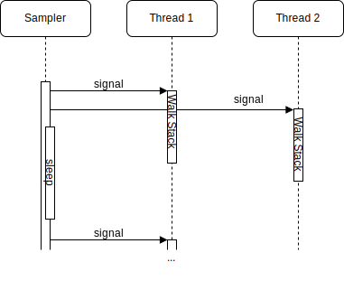
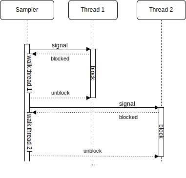

# Profiling

## 基于 Safepoint 的 profiling 问题

- [Safepoints: Meaning, Side Effects and Overheads](https://psy-lob-saw.blogspot.com/2015/12/safepoints.html)

## Stack Walk

### AsyncGetCallTrace(AGCT)

 一些有用的资料：
- [AsyncGetStackTrace: A better Stack Trace API for the JVM](https://mostlynerdless.de/blog/2023/01/19/asyncgetstacktrace-a-better-stack-trace-api-for-the-jvm/)
- [Writing a Profiler from Scratch: Introduction](https://mostlynerdless.de/blog/2022/12/20/writing-a-profiler-from-scratch-introduction/)
- [The Pros and Cons of AsyncGetCallTrace Profilers](https://psy-lob-saw.blogspot.com/2016/06/the-pros-and-cons-of-agct.html)

AGCT 实现的大概流程见：

> [The Pros and Cons of AsyncGetCallTrace Profilers](https://psy-lob-saw.blogspot.com/2016/06/the-pros-and-cons-of-agct.html)
>
> 1. Make sure thread is in 'walkable' state, in particular not when:
>    - Thread is not a Java thread.
>    - GC is active
>    - New/uninitialized/just about to die. I.e. threads that are either before or after having Java code running on them are of no interest.
>    - During a deopt
> 2. Find the current/last Java frame (as in actual frame on the stack, revisit Operating Systems 101 for definitions of stacks and frames):
>    - The instruction pointer (commonly referred to as the PC - Program Counter) is used to look up a matching Java method (compiled/interpreter). The current PC is provided by the signal context.
>    - If the PC is not in a Java method we need to find the last Java method calling into native code.
>    - Failure is an option! we may be in an 'unwalkable' frame for all sorts of reasons... This is quite complex and if you must know I urge you to get comfy and dive into the maze of relevant code. Trying to qualify the top frame is where most of the complexity is for AGCT.
> 3. Once we have a top frame we can fill the call trace. To do this we must convert the real frame and PC into:
>    - Compiled call frames: The PC landed on a compiled method, find the BCI (Byte Code Index) and record it and the jMethodId
>    - Virtual call frames: The PC landed on an instruction from a compiled inlined method, record the methods/BCIs all the way up to the framing compiled method
>    - Interpreted call frames
>    - From a compiled/interpreted method we need to walk to the calling frame and repeat until we make it to the root of the Java call trace (or record enough call frames, whichever comes first)
> 4. WIN!

#### Async-profiler's AsyncGetCallTrace

async-profiler 的 wall-clock 模式下， walk stack 在目标线程中执行：

*图 Source: [Couldn’t we just Use AsyncGetCallTrace in a Separate Thread?](https://community.sap.com/t5/technology-blogs-by-sap/couldn-t-we-just-use-asyncgetcalltrace-in-a-separate-thread/ba-p/13558812)*

### Async-profiler's AsyncGetCallTrace replacement

- [AsyncGetCallTrace replacement #795 - async-profiler issues](https://github.com/async-profiler/async-profiler/issues/795)

## JDK Flight Recorder (JFR) SuspendedThreadTask

*图： JFR 架构, Source: [Get Started with JDK Flight Recorder - foojay.io](https://foojay.io/today/using-java-flight-recorder-and-mission-control-part-1/)*

JDK Flight Recorder (JFR) 使用单线程执行 Stack Walk :

*图 Source: [Couldn’t we just Use AsyncGetCallTrace in a Separate Thread?](https://community.sap.com/t5/technology-blogs-by-sap/couldn-t-we-just-use-asyncgetcalltrace-in-a-separate-thread/ba-p/13558812)*

### 比较几种 Stack Walk 方法

> One important difference to consider is that in JFR, in contrast to AGCT, there is only a single thread, the ThreadSampler thread, that is wrapped in the CrashProtection. Stack walking is different in JFR compared to AGCT, in that it is done by a *different thread*, during a point where the target is suspended. Originally, this thread sampler thread was not even part of the VM, although now it is a NonJavaThread. It has been trimmed to not involve malloc(), raii, and other hard-to-recover-from constructs, from the moment it has another thread suspended. Over the years, some transitive malloc() calls has snuck in, but it was eventually found due to rare deadlocking. Thomas brings a good point about crashes needing to be recoverable.
>
> [MarKUS Grönlund In A Comment on OpenJDK PR 8225](https://github.com/openjdk/jdk/pull/8225#issuecomment-1099391050)

## 参考

- [AsyncGetStackTrace: A better Stack Trace API for the JVM](https://mostlynerdless.de/blog/2023/01/19/asyncgetstacktrace-a-better-stack-trace-api-for-the-jvm/)
- [Couldn’t we just Use AsyncGetCallTrace in a Separate Thread?](https://community.sap.com/t5/technology-blogs-by-sap/couldn-t-we-just-use-asyncgetcalltrace-in-a-separate-thread/ba-p/13558812)

