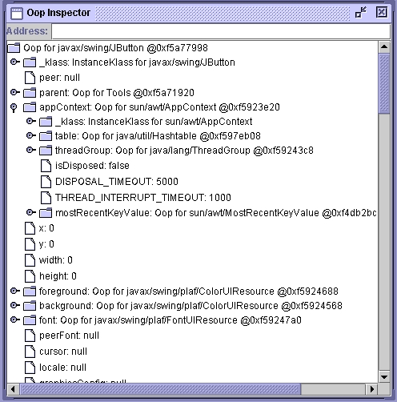
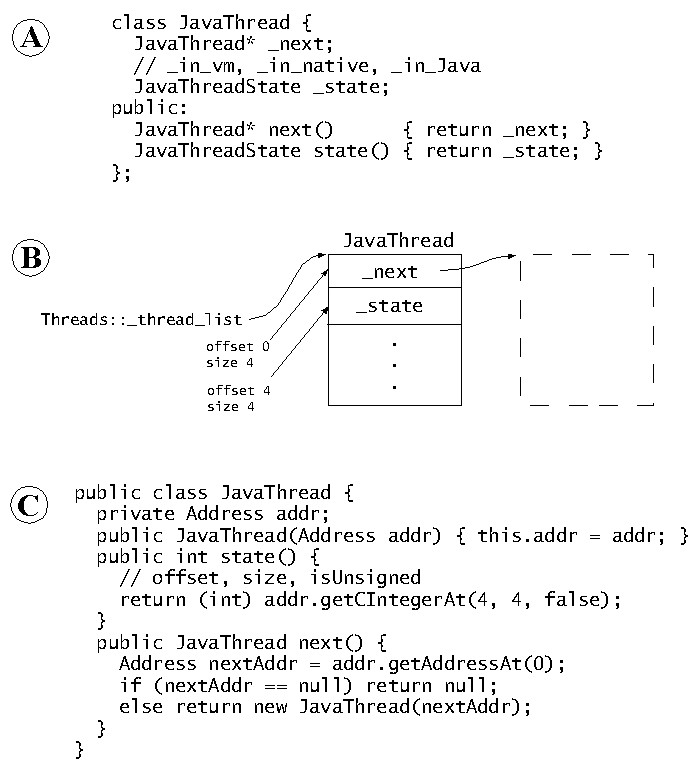

# Serviceability Agent

> 参考：
>
> - [The HotSpot Serviceability Agent: An out-of-process high level debugger for a JVM - usenix.org](https://www.usenix.org/legacy/events/jvm01/full_papers/russell/russell_html/index.html)
>
> - [Serviceability in HotSpot - openjdk.org](https://openjdk.org/groups/hotspot/docs/Serviceability.html)


`Serviceability Agent(SA)` 原是 HotSpot 原码库中的 Sun 私有组件，由 HotSpot 工程师开发，用于协助调试 HotSpot OpenJDK。他们随后意识到 SA 可用于支持用户编写 serviceability tools ，因为它可以在运行中的进程以及 Core Dump 文件中检视 Java 对象以及 HotSpot 数据结构。


SA 组件有以下功能：

- 从正在执行的 Java 进程中读取内存，或读取 Java 进程生成的 core dump file。
- 从原始内存中提取所有 `HotSpot VM C++ 数据结构`。
- 从 `HotSpot VM C++` 数据结构 中提取 Java 对象。


> ❔ 问题：我只是想学习 JVM Internal 原理，为何要研究 SA 原理和实现?


注意，SA 在与目标JVM进程不同的进程中运行，并且不会在目标进程中执行代码。但是，当 SA 观察目标进程时，目标进程会停止(halted)。

SA 主要由 Java 类组成，但也包含少量 native code，用于从进程和 core dump file 中读取原始内存。在 Linux 上，SA 使用 `/proc` 和 `ptrace`（主要是后者）的组合来读取目标进程中的原始内存。对于 core dump file，SA 直接解析 ELF 文件。


在 OpenJDK 9 以前，是 OpenJDK 自带的基于 SA 的工具是 JAVA_HOME/lib 中的 sa-jdi.jar 。OpenJDK 9 以后变成了  jhsdb (Java HotSpot DeBug) 工具。


HotSpot `Serviceability Agent(SA)` 是一组 Java 编程的 API，可为目标 Java HotSpot JVM 建立数据模型。与大多数动态语言调试系统不同，它们基于一种 “协作(cooperative)” 模型，需要在目标进程运行代码来协助调试过程，而 SA 不需要在目标 VM 中运行代码。相反，它使用符号查找( symbol lookup) 和读取进程内存等原语来(primitives)实现其功能。SA 可以透明地检视运行中的进程或 core dump file，使其适合调试 navtive VM  code 和 Java code。


HotSpot Open JDK 采用混合模式汇编解释器(mixed-mode assembly interpreter)，该解释器与编译为机器代码的 C 代码和 Java 编程语言方法（Java 方法）共享堆栈。运行时分析(Run-time profiling) 仅将编译工作集中在“热” method 上。

如果编译 method 时所依据的要素，因未来的类加载而变弱，`动态反优化(Dynamic deoptimization)`技术 允许已编译的 method 恢复到解释状态。动态反优化的设计，使得编译器可以执行激进的优化和内联，而无后顾之忧。


要调试高度优化后的 JVM 程序，要解决一些挑战：

- 倾向使用生成的机器代码进行调试操作，并合并 C++ 和 Java 虚拟机堆栈（Java 堆栈）。
- 对于编译器高度优化的代码。由于内联(inlining)，堆栈上的一个 Frame 可能对应于多个 Java 方法调用。
- 为节省空间，许多运行时数据结构，不是以原生格式，而会以再编码的格式记录于内存。
- 没有 C++ 数据结构调试信息，去结构描述系统运行时的数据，例如堆(heap)的布局(layout)。

简而言之，当使用传统的 C++ 调试器检视 JVM 时，要直接面对原始二进内存数据。所有高级的抽象数据类型都不能应用于检视。


HotSpot Serviceability Agent 是一组 Java 编程语言的 API，可从运行中的 HotSpot JVM 或 core dump file 中读取原始数据，并解释为高级的抽象数据类型的形式返回给使用者。




*图: 基于 SA API 的对象检视器(object inspector)*


使用 SA 的应用程序，可以使用其 API 编写特定于应用程序的工具、调试辅助工具和查询操作，这些操作直接在目标 JVM 上运行，并且完全非侵入式。*图: 基于 SA API 的对象检视器(object inspector)*  展示了基于 SA 的 API 构建的对象检查器。

与大多数动态语言调试器不同，SA 不需要在目标 JVM 中运行任何代码。此属性使它能够作为 JVM core dump file 的调试器。SA 还适用于更多情况，而不仅仅是调试 JVM。例如，最终用户可以使用它来编写堆分析器，这些分析器可以在生产 JVM 上运行，而无需重启 JVM。


SA 旨在诊断 JVM 故障。这一要求决定了几个设计决策，包括目标进程中不运行任何代码。SA 目前是一个仅用于检视的系统，这意味着它使用低级原语（如符号查找(symbol lookup)和从目标进程读取内存）来获取所有信息。这使得它既可以通过 attach 到正在运行的进程来工作，也可以通过读取 core dump file 来工作。它还可以在任意 JVM 中注入并运行其代码。


## 遍历线程列表

HotSpot JVM 在内存中维护着一个 flag ，指明每个 Java 线程正在执行哪种代码：

- JVM 内部代码
- “native”代码 
- Java 代码。


> 由于参考文章 [The HotSpot Serviceability Agent: An out-of-process high level debugger for a JVM - usenix.org](https://www.usenix.org/legacy/events/jvm01/full_papers/russell/russell_html/index.html) 是 2001 年的旧文，本小节部分内容可能已经在 2024 年有大变化。但 SA 的设计细想和原理基本不变。


以下为遍历目标 JVM 的线程列表的简单示例：



*图: SA 中 JVM 数据结构的镜像说明(基于 2001 年的 JVM 版本)*


- (A) JVM 的 [JavaThread class C++ 代码](https://github.com/openjdk/jdk//blob/890adb6410dab4606a4f26a942aed02fb2f55387/src/hotspot/share/runtime/javaThread.hpp#L244)，包括线程的状态 [JavaThread 的 volatile JavaThreadState _thread_state](_thread_state) 以 线程列表等数据结构。

[enum JavaThreadState](https://github.com/openjdk/jdk//blob/890adb6410dab4606a4f26a942aed02fb2f55387/src/hotspot/share/utilities/globalDefinitions.hpp#L1030) 的定义如下：

```c++
// JavaThreadState keeps track of which part of the code a thread is executing in. This
// information is needed by the safepoint code.
//
// There are 4 essential states:
//
//  _thread_new         : Just started, but not executed init. code yet (most likely still in OS init code)
//  _thread_in_native   : In native code. This is a safepoint region, since all oops will be in jobject handles
//  _thread_in_vm       : Executing in the vm
//  _thread_in_Java     : Executing either interpreted or compiled Java code (or could be in a stub)
//
// Each state has an associated xxxx_trans state, which is an intermediate state used when a thread is in
// a transition from one state to another. These extra states makes it possible for the safepoint code to
// handle certain thread_states without having to suspend the thread - making the safepoint code faster.
//
// Given a state, the xxxx_trans state can always be found by adding 1.
//
enum JavaThreadState {
  _thread_uninitialized     =  0, // should never happen (missing initialization)
  _thread_new               =  2, // just starting up, i.e., in process of being initialized
  _thread_new_trans         =  3, // corresponding transition state (not used, included for completeness)
  _thread_in_native         =  4, // running in native code
  _thread_in_native_trans   =  5, // corresponding transition state
  _thread_in_vm             =  6, // running in VM
  _thread_in_vm_trans       =  7, // corresponding transition state
  _thread_in_Java           =  8, // running in Java or in stub code
  _thread_in_Java_trans     =  9, // corresponding transition state (not used, included for completeness)
  _thread_blocked           = 10, // blocked in vm
  _thread_blocked_trans     = 11, // corresponding transition state
  _thread_max_state         = 12  // maximum thread state+1 - used for statistics allocation
};
```


- (B) 说明了此数据结构在 JVM 地址空间中的内存布局；从全局线程列表开始，JavaThread 对象链接在一起*(基于 2001 年的 JVM 版本)*
- (C) 访问这些数据结构的 SA 代码。


SA 采用镜像 JVM  C++ 数据结构的方法。当 SA 要创建`目标 JVM 的对象`的镜像对象时，它会使用 `Address 抽象对象` 从目标地址中获取数据，该 `Address 抽象对象`  包含上图的 method 以及数据结构，以及Java 原始数据：如 `byte getJByteAt(long offset)` 和 `short getJShortAt(long offset)` 。


## 目标对象的解码


目标 JVM 镜像对象的创建，如何才能避免 hard code pointer offset ? 见 [The HotSpot Serviceability Agent: An out-of-process high level debugger for a JVM - usenix.org](https://www.usenix.org/legacy/events/jvm01/full_papers/russell/russell_html/index.html) 中的 [Describing C++ Types](https://www.usenix.org/legacy/events/jvm01/full_papers/russell/russell_html/index.html#:~:text=Describing%20C%2B%2B%20Types) 。其实这个需求有点像 eBPF 的 [BTF](https://docs.ebpf.io/concepts/btf/) 。


有兴趣的读者可以参考 [Describing C++ Types](https://www.usenix.org/legacy/events/jvm01/full_papers/russell/russell_html/index.html#:~:text=Describing%20C%2B%2B%20Types) 或 OpenJDK 源码 [src/hotspot/share/runtime/vmStructs.hpp](https://github.com/openjdk/jdk//blob/890adb6410dab4606a4f26a942aed02fb2f55387/src/hotspot/share/runtime/vmStructs.hpp#L77) 与 [src/jdk.hotspot.agent/share/classes/sun/jvm/hotspot/HotSpotTypeDataBase.java](https://github.com/openjdk/jdk//blob/890adb6410dab4606a4f26a942aed02fb2f55387/src/jdk.hotspot.agent/share/classes/sun/jvm/hotspot/HotSpotTypeDataBase.java#L46)  ，其中有大量注释讲解这个对象 Metadata  database 的编写和生成原理。

[src/hotspot/share/runtime/vmStructs.hpp](https://github.com/openjdk/jdk//blob/890adb6410dab4606a4f26a942aed02fb2f55387/src/hotspot/share/runtime/vmStructs.hpp#L77)  包含每个 HotSpot 类及其字段的 “声明”。


### 目标对象的解码例子

以下以 `oopDesc` 这个数据结构为例，说明 meta data 的编写原理。

[src/hotspot/share/oops/oop.hpp](https://github.com/openjdk/jdk//blob/890adb6410dab4606a4f26a942aed02fb2f55387/src/hotspot/share/oops/oop.hpp#L52)

```c++
// oopDesc is the top baseclass for objects classes. The {name}Desc classes describe
// the format of Java objects so the fields can be accessed from C++.
// oopDesc is abstract.
class oopDesc {
 private:
  volatile markWord _mark;
  union _metadata {
    Klass*      _klass;
    narrowKlass _compressed_klass;
  } _metadata;
```


[src/hotspot/share/oops/arrayOop.hpp](https://github.com/openjdk/jdk//blob/890adb6410dab4606a4f26a942aed02fb2f55387/src/hotspot/share/oops/arrayOop.hpp#L42)

```c++
class arrayOopDesc : public oopDesc {
  // Accessors for array length.  There's not a member variable for
  // it; see length_offset_in_bytes().
  int length() {...    
```


[src/hotspot/share/oops/objArrayOop.hpp](https://github.com/openjdk/jdk//blob/890adb6410dab4606a4f26a942aed02fb2f55387/src/hotspot/share/oops/objArrayOop.hpp#L37)

```c++
class objArrayOopDesc : public arrayOopDesc {
    Klass* element_klass();
```


#### vmStructs.hpp


oop field offset 的计算公式：[src/hotspot/share/utilities/globalDefinitions_gcc.hpp](https://github.com/openjdk/jdk//blob/890adb6410dab4606a4f26a942aed02fb2f55387/src/hotspot/share/utilities/globalDefinitions_gcc.hpp#L142)

```c++
// gcc warns about applying offsetof() to non-POD object or calculating
// offset directly when base address is null. The -Wno-invalid-offsetof
// option could be used to suppress this warning, but we instead just
// avoid the use of offsetof().
//
// FIXME: This macro is complex and rather arcane. Perhaps we should
// use offsetof() instead, with the invalid-offsetof warning
// temporarily disabled.
#define offset_of(klass,field)                          \
([]() {                                                 \
  char space[sizeof (klass)] ATTRIBUTE_ALIGNED(16);     \
  klass* dummyObj = (klass*)space;                      \
  char* c = (char*)(void*)&dummyObj->field;             \
  return (size_t)(c - space);                           \
}())
```


对应于 [src/hotspot/share/runtime/vmStructs.hpp](https://github.com/openjdk/jdk//blob/890adb6410dab4606a4f26a942aed02fb2f55387/src/hotspot/share/runtime/vmStructs.hpp#L155)  的声明如下：

```c++
// This table encapsulates the debugging information required by the
// serviceability agent in order to run. Specifically, we need to
// understand the layout of certain C data structures (offsets, in
// bytes, of their fields.)
//
// There are alternatives for the design of this mechanism, including
// parsing platform-specific debugging symbols from a debug build into
// a program database. While this current mechanism can be considered
// to be a workaround for the inability to debug arbitrary C and C++
// programs at the present time, it does have certain advantages.
// First, it is platform-independent, which will vastly simplify the
// initial bringup of the system both now and on future platforms.
// Second, it is embedded within the VM, as opposed to being in a
// separate program database; experience has shown that whenever
// portions of a system are decoupled, version skew is problematic.
// Third, generating a program database, for example for a product
// build, would probably require two builds to be done: the desired
// product build as well as an intermediary build with the PRODUCT
// flag turned on but also compiled with -g, leading to a doubling of
// the time required to get a serviceability agent-debuggable product
// build. Fourth, and very significantly, this table probably
// preserves more information about field types than stabs do; for
// example, it preserves the fact that a field is a "jlong" rather
// than transforming the type according to the typedef in jni_md.h,
// which allows the Java-side code to identify "Java-sized" fields in
// C++ data structures. If the symbol parsing mechanism was redone
// using stabs, it might still be necessary to have a table somewhere
// containing this information.
//
// Do not change the sizes or signedness of the integer values in
// these data structures; they are fixed over in the serviceability
// agent's Java code (for bootstrapping).

typedef struct {
  const char* typeName;            // The type name containing the given field (example: "Klass")
  const char* fieldName;           // The field name within the type           (example: "_name")
  const char* typeString;          // Quoted name of the type of this field (example: "Symbol*";
                                   // parsed in Java to ensure type correctness
  int32_t  isStatic;               // Indicates whether following field is an offset or an address
  uint64_t offset;                 // Offset of field within structure; only used for nonstatic fields
  void* address;                   // Address of field; only used for static fields
                                   // ("offset" can not be reused because of apparent solstudio compiler bug
                                   // in generation of initializer data)
} VMStructEntry;

typedef struct {
  const char* typeName;            // Type name (example: "Method")
  const char* superclassName;      // Superclass name, or null if none (example: "oopDesc")
  int32_t isOopType;               // Does this type represent an oop typedef? (i.e., "Method*" or
                                   // "Klass*", but NOT "Method")
  int32_t isIntegerType;           // Does this type represent an integer type (of arbitrary size)?
  int32_t isUnsigned;              // If so, is it unsigned?
  uint64_t size;                   // Size, in bytes, of the type
} VMTypeEntry;

// This class is a friend of most classes, to be able to access
// private fields
class VMStructs {
public:
  // The last entry is identified over in the serviceability agent by
  // the fact that it has a null fieldName
  static VMStructEntry localHotSpotVMStructs[];
  ...

  // The last entry is identified over in the serviceability agent by
  // the fact that it has a null typeName
  static VMTypeEntry   localHotSpotVMTypes[];
  ...

  /**
   * Table of addresses.
   */
  static VMAddressEntry localHotSpotVMAddresses[];
  ...
}    

// This utility macro quotes the passed string
#define QUOTE(x) #x

//--------------------------------------------------------------------------------
// VMStructEntry macros
//

// This macro generates a VMStructEntry line for a nonstatic field
#define GENERATE_NONSTATIC_VM_STRUCT_ENTRY(typeName, fieldName, type)              \
 { QUOTE(typeName), QUOTE(fieldName), QUOTE(type), 0, offset_of(typeName, fieldName), nullptr },

//--------------------------------------------------------------------------------
// VMTypeEntry macros
//

#define GENERATE_VM_TYPE_ENTRY(type, superclass) \
 { QUOTE(type), QUOTE(superclass), 0, 0, 0, sizeof(type) },

#define GENERATE_TOPLEVEL_VM_TYPE_ENTRY(type) \
 { QUOTE(type), nullptr,              0, 0, 0, sizeof(type) },
```

注意上面的 static 声明。


#### vmStructs.cpp

对应于 [src/hotspot/share/runtime/vmStructs.cpp](https://github.com/openjdk/jdk//blob/890adb6410dab4606a4f26a942aed02fb2f55387/src/hotspot/share/runtime/vmStructs.cpp#L1215)  的定义上面 Object 的 Meta-data 的代码如下：

```c++
//--------------------------------------------------------------------------------
// VM_STRUCTS
//
// This list enumerates all of the fields the serviceability agent
// needs to know about. Be sure to see also the type table below this one.
// NOTE that there are platform-specific additions to this table in
// vmStructs_<os>_<cpu>.hpp.

#define VM_STRUCTS(nonstatic_field, \
                   static_field, \
                   static_ptr_volatile_field, \
                   unchecked_nonstatic_field, \
                   volatile_nonstatic_field, \
                   ...) \
  /******************************************************************/ \
  /* OopDesc and Klass hierarchies (NOTE: MethodData* incomplete)   */ \
  /******************************************************************/ \
  volatile_nonstatic_field(oopDesc, _mark, markWord) \
  volatile_nonstatic_field(oopDesc, _metadata._klass, Klass*) \
  volatile_nonstatic_field(oopDesc, _metadata._compressed_klass, narrowKlass) \
  ...

      
      
//--------------------------------------------------------------------------------
// VM_TYPES
//
// This list must enumerate at least all of the types in the above
// list. For the types in the above list, the entry below must have
// exactly the same spacing since string comparisons are done in the
// code which verifies the consistency of these tables (in the debug
// build).
//
// In addition to the above types, this list is required to enumerate
// the JNI's java types, which are used to indicate the size of Java
// fields in this VM to the SA. Further, oop types are currently
// distinguished by name (i.e., ends with "oop") over in the SA.
//
// The declare_toplevel_type macro should be used to declare types
// which do not have a superclass.
//
// The declare_integer_type and declare_unsigned_integer_type macros
// are required in order to properly identify C integer types over in
// the SA. They should be used for any type which is otherwise opaque
// and which it is necessary to coerce into an integer value. This
// includes, for example, the type uintptr_t. Note that while they
// will properly identify the type's size regardless of the platform,
// since it is does not seem possible to deduce or check signedness at
// compile time using the pointer comparison tricks, it is currently
// required that the given types have the same signedness across all
// platforms.
//
// NOTE that there are platform-specific additions to this table in
// vmStructs_<os>_<cpu>.hpp.

#define VM_TYPES(declare_type,                                            \
                 declare_toplevel_type,                                   \
                 declare_oop_type,                                        \
                 declare_integer_type,                                    \
                 declare_unsigned_integer_type,                           \
                 declare_c1_toplevel_type,                                \
                 declare_c2_type,                                         \
                 declare_c2_toplevel_type)                                \
...                                                                       \
  /******************************************/                            \
  /* OopDesc hierarchy (NOTE: some missing) */                            \
  /******************************************/                            \
                                                                          \
  declare_toplevel_type(oopDesc)                                          \
    declare_type(arrayOopDesc, oopDesc)                                   \
      declare_type(objArrayOopDesc, arrayOopDesc)                         \
    declare_type(instanceOopDesc, oopDesc)                                \
```


```c++
//
// Instantiation of VMStructEntries, VMTypeEntries and VMIntConstantEntries
//

// These initializers are allowed to access private fields in classes
// as long as class VMStructs is a friend
VMStructEntry VMStructs::localHotSpotVMStructs[] = {

  VM_STRUCTS(GENERATE_NONSTATIC_VM_STRUCT_ENTRY,
             GENERATE_STATIC_VM_STRUCT_ENTRY,
             GENERATE_STATIC_PTR_VOLATILE_VM_STRUCT_ENTRY,
             GENERATE_UNCHECKED_NONSTATIC_VM_STRUCT_ENTRY,
             GENERATE_NONSTATIC_VM_STRUCT_ENTRY, // <---
             GENERATE_NONPRODUCT_NONSTATIC_VM_STRUCT_ENTRY,
             GENERATE_C1_NONSTATIC_VM_STRUCT_ENTRY,
             GENERATE_C2_NONSTATIC_VM_STRUCT_ENTRY,
             GENERATE_C1_UNCHECKED_STATIC_VM_STRUCT_ENTRY,
             GENERATE_C2_UNCHECKED_STATIC_VM_STRUCT_ENTRY)
...
}

VMTypeEntry VMStructs::localHotSpotVMTypes[] = {

  VM_TYPES(GENERATE_VM_TYPE_ENTRY,
           GENERATE_TOPLEVEL_VM_TYPE_ENTRY,
           GENERATE_OOP_VM_TYPE_ENTRY,
           GENERATE_INTEGER_VM_TYPE_ENTRY,
           GENERATE_UNSIGNED_INTEGER_VM_TYPE_ENTRY,
           GENERATE_C1_TOPLEVEL_VM_TYPE_ENTRY,
           GENERATE_C2_VM_TYPE_ENTRY,
           GENERATE_C2_TOPLEVEL_VM_TYPE_ENTRY)
...
}
```


以上使用了 `C Macro` / `C Preprocessor` 的编写方法，人要从这些参数化+多层嵌套的程序中看到生成的代码有困难。没事，我们直接让 gcc 在编译时保存一下这些  `C Preprocessor`  生成的中间代码。生成方法见：

1. [1](/appendix-lab-env/build-jdk/inspect-build#inspect-c-preprocessor-gen-code)
2. [2](/appendix-lab-env/build-jdk/inspect-build#inspect-c-preprocessor-gen-code)
3. [3](/appendix-lab-env/build-jdk/inspect-build#探视-c-preprocessor-生成代码)
4. [4](/appendix-lab-env/build-jdk/inspect-build#c-preprocessor)
5. [1](appendix-lab-env/build-jdk/inspect-build#inspect-c-preprocessor-gen-code)
6. [2](appendix-lab-env/build-jdk/inspect-build#inspect-c-preprocessor-gen-code)
7. [3](appendix-lab-env/build-jdk/inspect-build#探视-c-preprocessor-生成代码)
8. [4](appendix-lab-env/build-jdk/inspect-build#c-preprocessor)
9. {ref}`appendix-lab-env/build-jdk/inspect-build:inspect_c_preprocessor_gen_code`


生成后的文件：hotspot/variant-server/libjvm/objs/vmStructs.ii 

```c++
VMStructEntry VMStructs::localHotSpotVMStructs[] = {
...
    {"oopDesc", "_mark", "markWord", 0, 
     ([](){ 
        char space[sizeof (oopDesc)] __attribute__((aligned(16)));
        oopDesc* dummyObj = (oopDesc*)space; 
        char* c = (char*)(void*)&dummyObj->_mark; 
        return (size_t)(c - space); 
     }()),//call a lamda expression to get offset of field within structure
     nullptr},
    {"oopDesc", "_metadata._klass", "Klass*", 0, ([](){ char space[sizeof (oopDesc)] __attribute__((aligned(16))); oopDesc* dummyObj = (oopDesc*)space; char* c = (char*)(void*)&dummyObj->_metadata._klass; return (size_t)(c - space); }()),
     nullptr},
    {"oopDesc", "_metadata._compressed_klass", "narrowKlass", 0, ([](){ char space[sizeof (oopDesc)] __attribute__((aligned(16))); oopDesc* dummyObj = (oopDesc*)space; char* c = (char*)(void*)&dummyObj->_metadata._compressed_klass; return (size_t)(c - space); }()),
     nullptr},
...
}


VMTypeEntry VMStructs::localHotSpotVMTypes[] = {
    ...
    {"oopDesc", nullptr, 0, 0, 0, sizeof(oopDesc)}, 
    {"arrayOopDesc", "oopDesc", 0, 0, 0, sizeof(arrayOopDesc)}, 
    {"objArrayOopDesc", "arrayOopDesc", 0, 0, 0, sizeof(objArrayOopDesc)}, 
    {"instanceOopDesc", "oopDesc", 0, 0, 0, sizeof(instanceOopDesc)}, 
    {"ArrayKlass", "Klass", 0, 0, 0, sizeof(ArrayKlass)}, 
    {"ObjArrayKlass", "ArrayKlass", 0, 0, 0, sizeof(ObjArrayKlass)}, 
    ...
}
```


```
hsdb> vmstructsdump

type instanceOopDesc oopDesc false false false 16
type oopDesc null false false false 16 
type arrayOopDesc oopDesc false false false 16
type objArrayOopDesc arrayOopDesc false false false 16


field oopDesc _mark markWord false 0 0x0
field oopDesc _metadata._klass Klass* false 8 0x0
field oopDesc _metadata._compressed_klass narrowKlass false 8 0x0
```


特定 cpu 架构/特定 OS 相关的项（例如寄存器、sizeof 类型等）的声明，例如：

- [src/hotspot/cpu/x86/vmStructs_x86.hpp](https://github.com/openjdk/jdk//blob/890adb6410dab4606a4f26a942aed02fb2f55387/src/hotspot/cpu/x86/vmStructs_x86.hpp#L32)

```c++
// These are the CPU-specific fields, types and integer
// constants required by the Serviceability Agent. This file is
// referenced by vmStructs.cpp.

#define VM_STRUCTS_CPU(nonstatic_field, static_field, unchecked_nonstatic_field, volatile_nonstatic_field, nonproduct_nonstatic_field, c2_nonstatic_field, unchecked_c1_static_field, unchecked_c2_static_field)            \
  volatile_nonstatic_field(JavaFrameAnchor, _last_Java_fp, intptr_t*)
```


- [src/hotspot/os/linux/vmStructs_linux.hpp](https://github.com/openjdk/jdk//blob/890adb6410dab4606a4f26a942aed02fb2f55387/src/hotspot/os/linux/vmStructs_linux.hpp#L34)

```c++
// These are the OS-specific fields, types and integer
// constants required by the Serviceability Agent. This file is
// referenced by vmStructs.cpp.

#define VM_STRUCTS_OS(nonstatic_field, static_field, unchecked_nonstatic_field, volatile_nonstatic_field, nonproduct_nonstatic_field, c2_nonstatic_field, unchecked_c1_static_field, unchecked_c2_static_field)
```


- [src/hotspot/os_cpu/linux_x86/vmStructs_linux_x86.hpp](https://github.com/openjdk/jdk//blob/890adb6410dab4606a4f26a942aed02fb2f55387/src/hotspot/os_cpu/linux_x86/vmStructs_linux_x86.hpp#L32)

```c++
// These are the OS and CPU-specific fields, types and integer
// constants required by the Serviceability Agent. This file is
// referenced by vmStructs.cpp.

#define VM_STRUCTS_OS_CPU(nonstatic_field, static_field, unchecked_nonstatic_field, volatile_nonstatic_field, nonproduct_nonstatic_field, c2_nonstatic_field, unchecked_c1_static_field, unchecked_c2_static_field) \
 \
  /******************************/ \
  /* Threads (NOTE: incomplete) */ \
  /******************************/ \
  nonstatic_field(OSThread, _thread_id, OSThread::thread_id_t) \
  nonstatic_field(OSThread, _pthread_id, pthread_t)

```


## Attach  到目标 JVM 进程


有兴趣知道 SA 是如何 attach 到 JVM 的读者，见：[src/jdk.hotspot.agent/share/classes/sun/jvm/hotspot/debugger/linux/LinuxDebuggerLocal.java 中的 void attach(int processID)](https://github.com/openjdk/jdk//blob/890adb6410dab4606a4f26a942aed02fb2f55387/src/jdk.hotspot.agent/share/classes/sun/jvm/hotspot/debugger/linux/LinuxDebuggerLocal.java#L295)

以及其对应的 JNI native 代码：[src/jdk.hotspot.agent/linux/native/libsaproc/LinuxDebuggerLocal.cpp](https://github.com/openjdk/jdk//blob/890adb6410dab4606a4f26a942aed02fb2f55387/src/jdk.hotspot.agent/linux/native/libsaproc/LinuxDebuggerLocal.cpp#L284)


Native debug 层，类似 gdb 的行为，如 `ptrace_attach(pid)` 发生在 src/jdk.hotspot.agent/linux/native/libsaproc/ps_proc.c 的 [Pgrab(pid_t pid, ...)](https://github.com/openjdk/jdk//blob/890adb6410dab4606a4f26a942aed02fb2f55387/src/jdk.hotspot.agent/linux/native/libsaproc/ps_proc.c#L443) 


## stack 还原

见 [The HotSpot Serviceability Agent: An out-of-process high level debugger for a JVM - usenix.org] 中的 [Traversing the Stacks](https://www.usenix.org/legacy/events/jvm01/full_papers/russell/russell_html/index.html#:~:text=Traversing%20the%20Stacks) 。这个有点复杂，需要大量背景知识，有兴趣的读者还是自己阅读吧。


 


## 参考

-  [The HotSpot Serviceability Agent: An out-of-process high level debugger for a JVM - usenix.org](https://www.usenix.org/legacy/events/jvm01/full_papers/russell/russell_html/index.html)